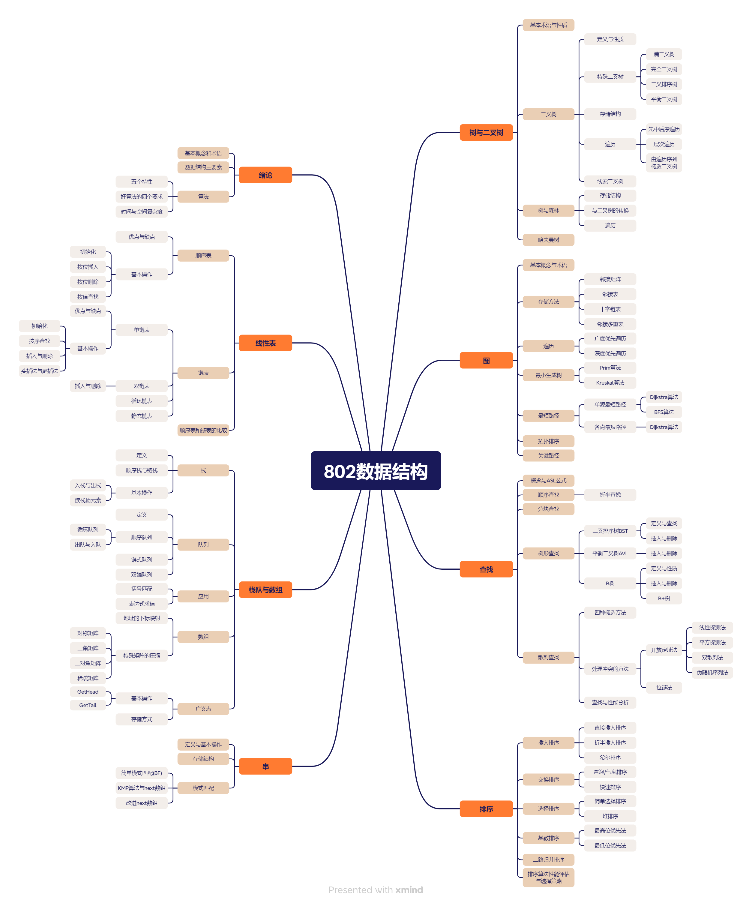

[toc]

# 绪论

## 基本概念和术语

1. **数据**是信息的载体，是描述客观事物属性的数、字符及所有能输入到计算机中并被计算机程序识别和处理的符号的集合。
2. **数据元素**是数据的基本单位，通常作为一个整体进行考虑和处理。一个数据元素可由若干**数据项**组成，数据项是构成数据元素的不可分割的最小单元。
3. **数据对象**是具有相同性质的数据元素的集合，是数据的一个子集。
4. **数据类型**是一个值的集合和定义在此集合上的一组操作的总称，拥有原子类型、结构类型和**抽象数据类型**（ADT），其中ADT指的是一个数学模型及定义在该数据模型上的一组操作。
5. **数据结构**是相互之间存在的一种或多种特定关系的数据元素的集合，数据元素相互之间的关系称之为结构。

## 数据结构三要素

数据结构包括三方面的内容：逻辑结构、存储结构和数据的运算。而数据的逻辑结构和存储结构是密不可分的两个方面，一个算法的设计取决于所选定的逻辑结构，而算法的实现依赖于所采用的存储结构。

### 数据的逻辑结构

**逻辑结构**是指数据元素之间的逻辑关系，即从逻辑关系上描述数据，其分为线性结构和非线性结构，线性表（OneToOne）是典型的线性结构；集合、树（OneToMany）和图（ManyToMany）是典型的非线性结构。

### 数据的存储结构

**存储结构**是指数据结构在计算机中的表示，也称物理结构，分为顺序存储、链式存储、索引存储和散列存储。

### 数据的运算

施加在数据上的运算包括运算的定义和实现。运算的定义是针对逻辑结构的，运算的实现是针对存储结构的。

## 算法

算法是对特定问题求解步骤的一种描述，它是指令的有限集合，其中的每条指令表示一个或多个操作。此外，一个算法还具备下列五个重要特性：

1. **有穷性**，一个算法必须总在执行有穷步之后结束，且每一步都可在有穷时间内完成。
2. **确定性**，算法中的每条指令都必须由确切的含义，对于相同的输入只能有相同的输出。
3. **可行性**，算法中描述的操作都可以通过已经实现的基本运算执行有限次来实现。
4. 一个算法有零个或多个输入，有一个或多个输出。

此外，设计一个“好”算法应考虑达到以下目标：1.正确性；2.可读性；3.健壮性；4.高效率和低存储量需求。

### 算法效率的度量

#### **时间复杂度 高频**

时间复杂度用于描述算法执行时间随问题规模n增长的渐近趋势，采用大O符号表示算法运行时间的上界。

**【常见时间复杂度排序】**

`O(1) < O(log₂n) < O(n) < O(nlog₂n) < O(n²) < O(n³) < O(2ⁿ) < O(n!) < O(nⁿ)`

##### 计算流程

1. **确定基本语句**：找出算法中执行次数最多的语句，通常是最内层循环体。
2. **计算执行次数的数量级**：分析基本语句的执行次数f(n)，仅保留最高次项并忽略低次项及系数。
3. **推导时间复杂度**：用大O符号表示最终的时间复杂度。

##### 典型题的计算与分析

1. **递归算法复杂度**：主定理应用
2. **循环嵌套分析**：等差/等比数列求和
3. **分治算法复杂度**：T(n) = aT(n/b) + f(n)

```c
int sum = 0;
for(int i = 1;i < n;i *= 2){
    for(int j = 0;j < i;j ++ ) sum++;
}
O(log₂n)
```

```c
for(int i = 1;i <= n;i++){
    for(int j = 2 * i;j <= n;j++) y += i * j;
}
```

对于此类经典的嵌套循环结构，可以通过将内外层循环拆解来分析关键语句（y+=i*j）的执行次数。具体计算步骤如下表所示：

|   外层i   | 内层j |     循环次数     |
| :-------: | :----: | :---------------: |
|     1     | 2 ~ n |     `n - 1`     |
|     2     | 4 ~ n |     `n - 3`     |
|    ...    |  ...  |        ...        |
|     i     | 2i ~ n | `n - 2 * i + 1` |
| `n / 2` |   n   |         1         |

这是一个简单的等差数列求和问题：`(n - 1 + 1) * (n / 2) / 2 = n² / 4`，因此时间复杂度为O(n²)。

#### 空间复杂度

空间复杂度是衡量算法执行过程中所需存储空间的重要指标，主要包括以下三个部分：

1. 输入数据占用的存储空间；2. 程序本身占用的存储空间；3. 辅助变量占用的额外空间

在计算空间复杂度时，通常只考虑辅助变量占用的额外空间。当算法满足原地工作的条件时，其辅助空间复杂度为O(1)，即仅使用常数级别的额外存储空间。

# 线性表

**线性表**是具有相同数据类型的n个数据元素的有限序列，除表头元素外，每个元素都有且仅有一个直接前驱；除表尾元素外，每个元素都有且仅有一个直接后继。

```c
#define MaxSize 100
typedef struct{
    int data[MaxSize];
    int length;
}SqList;

// 动态分配
#define InitSize 50
typedef struct{
    int *data;
    int MaxSize, length;
}SeqList;
/*data的类型无论是int还是ElemType，都不影响代码的考察重点。ElemType主要用于提示使用者，此处数据类型不限于特定类型，但需要额外实现相等或比较等基本操作，较为繁琐。为聚焦于核心代码实现，这里统一使用int类型。*/
```

## 顺序表

线性表的顺序存储也称顺序表，它是用一组地址连续的存储单元依次存储线性表中的数据元素，从而使得逻辑上相邻的两个元素在物理上也相邻。

- 优点：1. 可进行随机访问，即可以通过首地址和元素序号在O(1)的时间内找到指定的元素；2. 存储密度高，每个结点只存储数据元素。
- 缺点：1. 元素的插入和删除需移动大量的元素；2. 顺序存储分配需要一段连续的存储空间，不够灵活。

### **基本操作 中频**

##### 初始化

```c
bool InitList(SqList &L){
    for(int i = 0;i < MaxSize;i++) L.data[i] = 0;
    L.length = 0;			// 结构体类型用.访问属性
    return true;
}
bool InitList(SeqList &L, int InitSize){
    L.data = (int *)malloc(sizeof(int) * InitSize);
    if(L.data == NULL) return false;
    L.length = 0;
    L.MaxSize = InitSize;
    return true;
}
```

##### **按位插入**

```c
bool ListInsert(SqList &L, int i, int elem){
    if(i < 1 || i > L.length + 1) return false;
    if(L.length >= MaxSize) return false;
    for(int j = L.length;j >= i;j--) L.data[j] = L.data[j - 1];
    L.data[i - 1] = elem;
    L.length++;
    return true;
}
```

在长度为n的顺序表中，在第i个位置插入需后移 `n-i+1`个元素；由于可插入位置共有n+1个，平均移动次数为 `n(n+1)/(2(n+1))=n/2`，因此最坏和平均时间复杂度均为O(n)。

##### **按位删除**

```c
bool ListDelete(SqList &L, int i, int &elem){
    if(i < 1 || i > L.length) return false;
    elem = L.data[i - 1];
    for(int j = i;j < L.length;j++) L.data[j - 1] = L.data[j];
    L.length--;
    return true;
}
```

在长度为n的顺序表中，在第i个位置删除需前移 `n-i`个元素；由于可删除位置共有n个，平均移动次数为 `n(n-1)/2n=(n-1)/2`，因此最坏和平均时间复杂度为O(n)。

##### 按值查找

```c
int LocateElem(SqList &L, int key){
    for(int i = 0;i < L.length;i++){
        if(L.data[i] == key) return i + 1;
    }
    return -1;
}
```

在长度为n的顺序表中，平均查找长度为 `n(n+1)/2n=(n+1)/2`，因此最坏和平均时间复杂度为O(n)。

## 链表

### 单链表

线性表的链式存储也称单链表，它是指通过一组任意的存储单元来存储线性表中的数据元素。

```c
typedef struct LNode{
    int data;
    struct LNode *next;
}LNode, *LinkList;
```

- 优点：1. 可以解决顺序表初始化需要大量连续存储单元和扩展需要移动大量元素的缺点；2. 链表在给定对象的插入和删除操作不需要移动元素，时间复杂度是O(1)的。
- 缺点：1. 单链表的元素离散在存储空间中，因此是**非随机存储**的存储结构；2. 单链表附加的指针域，存在浪费存储空间的问题。

**头结点与头指针的关系**：不管带不带头结点，头指针都始终指向链表的第一个结点，而头结点是带头结点的链表中的第一个结点，结点内部通常不存储信息。

题目中链表的头结点情况通常会在题干中明确说明。若未直接指明，可通过题目内部的链表操作逻辑和表现形式进行判断。**关键是要确保在同一题目中，所有链表操作的处理方式保持一致**（无论是有头结点还是无头结点）。

#### **基本操作 中频**

带头结点单链表的操作代码书写较为方便，这里默认带头结点。

##### 初始化

```c
// 带头结点的初始化
bool InitList(LinkList &L){
    LNode *L = (LNode *)malloc(sizeof(LNode));
    if(L == NULL) return false;
    L->next = NULL;				// 结构体指针用->访问属性
    return true;
}

// 不带头结点的初始化
bool InitList(LinkList &L) {
    L = NULL;
    return true;
}
```

##### 按值查找

```c
// 需要对原链表进行修改则传实参&L，不需要则传形参L
LNode *LocateElem(LinkList L, int elem){
    LNode *p = L->next;
    while(p != NULL && p->data != elem) p = p->next;
    return p;
}
```

##### 按序查找

```c
LNode *GetElem(LinkList L, int i){
    if(i < 0) return NULL;
    LNode *p = L;
    int j = 0;
    while(j < i && p != NULL){
        p = p->next;
        j++;
    }
    return p;
}
```

##### **按位插入**

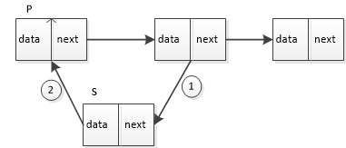

```c
bool ListInsert(LinkList &L, int i, int elem){
    LNode *p = GetElem(L, i - 1);
    if(p == NULL) return false;
    LNode *s = (LNode *)malloc(sizeof(LNode));
    if(s == NULL) return false;
    s->data = elem;
    s->next = p->next;
    p->next = s;
    return true;
}
```

第一步与第二步不能交换，若先做第二步链表会断裂，p的后继将丢失，后续操作无法进行。此处默认带头结点，已将 `i=1`情形统一处理；**若无头结点需单独讨论**。按位插入的合法范围为[1,length+1]：越界时 GetElem 返回 NULL 直接结束；边界 `i=1`与 `i=length+1`分别对应p为头结点与尾结点，后续代码无需额外分支。
以上代码为“后插”实现。另一种情形是已知结点p，需在p前插入新结点。由于寻找p的前驱较为麻烦，可先在p之后执行后插，再交换p与其后继结点的data，从而以O(1)时间完成“前插”。代码如下：

```c
s->next = p->next;
p->next = s;
temp = s->data;
s->data = p->data;
p->data = temp;
```

##### **按位删除**

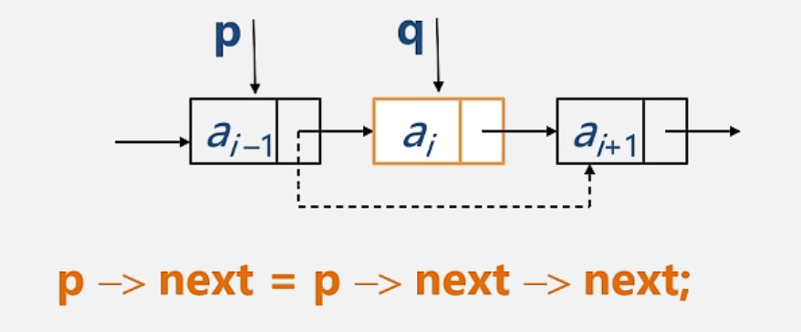

```c
bool ListDelete(LinkList &L, int i, int &elem){
    LNode *p = GetElem(L, i - 1);
    if(p == NULL) return false;
    if(p->next == NULL) return false;
    LNode *s = p->next;
    elem = s->data;
    p->next = s->next;
    free(s);
    return true;
}
```

单链表删除的合法范围为[1,length]，超出范围时GetElem返回NULL并终止。边界：`i=1`时p为头结点可统一处理；若误传 `i=length+1`，则p可能为尾结点且 `q=p->next`为NULL，删除前必须显式判空，避免解引用空指针。
类似地，当需要删除指定结点p时，先将p与其后继结点的数据交换，再删除p的后继结点即可，代码如下：

```c
// 若p没有后继结点，只能先找到p的前驱结点进行删除操作
LNode *q = p->next;
p->data = q->data;
p->next = q->next;
free(q);
```

##### ***头插法***

该方法通过将新结点依次插入到头结点之后来构建新链表。需注意：**读入顺序与生成链表的结点顺序相反**，因此可用于构造逆序链表。下面给出由给定链表生成其逆序链表的代码：

```c
bool ReverseLinkList(LinkList &L) {
    if (L == NULL) return false;
    LNode *p = L->next;
    L->next = NULL;
    while(p != NULL){
        LNode *temp = p;
/* 就算用temp作为临时结点，其和p指向的是同一个地方，
若该步骤在插入后，会导致在一个地方无限循环 */
        p = p->next;
        temp->next = L->next;
        L->next = temp;
    }
    return true;
}
```

##### 尾插法

头插法构建单链表虽简便，但结点顺序与输入顺序不一致；若需保持与输入顺序一致，可采用尾插法，并维护尾指针r指向表尾，以便O(1)时间完成插入。

### 双链表

为克服单链表难以寻找前驱结点的问题，引入双链表。双链表在每个结点中设置prior和next两个指针，能够方便地定位前驱与后继；因此在已知操作位置（或给定结点指针）时，插入和删除的指针调整均为O(1)。

```c
typedef struct DNode{
    int data;
    struct DNode *prior, *next;
}DNode, *DLinkList;
```

#### 双链表结点的插入与删除操作

**插入操作**
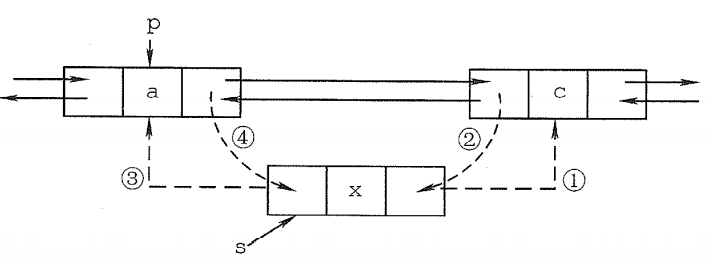

```c
bool ListInsert(DLinkList &L, int i, int elem){
    DNode *p = GetElem(L, i - 1);
    if(p == NULL) return false;
    DNode *s = (DNode *)malloc(sizeof(DNode));
    if(s == NULL) return false;
    s->data = elem;
    s->next = p->next;
    s->prior = p;
    if(p->next != NULL) p->next->prior = s;
    p->next = s;
    return true;
}
```

插入操作涉及指针s与p，由于p的后继只能通过 `p->next`访问，必须在执行 `p->next = s`之前先完成第2、3步（`s->next = p->next`与 `p->next->prior = s`），否则会丢失前驱指针并导致链表断裂。

**删除操作**
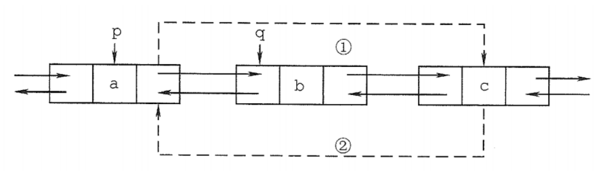

```c
bool ListDelete(DLinkList &L, int i, int &elem){
    LNode *p = GetElem(L, i - 1);
    if(p == NULL) return false;
    if(p->next == NULL) return false;
    LNode *s = p->next;
    elem = s->data;
    p->next = s->next;
    if(s->next != NULL) s->next->prior = p;
    free(s);
    return true;
}
```

### 循环链表

- **循环单链表**
  循环单链表与普通单链表的区别在于，**表中最后一个结点的指针不再为NULL，而是指向头结点**`head->next=head`，使整个链首尾相接形成环。在带头结点的循环单链表中，判空条件不是“头结点的next是否为 NULL”，而是“头结点的next是否等于头指针L”。在操作上，其插入、删除与单链表基本一致；若增设尾指针r，则在表头与表尾处的插入/删除均可在O(1)时间内完成。
- **循环双链表**
  循环双链表中，头结点的prior指向表尾结点，表尾结点的next指向头结点；当带头结点的循环双链表为空时，头结点的next与prior均指向自身。拥有头指针或尾指针的循环双链表，在头部或尾部执行插入和删除元素，时间复杂度都为O(1)。

### 静态链表

静态链表是用数组来描述线性表的链式存储结构，结点也有数据域data和指针域next，不同的是这里的指针是结点在数组中的相对地址，且以 `next == -1`作为结束的标志。

```c
#define MaxSize 50
typedef struct{
    ElemType data;
    int next;
}SLinkList[MaxSize];
```

## 顺序表和链表的比较

1. **读写方式**：顺序表既可顺序存取也支持随机存取（O(1)按下标访问）；链表只能从表头（或已知位置）起依次遍历，随机定位为O(n)。
2. **查找/插入/删除**：按值查找时，无序顺序表与链表均为O(n)；有序顺序表可用折半查找O(log₂ n)。按序号定位时，顺序表为O(1)，链表为O(n)。插入与删除的“指针/下标调整”本身在链表为O(1)、在顺序表为O(n)（主要开销在顺序表元素移动、链表在定位）。
3. **空间分配**：顺序表需较大连续空间，容量扩展与初始分配难以兼顾；链表按需分配、无需连续空间，但结点含指针域，存储密度较低且有额外分配开销与碎片风险。

因此在进行存储结构选择时，常见建议如下：

1. 难以预估表长或动态性强时，不宜采用顺序表，可优先考虑链表（接受存储密度<1的开销）。
2. 若需要高频“按序号随机访问”，且插入/删除不频繁，优先顺序表（数组）。
3. 表较长且数据元素信息量大，同时插入/删除频繁、对随机访问要求不高，优先链表（避免大量搬移）。
4. 实现成本方面，顺序表更简单，可直接使用数组；链表实现相对复杂但扩展灵活。

# 栈队和数组

## **栈 高频**

**栈**是一种受限的线性表，仅允许在一端进行插入和删除操作，具有后进先出（Last In First Out, LIFO）的操作特征。其基本操作包括入栈、出栈以及读取栈顶元素。一个重要的组合数学性质是：当n个互不相同的元素按固定顺序依次入栈时，可能的出栈序列数目等于第 n 个**Catalan数**。

$$
C_{2n}^{n} \frac{1}{\,n+1\,},\quad n\ge 0
$$

### 顺序栈

#### 实现

采用顺序存储的栈成为顺序栈，它利用一组地址连续的存储单元存放自栈底到栈顶的数据元素，同时附带一个top指针指示当前栈顶的位置。

```c
#define MaxSize 50
typedef struct{
    int data[MaxSize];
    int top;
}SqStack;
```

##### 两种栈顶指针的设置方式

| 初始化的top值设置 |           S.top=-1           |            S.top=0            |
| :---------------- | :---------------------------: | :---------------------------: |
| 栈顶元素          |         S.data[S.top]         |        S.data[S.top-1]        |
| 栈空条件          |           S.top==-1           |           S.top==0           |
| 栈满条件          |       S.top==MaxSize-1       |        S.top==MaxSize        |
| 栈长              |            S.top+1            |             S.top             |
| 入栈操作          | 栈不满时，Top先++再送值到栈顶 | 栈不满时，先送值到栈顶再Top++ |
| 出栈操作          | 栈非空时，先取栈顶元素再Top-- | 栈非空时，先Top--再取栈顶元素 |

#### 基本操作

这里默认采用S.top=-1的方式。

```c
bool InitStack(SqStack &S){
    S.data = (int *)malloc(MaxSize * sizeof(int));
    if(S == NULL) return false;
    S.top = -1;
    return true;
}
// 判空一律用IsEmpty
bool IsEmpty(SqStack S){
    return S.top == -1;
}
int GetLength(SqStack &S){
    return S.top + 1;
}
bool Push(SqStack &S, int elem){
    if(S.top == MaxSize - 1) return false;
    S.data[++S.top] = elem;
    return true;
}
bool Pop(SqStack &S, int &elem){
    if(S.top == -1) return false;
    elem = S.data[S.top--];
    return true;
}
bool GetTop(SqStack &S, int &elem){
    if(S.top == -1) return false;
    elem = S.data[S.top];
    return true;
}
```

#### 共享栈

共享栈让两个顺序栈共享一个一维数组空间，将两个栈的栈底分别设置在共享空间的两段，两个栈顶向共享空间的中间延伸。top0=-1，top1=MaxSize时栈为空；top1-top0=1时栈满；0号栈入栈时先++在赋值，1号栈入栈时先--再赋值，出栈反之。

## 链栈

采用链式存储的栈成为链栈，其优点是便于多个栈共享存储空间和提高其效率，且不存在栈满上溢的情况。通过采用单链表实现链栈，并规定**所有操作都是在单链表的表头进行的**，且这里规定**没有头结点**，Lhead指向栈顶元素。

```c
typedef struct Linknode{
    ElemType data;
    struct Linknode *next;
}LiStack;
```

### 经典考题

**1. 判断出栈序列的合法性**

- **问题描述：** 给定一个入栈序列，判断某个给定的排列是否为一个合法的出栈序列。
- **核心思想：** 检验是否在任何时刻违反了“后进先出”的原则。一个简明的判断依据是：如果元素 `j`在 `i`之后入栈，那么 `i`只有在 `j`出栈后才能出栈。
- **模拟算法：**
  1. **准备：** 在纸上写下完整的入栈序列。
  2. **标记与检查：** 按照给定的出栈序列，逐个考察每个出栈元素。
  3. 当考察到出栈元素 `X` 时，在入栈序列中找到 `X` 并给它打上“✔”。这个“✔”代表 `X` 和它之前的所有元素都已经被压入栈中。
  4. **关键判断：** 查看入栈序列中，`X` 的右侧是否**存在不相邻且已✔的元素**，若存在则该出栈序列非法。
  5. **结论：** 如果对出栈序列中的所有元素重复上述步骤，均未发现非法情况，则该序列合法。

**2. 用两个栈模拟队列**

- **问题描述：** 使用两个栈（`stack_in`, `stack_out`）来实现一个队列，支持 `enqueue`(入队)和 `dequeue`(出队)操作。
- **实现方法：**
  - **入队 `enqueue(x)`：**
    1. 若`stack_in`不满，直接将元素 `x`压入 `stack_in`。
    2. `stack_in`栈满，若`stack_out`栈空，则将`stack_in`的所有元素逐一弹出并压入 `stack_out`，将元素压入`stack_in`。
    3. 若`stack_in`栈满且`stack_out`不空，则返回错误。
  - **出队 `dequeue()`：**
    1. 首先检查 `stack_out`是否为空。
    2. 如果 `stack_out`不为空，直接从 `stack_out` 弹出一个元素并返回。
    3. 如果 `stack_out`为空，则将 `stack_in` 的所有元素逐一弹出并压入 `stack_out`。这个过程会颠倒元素的顺序，从而实现“先进先出”。
    4. 完成转移后，再从 `stack_out`弹出一个元素并返回。若此时 `stack_out`仍为空（说明原队列为空），则返回错误。

## 队列

**队列**简称队，是一种操作受限的线性表，只允许在表的一端进行插入（链表队尾），在表的另一端进行删除（链表队头），具有先进先出（First In First Out, FIFO）的操作特征，基本操作包括入队出队以及读取队首元素。

### **队列的顺序存储结构 高频**

队列的顺序实现是指分配一块连续的存储单元存放队列中的元素，并附带队首指针front和队尾指针rear。在不同教材中，对于front和rear的定义不同，默认front指向队首元素，rear指向队尾元素的下一个元素。

```c
#define MaxSize 50
typedef struct{
    ElemType data[MaxSize];
    int front, rear;
}SqQueue;
```

初始时 `front = rear = 0`；队空时 `front = rear`；入栈时先放入rear再++；出栈时front先++再放入。

#### 循环队列

为解决顺序队列的“假溢出”问题，这里引出循环队列的概念，将顺序队列臆造为一个环状的空间，利用除法取模运算来实现。

- 初始时 `Q.front = Q.rear = 0`
- 出队时队首指针进1 `Q.front = (Q.front + 1) % MaxSize`
- 入队时队尾指针进1 `Q.rear = (Q.rear + 1) % MaxSize`
- 队列长度 `(Q.rear - Q.front + MaxSize) % MaxSize`

在循环队列中，队空和队满的条件都可能表现为 `Q.front == Q.rear`，这导致了状态的二义性。为了准确区分这两种情况，通常采用以下三种策略：

1. **牺牲一个存储单元**：约定队列中最多只占用 `MaxSize - 1`个单元。此时，队空条件仍为 `Q.front == Q.rear`，而队满条件则定义为 `(Q.rear + 1) % MaxSize == Q.front`，这是考研中最常用、最重要的方法。
2. **增设 `size`成员**：在队列结构体中添加一个整型变量 `size`，用于实时记录队列中的元素个数。这样判空条件为 `size == 0`，判满条件为 `size == MaxSize`，不再依赖于 `front`和 `rear`的关系。
3. **增设 `tag`标志位**：在队列结构体中添加一个标志位 `tag`，表示最近一次操作为入队还是出队。当 `Q.front == Q.rear`时，若 `tag == 0`则表示队列为空，若 `tag == 1`则表示队列为满。

#### 基本操作

```c
bool InitStack(SqQueue &Q){
    Q.data = (int *)malloc(MaxSize * sizeof(int));
    if(Q.data == NULL) return false;
    Q.front = 0;
    Q.rear = 0;
    return true;
}
bool IsEmpty(SqQueue &Q){
    return Q.rear == Q.front;
}
bool IsFull(SqQueue &Q){
    return (Q.rear + 1) % MaxSize == Q.front;
}
int GetLength(SqQueue &Q){
    return (Q.rear - Q.front + MaxSize) % MaxSize;
}
bool EnQueue(SqQueue &Q, int elem){
    if((Q.rear + 1) % MaxSize == Q.front) return false;
    Q.data[Q.rear] = elem;
    Q.rear = (Q.rear + 1) % MaxSize;
    return true;
}
bool DeQueue(SqQueue &Q, int &elem){
    if(Q.rear == Q.front) return false;
    elem = Q.data[Q.front];
    Q.front = (Q.front + 1) % MaxSize;
    return true;
}
int GetFront(SqQueue &Q){
    return Q.data[Q.front];
}
```

#### front与rear的不同定义

|  操作  | front->队首,rear->队尾next | front->队首prior,rear->队尾 |  front->队首,rear->队尾  | front->队首prior,rear->队尾next |
| :----: | :------------------------: | :-------------------------: | :-----------------------: | :-----------------------------: |
| 初始化 |    Q.front = Q.rear = 0    |    Q.front = Q.rear = -1    | Q.front = 0 ; Q.rear = -1 |    Q.front = -1 ; Q.rear = 0    |

### 队列的链式存储结构

队列的链式表示称为链式队列，它实际上是一个同时有队首和队尾指针的单链表，一般默认该链表无头结点。不带头结点时，`Q.front == NULL`且 `Q.rear == NULL`时链式队列为空；带头结点时，`Q.front == Q.rear`时链式队列为空。
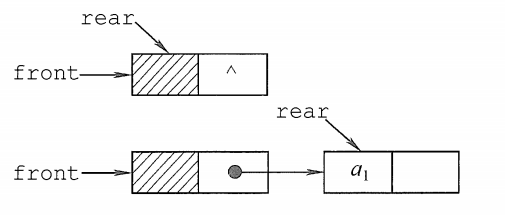

## 栈与队列的应用

### 括号匹配

表达式含多种括号（如 `()[]{}`），需判断其括号匹配是否正确。可用栈思路如下：

1. 初始化空栈，按序扫描表达式。
2. 遇左括号则入栈；遇右括号则检查栈顶是否为对应左括号：若匹配则弹出并继续，否则立即判不合法并终止；
3. 扫描结束时，若表达式已读完且栈为空，则判为合法，否则不合法。
   不合法的情形共有三类：① 左右括号类型不匹配；② 扫描结束栈仍有元素（左括号多）；③ 扫描中遇到右括号但栈已空（右括号多）。

### 表达式求值

对于数学计算的表达式而言，人类常用中缀表示。为便于计算机处理，通常分两步：① 将中缀表达式转换为后缀（逆波兰）表达式；② 计算后缀表达式的值。

#### 中缀转后缀

中缀转后缀需要用到运算符栈，规则如下：

1. 初始化空栈，按序扫描表达式。
2. 读到**【操作数】**直接输出到后缀表达式；读到**【左括号】**则入栈，读到**【右括号】**则将栈顶运算符依次弹出并输出，直到遇到左括号为止；读到**【运算符】**时，当栈顶为优先级**低于当前的运算符或左括号时入栈**，当**栈顶为优先级高于或等于当前的运算符**（**右结合仅在高于的时候弹出**），则依次弹出元素直到满足入栈要求。
3. 扫描结束后，将栈内剩余运算符依次弹出到输出；若栈中仍有括号，则表达式非法。

常见优先级与结合性：括号 > 乘除 > 加减。此外，可以将后缀表达式逆置获得前缀表达式。

#### 后缀表达式求值

后缀求值同样使用栈：

1. 初始化空栈，按序扫描后缀表达式。
2. 读到操作数则入栈；读到运算符，按其元数弹出相应个数的操作数进行运算（如二元运算：**先弹出b，再弹出a，计算a op b**），将结果压回栈。
3. 扫描结束时，栈应且仅含一个元素，该元素即结果；否则表达式非法。

#### 前缀/后缀表达式转中缀表达式

使用栈辅助转换。核心思路是：遇到操作数压栈，遇到操作符则弹出两个操作数，合并为带括号的子表达式再压栈。

- **后缀转中缀**:
    - **扫描顺序**: 从左到右。
    - **操作**: 遇到操作符 `op`，先弹出 `op2`，再弹出 `op1`，然后将 `(op1 op op2)` 压栈。
- **前缀转中缀**:
    - **扫描顺序**: 从右到左。
    - **操作**: 遇到操作符 `op`，先弹出 `op1`，再弹出 `op2`，然后将 `(op1 op op2)` 压栈。

扫描结束后，栈中唯一的元素即为最终的中缀表达式。**注意：为维持原运算顺序，每次合并都必须添加括号。**

### 递归中栈的应用

在递归调用的过程中，系统为每一层的返回点、局部变量、传入实参等开辟了递归工作栈来进行数据存储，递归次数过多容易造成栈溢出。而其效率不高的原因是递归调用过程中包含很多重复的计算，可以将递归算法转换为非递归算法，通常需要借助栈来实现这种转变。
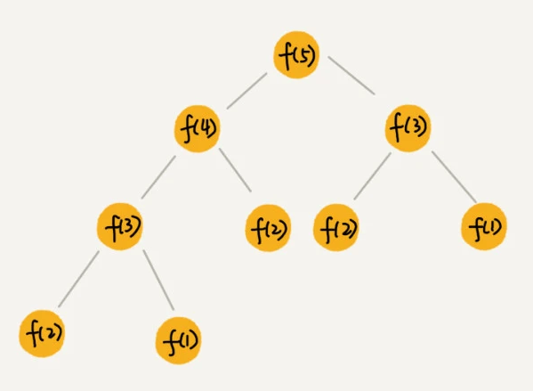

## **数组 中频**

### 一维至多维数组

一个数组的所有元素在内存中占用一段连续的存储空间。因此，无论是一维还是多维数组，其物理存储都是线性的，核心任务是把“下标”映射为“线性地址”。对于一维数组，地址计算为 `LOC(Ai) = LOC(A0) + i * L`，其中下标从 0 开始，L 表示每个元素占用的字节数。
对于二维数组线性布局有两种，行优先列优先。在同一种布局下，相邻元素沿着“优先维”连续存放。设数组 A[h1][h2]（下标从 0 开始），其地址公式如下：

$$
\left\{
\begin{aligned}
\mathrm{Loc}(A[i,j]) &= \mathrm{base} + \big[i*h2+j\big]*L \quad \text{(行优先)}\\
\mathrm{Loc}(A[i,j]) &= \mathrm{base} + \big[j*h1+i\big]*L \quad \text{(列优先)}
\end{aligned}
\right.
$$

由此可以推广到多维数组中，对于n维数组A[d1][d2]...[dn]，求元素a(k1,k2...kn)的地址，其公式为：

$$
\begin{aligned}
\mathrm{Loc}(k_1,k_2,\dots,k_n) &= \mathrm{BaseAddr} + \mathrm{L}*\,\Big( k_1\!\!\prod_{t=2}^{n} d_t + k_2\!\!\prod_{t=3}^{n} d_t + \cdots + k_{n-1}\, d_n + k_n \Big)
\end{aligned}
$$

### 特殊矩阵的压缩

压缩矩阵是指多个值相同的元素只分配一个存储空间，对零元素不分配空间。
特殊矩阵是指具有许多相同矩阵元素或零元素，并且这些相同矩阵元素或零元素的分布有一定规律性的矩阵，常见的有**对称、上三角矩阵和对角矩阵**等。

#### 对称矩阵

定义：对称矩阵满足 a(i,j)=a(j,i)（1≤i,j≤n）。
存储：仅保留一侧，共n(n+1)/2个元素，放入B[0..n(n+1)/2−1]。
关键约定：

- 下三角按行存放
- i、j从1开始；线性下标k从0开始

索引公式（k从0开始）：

$$
k = 
\begin{cases}
\dfrac{i(i-1)}{2} + j - 1, & i\ge j \\
\dfrac{j(j-1)}{2} + i - 1, & i< j
\end{cases}
$$

若k从1开始计数时，式中的“−1”应去掉。
数组按照存储优先可以分为行优先和列优先，数组可以存储上三角或下三角，通过计算得到下三角按行存放和上三角按列存放以及下三角按列存放和上三角按行存放，只是i和j互换的区别，上面计算得到了下三角的行优先，下面将推算存储上三角的行优先的公式。
上三角（行优先，i≤j）计数：前i−1行+第i行的前(j−i)个元素，公式：

$$
k=\frac{(i-1)(2n-i+2)}{2}+(j-i),\quad 1\le i\le j\le n
$$

#### 三角矩阵

三角矩阵是指除一侧三角外，其余元素为同一常数。压缩存储用B[0..n(n+1)/2]（共n(n+1)/2+1个元素），常数一般单独存或置于末位B[n(n+1)/2]。

### 三对角矩阵

对角矩阵也称带状矩阵，对n阶矩阵A中任意一个元素a(i,j)，当 `|i - j| > 1`时，若有a(i,j)=0，则称为三对角矩阵。
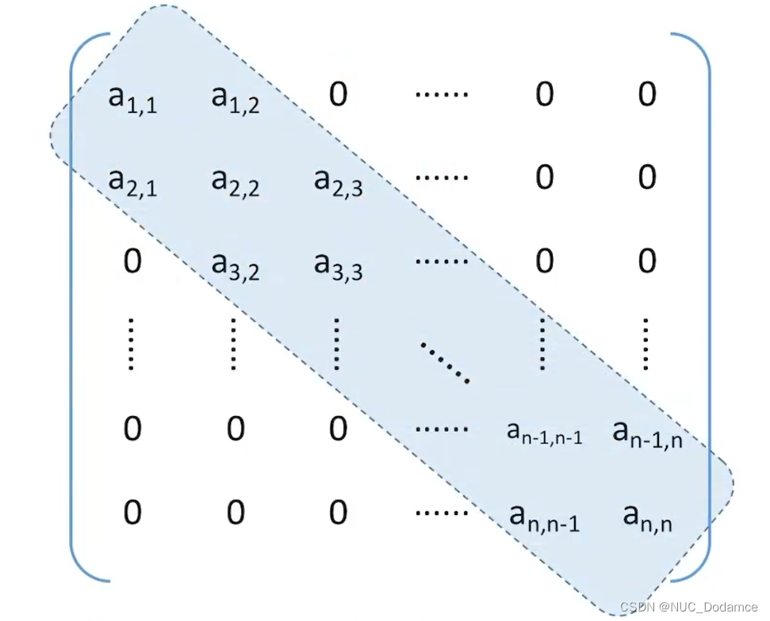
**三对角矩阵按行存储**：用一维数组 B[0…3n-3]（共3n-2个元素）。前i-1行共存放 `3(i-1)-1=3i-4`个元素；第i行的首个非零在列j=i-1 ，因此在第i行内，a(i,j)之前有 `j-(i-1)`个元素，故其在B中的下标（从 0 开始)为`k=(3i-4)+[j-(i-1)]=2i+j-3`。反向定位时，`i-1=(k+1)/3`。

### 稀疏矩阵

当非零元素极少（远小于元素总数）时称为稀疏矩阵，此时常用三元组表（行i、列j、值aij）而非常规数组存储，会牺牲随机存取特性，此外还需要存储表的行数、列数和非零元素个个数。

## 广义表

广义表是线性表的推广属非线性结构，定义递归，其元素可以是广义表。本文仅讨论基本运算Head与Tail：Head返回表头（首个元素），Tail返回表尾（除表头外其余元素构成的一个表），需注意Tail返回的结果必为一个表（可为空表）。

### 存储结构

广义表在存储上将表结点与原子结点分离表示，典型结点定义如下：

```c
typedef enum {ATOM, LIST}ElemTag;   // 0为原子，1为子表
typedef struct GLNode {
    ElemTag tag;
    union {
        AtomType atom;              // 原子存储数据  
        struct {
            struct GLNode *hp, *tp  // hp指向头元素，tp指向尾表
        }
    }
}*GList;
```

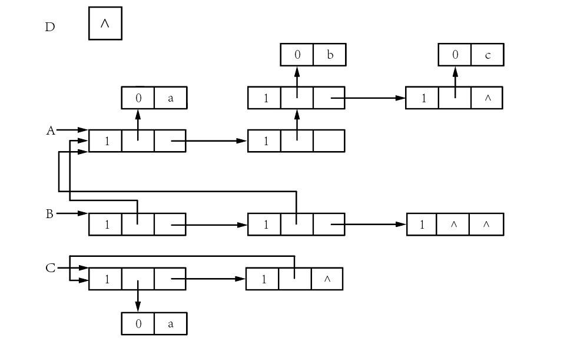

### 树的广义表表示
在广义表表示法中，树的根节点写在最外层，广义表包含的元素是其直接孩子节点，因此广义表的长度是该树根节点拥有的孩子数量，其深度是树的深度。例如，图1中的树可以用广义表表示为：`(A(B(E,F(K(N)),G),C(H),D(I,J(L,M))))`

# 串

## 定义

数据结构中的串值由0个或多个字符组成的有限序列，零个字符的串称为空串，长度为零。串中任意个连续字符组成的子序列称为该串子串，子串在主串中的位置以子串的第一个字符在主串中的位置来表示。

## 基本操作

1. length(S)，求串S的长度，返回一个int型的数。
2. index(S1,s)，求子串s在主串S1中第一个出现的位置，后续的模式匹配与KMP算法都是围绕这个展开的。
3. substr(S1,x,y)，从S1的下标x处开始，截取长度为y的子串（包含下标x的字符），并返回该子串。
4. replace(S1,S2,S3)，将S1中的S2子串替换为S3，返回替换后的串。
5. concat(S1,S2)，连接S1和S2两个串，返回连接后的串。

## 存储结构

### 定长顺序存储

类似于线性表的顺序存储结构，用一组地址连续的存储单元来存储串值的字符序列。串的实际长度只能小于或等于MAXLEN，超过就会被截断。

```c
#define MAXLEN 255
typedef struct{
    char ch[MAXLEN];
    int length;
}SString;
```

### 堆分配存储

堆分配存储表示仍然用一组地址连续的存储单元存放串值的字符字符序列，但他们的存储空间是在程序执行过程中动态分配得到的。

```c
typedef struct{
    char *ch;
    int length;
}HString;
```

### 块链存储

串的链式表示常采用块链结构<由于单结点仅存1个字符会导致存储密度低，故将多个字符存于同一结点（称为“块”），各块再以指针相连成链。

## 模式匹配

### 简单模式匹配

```c
int index(String str, String substr){
    if(str == NULL || substr == NULL) return 0;
    int i = 0, j = 0, k = i;
    while(i < str.length && j < substr.length){
        if(str[i] == substr[j]) { i++; j++; }
        else{ j = 0; i = ++k; }
    }
    if(j == substr.length) return k + 1;
    return 0;
}
```

采用定长顺序存储，零号单元存放长度，字符自下标1开始，因此i、j均从1起。该算法为朴素（BF）匹配：从起始位置对齐，S与T同步比较；若当前字符相等，则i、j同步前进；若不等，则主串指针回到“上次匹配起点的下一位”，模式串指针复位到首字符继续匹配。仅当j超过T的长度时判定匹配成功；否则返回0。匹配窗口最多移动 `n−m+1`次，每次最多比较m次，故最坏时间复杂度为O(nm)。

### KMP算法

#### 朴素匹配的问题

在朴素匹配算法中，每当一个字符失配，模式串 `T`就整体向右移动一位，然后从头开始与主串 `S`的新位置进行比较。这种策略没有利用到失配前已经匹配成功的那部分信息，导致了大量不必要的回溯和重复比较，效率较低。

#### 核心思想

KMP算法的核心思想是**利用已知信息，避免主串指针回溯**。当发生失配时，主串的指针 `i`保持不动，仅将模式串的指针 `j`回退到一个合适的位置，然后继续比较。这样就大大减少了重复的比较次数。

#### **next数组与KMP的精髓**

为了实现模式串指针 `j`的智能回退，KMP算法引入了 `next`数组。

* **`next`数组的含义**：`next[j]`的值指明了当模式串的第 `j`个字符 `T[j]`与主串失配时，指针 `j`应该回退到的新位置。
* **`next`数组的计算**：`next[j]`的值为，该字符左边的串的**最长前后缀匹配长度值**加一。需要注意的是，**子串可以与原字符串完全相同，但前后缀不能与原字符串完全相同**，同时需要明确指定字符串下标的起始位置以确定数组首位是0还是-1，一般默认0。
* **`next`数组如何工作（重要理解）**：当 `T[j]`失配时，我们知道它前面的子串 `T[0...j-1]`已经与主串中的某一段完全匹配，`next`数组正是基于这个信息来工作的。因为 `T[0...k-1]`（前缀）等于 `T[j-k...j-1]`（后缀），而 `T[j-k...j-1]`又已经和主串的一部分匹配上了。所以我们不必将模式串从头开始移动，只需将模式串向右滑动，让它的第 `k`个字符 `T[k]`对准主串当前失配的位置，然后从**这个位置继续比较即可**。这就实现了模式串指针 `j`的快速跳转，而主串指针 `i`完全不需要回退。因此当匹配失败时，主串指针i递增，模式串指针j重置为next[j]的值，此时右移`j-next[j]`个位置。
  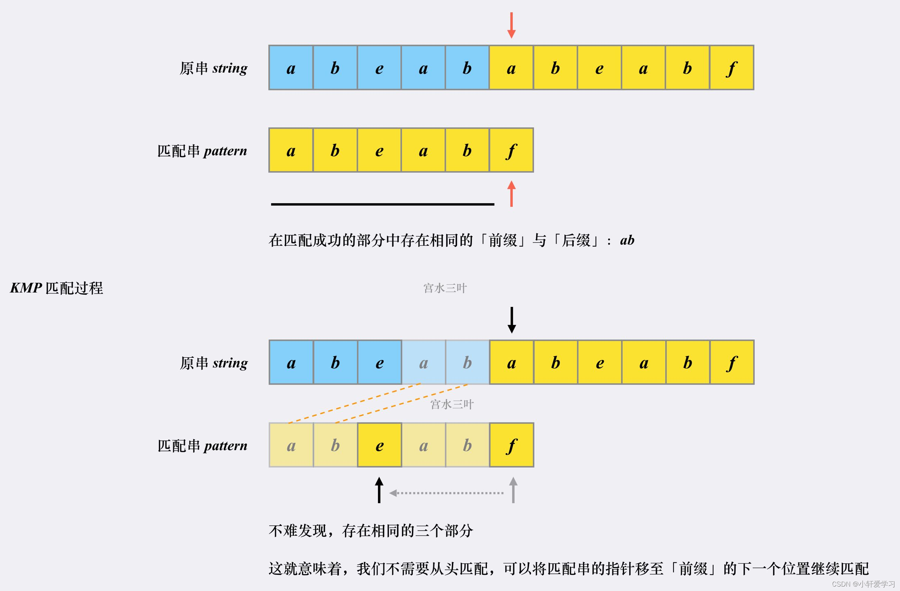

#### nextval数组

nextval数组是next数组的优化版，可避免不必要的比较。其手算规则很简单：当第j个字符与其next数组对应的字符相同时，令 `nextval[j] = next[next[j]]`，并按从左到右依次计算。

# 树与二叉树

树是n个结点的有限集，当n=0时称为空树，在任意一棵非空树中应满足：

1. 有且仅有一个根结点。
2. 当n>1时，其余结点可分为m个互不相交的有限集，其中每个集合本身又是一棵树，并且称为根的子树。

## 基本术语

1. **祖先、子孙、双亲、孩子、兄弟和堂兄弟**。从根到某个结点K的唯一路径上的所有其他结点，称为K的祖先，同时K为这些祖先的子孙。
2. **结点的层次、深度和高度**。结点的深度就是结点所在的层次，而树的深度是树中结点的最大层数。
3. **结点的度和树的度**。树中一个**结点的孩子个数称为该结点的度**，树中结点的最大度数称为树的度，且**树中结点度之和为结点数减一**。
4. **分支结点和叶结点**。
5. **有序树和无序树**。树中结点的各子树从左到右是有次序的，不难互换的，称该树为有序树，否则称为无序树。
6. **路径和路径长度**。树中两个结点之间的路径是由这两个结点之间所经过的结点序列构成的，而路径长度是路径上所经过的边的个数。
7. **森林**。森林是m棵互不相交的树的集合。

## **树的性质 高频**

1. ***树的结点数n等于所有结点的度数之和加一***。
2. ***度为m的树中第i层上至多有 $m^{i-1}$ 个结点***。
3. ***高度为H的m叉树至多由 $\frac{m^h - 1}{m - 1}$ 个结点***
4. ***度为m、具有n个结点的树的最小高度h为 $\left\lceil \log_m\!\big(n(m-1)+1\big)\right\rceil$***
5. ***度为m、具有n个结点的树的最大高度为 `n - m + 1`***
6. ***有n个结点的二叉树，共有n阶Catalan种树形***

## 二叉树

二叉树是一种特殊的树形结构，其特点是每个结点至多只有两棵子树，并且二叉树的子树有左右之分，次序不可任意颠倒。

### 重要性质

1. ***非空二叉树上的叶结点等于度为2的节点数加一，即 `n0 = n2 + 1`***
2. ***非空二叉树的第k层最多有 $2^{k-1}$ 个结点***
3. **高度为h的二叉树至多有 $2^{h}-1$ 个结点***
4. 对完全二叉树按从上到下，从左到右的顺序依次编号，则有以下性质：①最后一个分支节点的编号为 `[n/2]`，若i大于 `[n/2]`则为叶结点；② 叶结点只可能在最后两层上出现；③度为1的结点只能有一个；④n为奇数时，所有分支结点都有左右子树；n为偶数时，有一个分支节点只有左子树；⑤结点i所在的层次为 `[log₂i] + 1`。
5. 具有n个结点的完全二叉树的高度为 `[log₂(n + 1)]`。

### **特殊二叉树 高频**

- 满二叉树。一棵高度为h，且有 `2^h - 1`个结点的二叉树称为满二叉树，即二叉树中的每层都含有最多的结点。从根节点起，自上而下自左向右编号，对于从1开始的编号为i的结点，其双亲为 `[i/2]`、左孩子为2i以及右孩子为2i+1；从0开始则双亲为 `[(i-1)/2]`，左孩子2i+1右孩子2i+2。而对于满k叉树结构，节点编号遵循以下规则：1. 编号为p的节点的第i个子节点（i从0开始计数）的计算公式为：`kp - k + i + 1`；2. 编号为p的节点的父节点计算公式为：`⌊(p - 2 + k) / k⌋`。
- 完全二叉树。高度为h、有n个节点的二叉树，当且仅当其每个结点都与高度为h的满二叉树中编号为1~n的结点一一对应时，称为完全二叉树，其顺序存储结构的数组长度为该深度下，满二叉树的结点个数。
- 二叉排序树BST和平衡二叉树AVL，在后续查找章节会提及。

### 存储结构

#### 顺序存储结构

二叉树的顺序存储是指用一组连续的存储单元依次自上而下、自左至右存储完全二叉树上的结点元素，即将完全二叉树上编号为i的结点元素存储在一维数组下标为i-1的分量中。
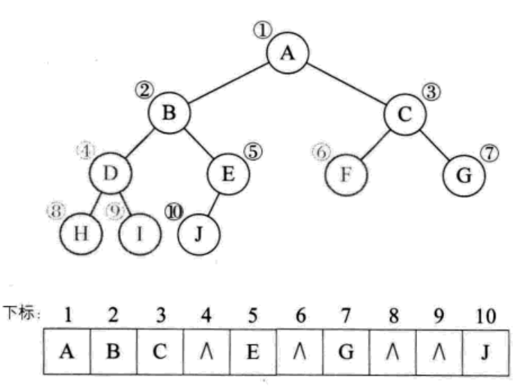

#### 链式存储结构

由于顺序存储需要严格按照编号的形式存储，导致顺序存储的空间利用率低，因此二叉树一般都采用链式结构。

```c
typedef struct BiTNode{
    ElemType data;
    struct BiTNode *lchild, *rchild;
}BiTNode, *BiTree;
```

该结构便于查找左右孩子，但不便于查找双亲，因此常增设指向双亲的指针。此外，在含有n个结点的二叉链表中共有n+1个空链域，可用于构成线索链表。

### 遍历

二叉树的遍历是沿某条搜索路径访问树中每个结点，使每个结点恰好被访问一次。由于二叉树具有递归定义，遍历实质上是确定根结点 N、左子树 L 与右子树 R 的访问顺序，常见有先序遍历、中序遍历和后序遍历，其中“序”指根结点被访问的时机。**需注意**：只有在二叉搜索树（BST）中，中序遍历序列才为升序，而一般二叉树的中序序列不保证有序。**对于给定长度为n的先序序列(或结点总数为n的树)，其可能的二叉树形状数为n阶卡特兰数**。

```c
void InOrder(BiTree T){
    if(T != NULL){
        InOrder(T->lchild);
        visit(T);
        InOrder(T->rchild);
    }
}
```

#### 层次遍历

实现二叉树的层次遍历算法，按照自上而下、自左向右的顺序逐层访问节点。层次遍历需要使用队列数据结构来辅助完成，确保每一层的节点都被完整访问后再进入下一层，其代码如下：

```c
void LayeredOrderTraverse(BiTree T){
    if(T == NULL) return;
    SqQueue Q;InitQueue(Q);
    EnQueue(Q, T);
    BiTNode *p;
    while(!IsEmpty(Q)){
        DeQueue(Q, p);visit(p);
        if(p->lchild != NULL) EnQueue(Q, p->lchild);
        if(p->rchild != NULL) EnQueue(Q, p->rchild);
    }
}
```

### 由遍历序列构造二叉树

在二叉树结点互异的前提下，已知中序序列并配合其他任意一种遍历序列（先序/后序/层序），可以唯一确定一棵二叉树。具体构造方法如下：

1. 先序遍历构造：

   - 先序序列的第一个元素为根结点
   - 在中序序列中定位该根结点，将其划分为左子树和右子树的中序子序列
   - 根据左右子树的结点数量，在先序序列中切分出对应的左右子树的先序子序列
   - 递归应用上述方法构造左右子树
2. 后序遍历构造：

   - 后序序列的最后一个元素为根结点
   - 在中序序列中定位该根结点，将其划分为左子树和右子树的中序子序列
   - 根据左右子树的结点数量，在后序序列中切分出对应的左右子树的后序子序列
   - 递归应用上述方法构造左右子树
3. 层序遍历构造：

   - 层序序列的第一个元素为根结点
   - 在中序序列中定位该根结点，将其划分为左子树和右子树的中序子序列
   - 将层序序列中剩余结点按所属子树进行分组，保持原有相对顺序
   - 递归应用上述方法构造左右子树

在二叉树的三种遍历序列（前序、中序、后序）中，存在一个重要特性：**叶子节点在这三种遍历方式中的相对顺序始终保持一致**。

#### 新题型

当前考试中常出现一种新型题型，要求根据不完整的前序、中序或后序遍历序列来还原二叉树结构。解答此类题目需要深入理解遍历序列的特性，具体解题思路如下：

1. 将树拆分为根节点、左子树和右子树三部分
2. 通过后序遍历的最后一个元素确定根节点
3. 在中序遍历中找到根节点位置，其左侧为左子树，右侧为右子树
4. 根据子树节点数量，在前序和后序遍历中划分对应的子树序列

以下面例题为例进行解析：

- 节点全集：{A, B, C, D, E, F, G, H, I, J, K}
- 前序：_ _ C D E _ G H I _ K
- 中序：C B _ _ F A _ J K I G
- 后序：_ E F D B _ J I H _ A

解题步骤：

1. 根据后序最后一个元素A确定根节点，于是前序第一个元素为A
2. 在中序序列中找到A，其左侧{C,B,_,_,F}为左子树，右侧{_,J,K,I,G}为右子树
3. 根据节点数量确定左子树为{B,C,D,E,F}，右子树为{G,H,I,J,K}
4. 对于左子树部分，通过后序序列EFD和前序序列DEF，结合中序序列的__F，可以使用**假设法**推断出中序序列应为EDF

最终结论：只要清晰地分离出前序、中序、后序序列中的根节点、左子树和右子树结构，就能逐步推导出完整的二叉树结构。

### 线索二叉树

#### 基本概念

遍历二叉树是指按照特定规则将二叉树中的节点排列成线性序列，从而生成不同的遍历序列。在该序列中，每个节点都有明确的前驱节点和后继节点。引入线索二叉树的主要目的是提高查找节点前驱和后继的效率，并充分利用空指针域。其实现原理是通过增加一个标记位（tag）来标识指针域的指向类型：当tag为0时表示指向子节点，当tag为1时表示指向前驱或后继节点。

```c
typedef struct BiThrNode{
    ElemType data;
    struct BiThrNode *lchild, *rchild;
    int ltag, rtag;
}BiThrNode, *BiThrTree;
```

#### 中序线索二叉树的构造

二叉树的线索化是将二叉链表中的空指针改为指向前驱或后继的线索，这里以中序线索二叉树的建立为例。设指针pre指向上一个访问的结点，指针p指向当前正在访问的结点。在中序遍历的过程中，检查p的左指针是否为空，若为空就将其指向pre；检查pre的右指针是否为空，若为空就将它指向p。对于中序线索二叉树，其所有指针域都必须被有效利用：若节点有子节点，则指针指向其子节点；若无子节点，则指针指向前驱或后继节点。特别需要注意的是，中序序列的首节点前驱指针和末节点后继指针都应设置为NULL。

```c
void InThread(BiThrTree &p, BiThrTree &pre){
    if(p != NULL){
        InThread(p->lchild, pre);

        if(p->lchild == NULL){
            p->lchild = pre;
            p->ltag = 1; 
        }
        if(pre != NULL && pre->rchild == NULL){
            pre->rchild = p;
            pre->rtag = 1;
        }
        pre = p;

        InThread(p->rchild, pre);
    }
}
void CreateInThread(BiThrTree &T){
    BiThrNode *pre = NULL;
    if(T){
        InThread(T, pre);
        pre->rchild = NULL;
        pre->rtag = 1;
    }
}
```

#### 中序线索二叉树的遍历

根据中序线索二叉树进行遍历时，需按照以下两步操作：

1. 定位中序遍历序列的第一个结点。
2. 按照线索依次访问每个结点的后继结点。

- 求中序线索二叉树的中序序列下的第一个结点，即找到最左下的结点

```c
ThreadNode *Firstnode(ThreadNode *p){
    while(p->ltag == 0) p = p->lchild;
    return 0;
}
```

- 求中序线索二叉树中结点p在中序序列下的后继，即寻找其右子树中最左下的元素

```c
ThreadNode *Nextnode(ThreadNode *p){
    if(p->rtag == 0) return Firstnode(p->rchild);
    else return p->rchild;
}

// 得到遍历的算法
void Inorder(ThreadNode *T){
    for(ThreadNode *p = Firstnode(T);p != NULL;p = Nextnode(p)) visit(p);
}
```

## 树与森林

### 存储结构

**1.【双亲表示法】**
这种存储结构采用一组连续的存储空间来存储每个结点，同时在每个结点中增设一个伪指针，指示其双亲结点在数组中的位置，根结点其值为-1。

```c
#define MAX_TREE_SIZE 100
typedef struct{
    ElemType data;
    int parent;
}PTNode;
typedef struct{
    PTNode nodes[MAX_TREE_SIZE];
    int n;
}PTree;
```

双亲表示法利用了每个结点只有唯一双亲的性质，可以很快的得到每个结点的双亲结点，但求结点的孩子时则需要遍历整个结构。

**2.【孩子表示法】**
孩子表示法是将每个结点的孩子结点视为一个线性表，且以单链表作为存储结构，则n个结点就有n个孩子链表。
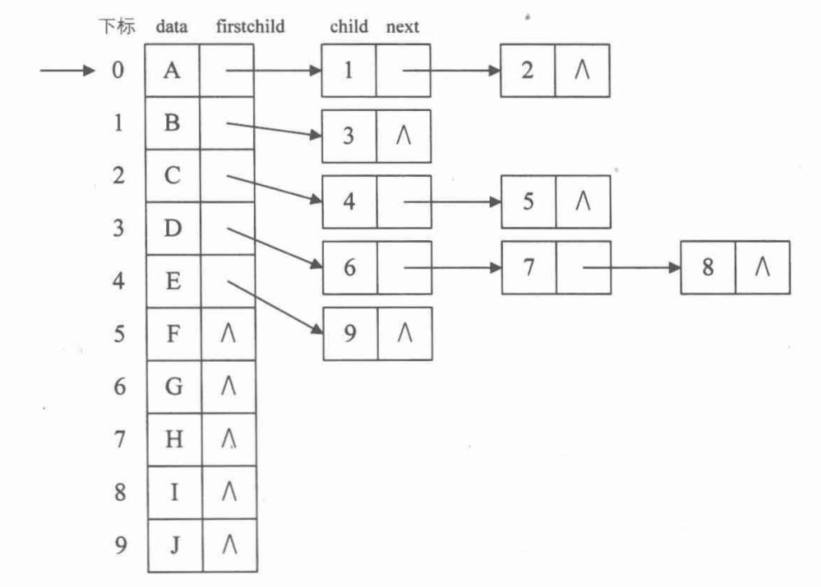
与双亲表示法相反，孩子表示法寻找孩子的操作非常方便，而寻找双亲的操作则需要遍历n个结点中孩子链表指针域所指向的n个孩子链表。

**3.【孩子兄弟表示法】**
孩子兄弟表示法也称二叉树表示法，即以二叉链表作为树的存储结构。孩子兄弟表示法使每个结点包含三部分内容：结点值、指向结点第一个孩子的指针，以及指向结点下一个兄弟的指针。
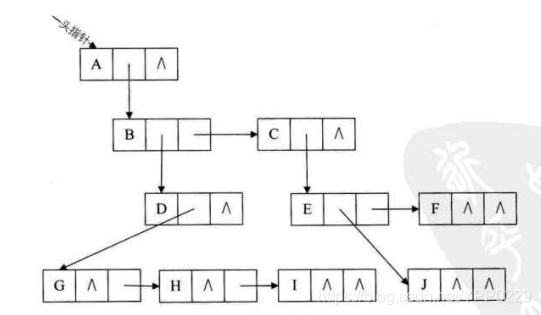

```c
typedef struct CSNode {
    ElemType data;
    struct CSNode *firstchild;   // 第一个孩子
    struct CSNode *nextbro;  // 下一个兄弟
} CSNode, *CSTree;
```

孩子兄弟表示法比较灵活，其最大的优点是可以方便地**实现树转换为二叉树的操作**，易于查找结点的孩子等，但缺点是从当前结点查找双亲结点比较麻烦。

### **与二叉树的转化 中频**

树/森林转二叉树的本质是采用“孩子-兄弟”表示法：令每个结点的左指针指向其第一个孩子，右指针指向其紧邻的下一个兄弟。具体做法是：先在同层兄弟结点之间建立兄弟连线，再只保留每个结点与其第一个孩子之间的连线，删除其余父子连线。对于森林：先分别把每棵树按上述规则转为二叉树，再以第一棵树的根结点为总根，将各棵树的根结点按兄弟关系依次相连（用右指针相连）。二叉树还原为树/森林时，按上述过程逆向恢复即可。

对于树的二叉树表示，其没有右子树的结点数量等于结点总数减去叶子结点数量再加一。

### 遍历

1. 树的遍历按根结点的访问时机分为先根遍历与后根遍历：先根遍历先访问根结点，再依次遍历各子树；后根遍历则先依次遍历各子树，最后访问根结点。
2. 森林的遍历分为先序遍历与中序遍历：先序遍历先访问第一棵树的根结点，再先序遍历该树的子树森林，最后先序遍历其余森林；中序遍历先中序遍历第一棵树的子树森林，再访问该树的根结点，最后中序遍历其余森林。

树和森林的遍历与二叉树的遍历关系如下：

|    树    |   森林   |  二叉树  |
| :------: | :------: | :------: |
| 先根遍历 | 先序遍历 | 先序遍历 |
| 后根遍历 | 中序遍历 | 中序遍历 |

## **哈夫曼树 高频**

### 定义

在许多应用中，树中结点常常被赋予一个表示某种意义的数值，称为该结点的权。从树的根到一个结点的路径长度与该结点上权值的乘积，称为该结点的带权路径长度。而树中的所有叶结点的带权路径长度之和，称为该树的带权路径长度，记为 `WPL = SUM(WiLi)`。
在含有n个带权叶结点的二叉树中，其中带权路径长度最小的树称为哈夫曼树，也称为最优二叉树。

### 构造

给定n个权值为w1,w2,w3,...,wn的结点，构造哈夫曼树的算法描述如下：

1. 将这n个结点各视为一棵单结点树，构成森林F；
2. 从F中选取权值最小的两棵树，合并为以新结点为根的二叉树，并将新根权值设为两子树根权值之和；从F中删除这两棵树，将新树加入F；
3. 重复步骤2，直至F中仅剩一棵树（即哈夫曼树）。

从上述构造过程中可以得到哈夫曼树具有以下特点：

1. 每个初始结点最终都成为叶结点，且权值越小的结点到根结点的路径长度越大。
2. 构造中共新建了n-1个结点，因此哈夫曼树的结点总数为2n-1。对于m叉哈夫曼树而言，当叶结点数量为n时，非叶结点的个数计算公式为 `(n-1)/(m-1)`。
3. 哈夫曼树中不存在度为1的结点。
4. 若有权值相同的结点，则哈夫曼树有可能不唯一。

### 哈夫曼编码

哈夫曼编码属于可变长度编码，且为前缀编码。其思想是以字符出现的频率作为结点权值，构造哈夫曼树；约定左子树记为1、右子树记为0（约定固定且全程一致即可），则从根到对应叶结点的路径标记即该字符的唯一前缀编码。

# 图

图G由顶点集V和边集构成，记为G∈(V,E)，|V|表结点数而|E|表边数。注意，图不能是空图，其顶点集V不能是空集。

## **基本概念与术语 高频**

图可按不同性质分类：

1. 按是否允许重边/自环：**简单图**（不含重边与自环）与**多重图**（允许重边，可含自环）。
2. 按边的多少：经验上以 `|E|`与 `|V|log₂|V|`的数量级比较作分界，`|E|`远小于 `|V|^2`为**稀疏图**，接近 `|V|^2`为**稠密图**。
3. 按边是否有方向：分为**有向图**与**无向图**，二者差异如下：

|          |                                                             有向图                                                             |                                             无向图                                             |
| :------: | :----------------------------------------------------------------------------------------------------------------------------: | :--------------------------------------------------------------------------------------------: |
|   定义   |                                 E为**有向边**集合，⟨v,w⟩表示一条从v指向w的有向边（弧）                                 |                          E为**无向边**集合，(v,w)表示v与w相关联                          |
|  关于度  |                          入度ID(v)：以v为终点的弧数；出度OD(v)：以v为起点的弧数；度deg(v)=ID(v)+OD(v)                          |                         度deg(v)：依附于v的边数；所有顶点度数之和等于2E                         |
|  完全图  |                                       有向完全图（无自环）共有 `n(n-1)`条弧（有向边）                                       |                           完全图（简单无向图）共有 `n(n-1)/2`条边                           |
| 关于连通 | v与w之间双向均存在有向路径则称为**强连通**；若任意两点强连通则为**强连通图**（例如n个顶点构成一条有向环仅需n条弧） | 当v到w存在路径称为**连通**；若任意两点连通则为**连通图**，连通图至少有 `n-1`条边 |
| 连通分量 |                                        **极大强连通子图**称为**强连通分量**                                        |                     **极大连通子图**称为**连通分量**（不唯一）                     |

关于路径，有以下术语：

1. 从Vp到Vq的顶点序列称为**路径**（相邻顶点对应一条边），路径上的边数称为**路径长度**；带权图中常取边权之和为路径长度。
2. 首尾顶点相同的路径称为**回路/环**；对于无向图，若 `|E| > |V| - c(G)`（c(G)为连通分量数）则必含环，特别地当 `|E| > n-1`时必有环。
3. **简单路径**：各顶点不重复；**简单回路**：除首尾顶点外其余顶点不重复。
4. **距离**：u到v的最短路径长度；若不存在，记为∞。

关于子图：若其顶点集与边集均为G的子集，则称为G的**子图**；若子图包含原图全部顶点，则称为**生成子图**。

关于树，有以下术语：

1. 连通图的**生成树**：包含图中所有顶点的极小连通子图，含 `n-1`条边。
2. 非连通图的**生成森林**：由各连通分量的生成树组成。
3. **有向树**：存在唯一入度为0的根，其余顶点入度为1的有向无环图。

## **存储方法 中频**

### 邻接矩阵法

所谓邻接矩阵存储，是指用一维数组存储顶点信息，用n×n二维数组A存储顶点间的邻接关系，该二维数组称为邻接矩阵。无向图：A[i][j]=1表示vi与vj有边，0表示无边；有向图：A[i][j]=1表示从vi到vj有弧，0表示无弧。带权图中，A[i][j]可存边权（无边处置0或∞，依实现约定）。邻接矩阵定义如下：

```c
#define MaxVertexNum 100
typedef struct{
    char vex[MaxVertexNum];
    int edge[MaxVertexNum][MaxVertexNum];
    int vexnum, arcnum;
    int kind;                   // 表示有向或无向
}MGraph;
```

图的邻接矩阵存储表示法具有以下特点：

1. 无向图的邻接矩阵一定为对称矩阵，可仅存上三角或下三角元素以节省空间。
2. 无向图中，第i行（或第i列）非零元素个数等于顶点i的度deg(vi)。
3. 有向图中，第i行非零元素个数等于出度OD(vi)，第i列非零元素个数等于入度ID(vi)。
4. 邻接矩阵便于O(1)判断两点是否相邻；但统计边数需扫描矩阵；空间复杂度为O(|V|^2)，枚举某顶点邻接点为O(|V|)，更适合稠密图。

### 邻接表法

当图较稀疏（|E|远小于|V|^2）时，邻接矩阵中大量零元素会造成空间浪费；邻接表将“顶点的顺序存储+边/弧的链式存储”结合：顶点表集中存放顶点信息及其第一条边指针，且为每个顶点建立一条边表链以串联其所有邻接边/弧。对于有向图，顶点v的邻接表通常存放以v为尾的弧（表结点记录弧的头顶点）；若采用逆邻接表，则存放以v为头的弧。
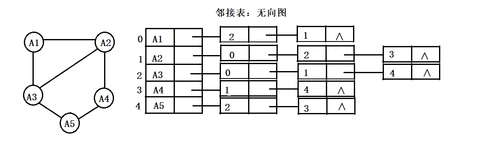
邻接表定义如下：

```c
typedef struct ArcNode{         // 边表结点
    int adjvex;
    // int weight;若边有权值
    struct ArcNode *nextarc;
}ArcNode;
typedef struct VNode{           // 顶点结点
    VertexType data;
    ArcNode *firstarc;
}VNode, AdjList[MaxVertexNum];
typedef struct{
    AdjList vertices;
    int vexnum, arcnum;
    int kind;                   // 1表有向
}ALGraph;
```

图的邻接表存储方法具有以下特点：

1. 空间复杂度：无向图需O(|V|+2|E|)（每条边对应两个边表结点），有向图需O(|V|+|E|)。总体更适合稀疏图。
2. 邻接查询：枚举顶点v的所有邻接点为O(deg(v))；但判断两点是否相邻通常需在线性扫描相应邻接表中查找，时间与度成正比（不及邻接矩阵的O(1)）。
3. 度的获取：无向图中顶点v的度等于其邻接表中的边表结点个数；有向图中，出度等于邻接表长度，入度需遍历全表或另建逆邻接表/入度数组。
4. 表示的不唯一性：相同的图其邻接表不唯一，因各边结点的链接次序可任意，通常取决于输入顺序。

### 十字链表

十字链表是有向图的链式存储结构，兼顾按出边与按入边的遍历和度数统计。其采用“顶点结点顺序表 + 弧结点链表”的组合：顶点结点包含数据data、firstout（以该顶点为弧尾的第一条弧）与firstin（以该顶点为弧头的第一条弧）；弧结点包含tailvex（弧尾）、headvex（弧头）、info，以及tlink（同弧尾的下一条弧）与hlink（同弧头的下一条弧），分别将出边链与入边链串接起来。
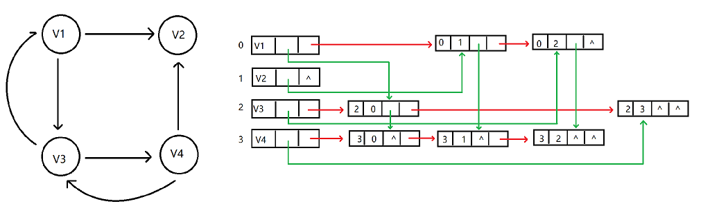

### 邻接多重表

邻接多重表是无向图的链式存储结构，便于以任一顶点为出发点枚举其所有关联边并支持度数统计。其采用“顶点结点顺序表 + 边结点链式组织”：顶点结点保存data与firstedge（依附于该顶点的第一条边）；边结点保存ivex与jvex（边的两个端点编号）、info，以及ilink与jlink，分别指向在ivex所属的边链中的下一条边与在jvex所属的边链中的下一条边。由于无向图无弧方向，边结点的i/j端点仅按约定或输入顺序确定。
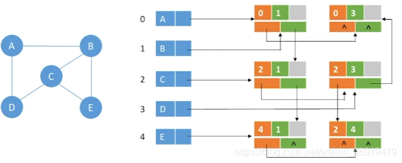

### 总结

|              |                邻接矩阵                |            邻接表            | 十字链表 | 邻接多重表 |
| :----------: | :------------------------------------: | :--------------------------: | :------: | :--------: |
|  空间复杂度  |              `O(\|V\|^2)`              |        `O(\|V\|+\|E\|)`        |          |            |
|   找相邻边   |               遍历行或列               |      遍历对应结点的边表      |          |            |
| 删除边或顶点 | 删除边方便，但删除顶点需要移动大量元素 | 无向图中删除边和顶点都不方便 |  很方便  |   很方便   |
|    适用于    |                 稠密图                 |         稀疏图和其他         | 仅有向图 |  仅无向图  |
|   表达方式   |                  唯一                  |            不唯一            |  不唯一  |   不唯一   |

需要特别说明的是，在后续多种算法的考察中，存储结构主要在邻接表和邻接矩阵之间选择。虽然邻接矩阵具有多个优点，例如便于查找入度、快速判断两个顶点间是否存在边，但由于删除边或顶点较为困难，且绝大多数算法都需要遍历所有顶点和边，因此时间复杂度通常为O(V^2)。相比之下，邻接表的时间复杂度为O(V+E)。在稀疏图为主的情况下，邻接表通常是更优的选择。

## 遍历

图的遍历是从图中某一顶点出发，按照某种搜索方式沿着图中的边对图中的所有顶点访问有且仅有一次。

### **广度优先遍历 中频**

广度优先搜索（Breadth-First-Search，BFS）类似于树的层序遍历，基本思想是：首先访问起始顶点v，接着由v出发，依次访问v的各个未访问过的邻接顶点，然后依次访问这些邻接顶点的所有未被访问过的邻接顶点。
算法的执行过程可简单概括如下：

1. 任取图中一个顶点访问，入队并将该顶点标记为已访问。
2. 当队列不空时循环执行：出队，依次检查出队顶点的所有邻接顶点，访问没有被访问过的邻接顶点并将其入队。
3. 当队列为空时跳出循环，完成广度优先遍历。

```c
bool visited[MAX_VERTEX_NUM];
SqQueue Q;
void BFS(ALGraph G, int v){
    visit(v);visited[v] = true;EnQueue(Q, v);
    while(!IsEmpty(Q)){
        DeQueue(Q, v);
        for(ArcNode *p = G.vertices[v].firstarc;p != NULL;p = p->nextarc){
            int k = p->adjvex;
            if(!visited[k]){
                visit(k);visited[k] = true;EnQueue(Q, k);
            }
        }
    }
}
void BFS_Traverse(ALGraph G){
    for(int i = 0;i < G.vexnum;i++) visited[i] = false;
    InitQueue(Q);
    for(int i = 0;i <G.vexnum;i++){
        if(!visited[i]) BFS(G, i);
    }
}
```

在手算模拟中，关于FirstNeighbor和NextNeighbor的操作需要特别注意：对于无向图和有向图，首个邻接点和下一个邻接点的确定依据是邻接矩阵或邻接表中的存储顺序，而非边的权值大小。
以邻接点A为例，若其邻接点为B、C、D，则第一个邻接点默认为B且下一个邻接点为C。

#### 广度优先生成树

在广度优先遍历的过程中，我们可以生成一棵以初始顶点为根的遍历树，称为广度优先遍历树。这棵遍历树可用于连通分量，也可以判断单源最短路径，具体实现方法将在最短路径算法部分详细说明。

### **深度优先遍历搜索 高频**

深度优先搜索（Depth-First-Search，DFS）类似于树的先序遍历，基本思想是：首先访问图中某一起始顶点v，然后由v出发，访问于v邻接且未被访问的任意一个顶点w，再访问与w1邻接且未被访问的任意顶点w2......重复上述过程，当不难再继续向下访问时，依次退回到最近被访问的顶点。

```c
bool visited[MAX_VERTEX_NUM];
void DFS(ALGraph G, int v){
    visit(v);
    visited[v] = true;
    for(ArcNode *p = G.vertices[v].firstarc;p != NULL;p = p->nextarc){
        if(!visited[p->adjvex]) DFS(G, p->adjvex);
    }
}
void DFS_Traverse(ALGraph G){
    for(int i = 0;i < G.vexnum;i++) visited[i] = false;
    for(int i = 0;i <G.vexnum;i++){
        if(!visited[i]) DFS(G, i);
    }
}
```

### 性能分析

**1.【时间复杂度分析】**
时间复杂度 = 访问各顶点所需时间 + 探索各条边所需时间

- 邻接矩阵存储结构：访问所有顶点需要 `O(|V|)`的时间，访问每个顶点的所有邻接点需要 `O(|V|)`的时间，时间复杂度为 `O(|V|^2)`。
- 邻接表存储结构：遍历会访问所有的边和顶点，时间复杂度为 `O(|V|+|E|)`。

**2.结果唯一性**
邻接矩阵唯一，广度优先遍历序列唯一；邻接表不唯一，广度优先遍历序列不唯一。

## 并查集 (Disjoint Set Union, DSU)

并查集是一种高效处理不相交集合合并与查询的数据结构，在图论（如Kruskal算法）中常作为辅助工具。它主要提供三个基本操作：

1.  **初始化 (makeSet)**: 将每个元素初始化为-个独立的集合。
2.  **查找 (findSet)**: 查找一个元素所属集合的代表（根节点）。
3.  **合并 (unionSets)**: 将两个元素所在的集合合并为一个。

通常使用一个`parent`数组来表示集合的树状结构。以下是包含核心优化（路径压缩）的简洁实现：

```c++
int parent[MAX_SIZE];
void initSet(int size) {
    for (int i = 0; i < size; i++) parent[i] = i;
}
int findSet(int x) {
    if (parent[x] != x) parent[x] = findSet(parent[x]);
    return parent[x];
}
void unionSets(int x, int y) {
    int rootX = findSet(x);
    int rootY = findSet(y);
    if (rootX != rootY) {
        parent[rootX] = rootY;
    }
}
```

## 最小生成树

**连通图**的生成树（有向图的生成树有向，无向图的生成树无向）是包含所有顶点的极小连通子图，而生成树中权值之和最小的那棵树称为G的最小生成树，其具有如下性质：

1. 在带权的连通图中，当任意一个环都不存在权值相同的边时，其最小生成树唯一。
2. 最小生成树不唯一，但其权值之和是唯一且最小的。
3. 最小生成树的边数为顶点数减一，表示为 `|E| = |V| - 1`。

### **Prim算法 中频**

Prim算法是求解最小生成树的经典算法，基本思想是：从图中任选一个顶点作为起始点，然后逐步扩展当前树，每次选择与当前树相邻的权值最小的边，将对应的顶点加入到树中，直到所有顶点都被包含进来。
算法的执行过程可简单概括如下：

1. 任选图中一个顶点加入生成树，并将其标记为已加入树的顶点。
2. 当树中顶点数少于总顶点数时循环执行：在所有连接树内顶点与树外顶点的边中，选择权值最小的边，将该边及其树外端点加入生成树。
3. 当生成树包含所有顶点时算法结束，得到最小生成树。
   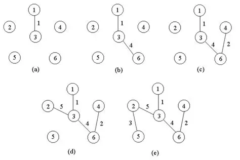
   Prim算法的时间复杂度为 `O(|V|^2)`，不依赖于|E|，因此它适用于求解边稠密的图的最小生成树。

### **Kruskal算法 中频**

Kruskal算法是求解最小生成树的经典算法，基本思想是：按边的权值由小到大逐条选择，在不形成回路的前提下将边加入生成森林，直至选出 `|V|-1`条边构成生成树。
算法的执行过程可简单概括如下：

1. 将图中所有边按权值从小到大排序（可用排序或小根堆维护）。
2. 按权值从小到大依次扫描各边：若当前边的两个端点分属不同连通分量，则将该边加入生成森林并合并这两个分量（通常用并查集实现）；否则跳过该边。
3. 当已选边数达到 `|V|-1`或边扫描完毕时算法结束，得到最小生成树。
   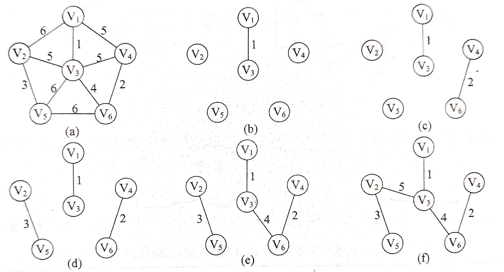
   Kruskal算法的时间复杂度为 `O(|E|log₂|E|)`（主要来自边排序与并查集的合并/查找），因此更适用于边稀疏的图。

## 最短路径

在带权图中，从顶点v到任一顶点vi的一条路径，其经过边的权值之和称为该路径的带权路径长度；在所有可达路径中带权路径长度最小者称为最短路径。最短路径问题通常分为：单源最短路径与各点最短路径。

### 单源最短路径

给定某一顶点，求图中该顶点到其他各顶点的最短路径。

#### **Dijkstra算法 中频**

该算法采用**贪心策略**，维护三组信息：**final[i]**（是否已确定从源点s到顶点i的最短路径）、**dist[i]**（当前已知从s到i的最短距离，若不可达记为∞）、**path[i]**（最短路径中i的前驱，用于回溯得到完整路径）。
算法的执行过程可简单概括如下：

1. **初始化**：令 `final[s]=true`，其余final值为false；对所有顶点i，设置 `dist[i]=w(s,i)`（无边则为 ∞）。
2. **选择**：在 `final=false`的顶点中，选取**dist**值最小的顶点u，置 `final[u]=true`。
3. **更新**：对每个 `final=false`的顶点v，若 `dist[u] + w(u,v) < dist[v]`，则更新dist[v]。
4. **重复**：重复步骤2–3，直到所有顶点final=true或不存在可改进的顶点。
   **时间复杂度**：朴素实现为 `O(|V|^2)`（与采用邻接矩阵/邻接表无关，因每轮都需在所有未确定顶点中取最小 dist）
   **注意**：存在**负权边**时该算法不适用。

**【图表过程】**

| 终点 |    第一轮    |      第二轮      | 第i轮 |
| :--: | :----------: | :--------------: | :---: |
|  V1  | 13, <V0, V1> |   13, <V0, V1>   |      |
|  V2  | 8, <V0, V2> |   8, <V0, V2>   |      |
|  V3  |      ∞      | 13, <V0, V1, V2> |      |
|  V4  | 30, <V0, V4> |   30, <V0, V4>   |      |
|  V5  |      ∞      |        ∞        |      |
| ... |              |                  |      |
|  S  |   {V0, V2}   |   {V0, V1, V2}   |      |

#### BFS算法

广度优先遍历也可以用于单源最短路径，但仅适用于无权或等权图。基于BFS的层次性：先将dist初始化为∞，设置源点s的dist[s]=0；在遍历过程中，每当首次发现一个未访问的顶点，就令其 `dist=前驱的dist+1`，并将其入队。更改的部分代码如下：

```c
for (w = FirstNeighbor(G, v); w >= 0 && w < G.vexnum; w = NextNeighbor(G, v, w)) {
    if (!visited[w]) {
        visited[w] = true;
        dist[w] = dist[v] + 1;
        EnQueue(Q, w);
    }
}
```

### Floyd算法

Floyd算法用于求解各点对最短路径，本质是基于邻接矩阵的动态规划：依次以顶点v_k作为可能的中转点，对所有(i,j)进行松弛更新，逐步得到更优的最短路矩阵。其n阶方阵序列的递推为：

$$
\begin{aligned}
&\text{设 } D^{(0)} = W,\quad W[i][j] = \begin{cases}
0, & i=j\\
w(i,j), & (i,j)\in E\\
-1, & \text{否则}
\end{cases} \\[6pt]
&\text{对 } k=1,2,\ldots,n,\quad
D^{(k)}[i][j] = \min\!\big(D^{(k-1)}[i][j],\; D^{(k-1)}[i][k] + D^{(k-1)}[k][j]\big)
\end{aligned}
$$

其中 `A^(k)[i][j]`表示从顶点vi到vj，中间顶点的序号数量不大于k的最短路径的长度。该算法的时间复杂度为 `O(|V|^3)`，对于中等规模的输入还是相当有效的。需要注意的是，**该算法允许图中有负权值的边，但不允许包含总权值为负的环**。

#### 例题

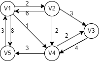

设顶点顺序为 V1、V2、V3、V4、V5。根据图中边权，Floyd 算法得到的各阶段最短路矩阵（用 ∞ 表示不可达）如下：

$$
D^{(0)} = \begin{bmatrix}
0 & 2 & \infty & 1 & 8 \\
6 & 0 & 3 & 2 & \infty \\
\infty & \infty & 0 & 4 & \infty \\
\infty & \infty & 2 & 0 & 3 \\
3 & \infty & \infty & \infty & 0
\end{bmatrix}
$$

$$
D^{(1)} = \begin{bmatrix}
0 & 2 & \infty & 1 & 8 \\
6 & 0 & 3 & 2 & 14 \\
\infty & \infty & 0 & 4 & \infty \\
\infty & \infty & 2 & 0 & 3 \\
3 & 5 & \infty & 4 & 0
\end{bmatrix}
$$

$$
D^{(2)} = \begin{bmatrix}
0 & 2 & 5 & 1 & 8 \\
6 & 0 & 3 & 2 & 14 \\
\infty & \infty & 0 & 4 & \infty \\
\infty & \infty & 2 & 0 & 3 \\
3 & 5 & 8 & 4 & 0
\end{bmatrix}
$$

$$
D^{(3)} = \begin{bmatrix}
0 & 2 & 5 & 1 & 8 \\
6 & 0 & 3 & 2 & 14 \\
\infty & \infty & 0 & 4 & \infty \\
\infty & \infty & 2 & 0 & 3 \\
3 & 5 & 8 & 4 & 0
\end{bmatrix}
$$

注：D^(1) 为以 V1 为中转点的更新结果，D^(2) 为以 V2 为中转点的更新结果，D^(3) 为以 V3 为中转点的更新结果。


### 总结

|                |    BFS算法    |  Kruskal算法  |       Floyd算法       |
| :------------: | :------------: | :------------: | :--------------------: |
|      用途      | 求单源最短路径 | 求单源最短路径 | 求各顶点之间的最短路径 |
|     无权图     |      适用      |      适用      |          适用          |
|     带权图     |     不适用     |      适用      |          适用          |
|  带负权值的图  |     不适用     |     不适用     |          适用          |
| 带负权回路的图 |     不适用     |     不适用     |         不适用         |
|   时间复杂度   |`O(|V^2)`     |  `O(|V|^2)`   |      `O(|V|^3)`       |

## **拓扑排序 高频**

**AOV网**：若用有向无环图表示一个工程，其顶点表示活动，用有向边<Vi, Vj>表示活动Vi必须先于活动Vj进行的这样一种关系，则将这种有向图称为**顶点表示活动的网络**，简称AOV网。
拓扑排序是对AOV网的顶点的一种排序，它使得若存在一条从顶点A到顶点B的路径，则在排序中B出现在A的后面。每个AOV网络都有一个或多个拓扑排序序列。
求解拓扑排序序列的基本思想如下（Kahn入度法，适用于有向无环图AOV 网）：

1. 计算所有顶点的入度，并将所有入度为0的顶点入队（或入栈）。
2. 当队列不空时循环：弹出一个入度为0的顶点并输出到拓扑序列；对该顶点的每条出边(u→v)，将v的入度减1，若v的入度减为0，则将v入队。
3. 结束判定：若最终输出的顶点数小于|V|，说明仍有顶点入度不为 0，图中必存在环（拓扑排序失败）。

时间复杂度：邻接表为 `O(|V|+|E|)`，邻接矩阵为 `O(|V|^2)`。
结果唯一性：当算法的每一步中入度为 0 的候选顶点始终唯一时，拓扑序唯一；若某一步存在多个候选，则拓扑序不唯一。
矩阵判定关系：有向图为 DAG 当且仅当存在某种顶点重排使其邻接矩阵成为严格上三角矩阵；若在当前顶点顺序下邻接矩阵已为上三角，则该顺序即为一个拓扑序。

## **关键路径**

在带权有向图中，以顶点表示事件，以有向边表示活动，以边上的权值表示完成该活动的开销（如完成活动所需的时间），称之为**用边表示活动的网络**，简称AOE网。其具备以下两个性质：

1. 只有在某顶点所代表的事件发生后，从该顶点出发的各有向边所代表的活动才能开始；
2. 只有在进入某顶点的各有向边所代表的活动都已结束时，该顶点所代表的事件才能发生。
在AOE网中仅有一个入度为0的顶点和出度为0的顶点，称为开始顶点（源点）和结束顶点（汇点），求关键路径即为求AOE网从源点到汇点的最长路径。

### 算法理解

    由于一些定义和算法比较抽象，这里继续用“做菜”的类比来帮助理解。把做一道菜的流程看作一张 AOE 网：包含买菜、洗菜、切菜、烧菜等步骤，且部分步骤存在先后依赖。实际操作中可以通过“并行/穿插”降低总耗时，比如在烧水的同时去洗菜、切菜。求解关键路径，本质是在求完成该工程的最短总时间，以及那些一旦被延迟就会必然拉长总时间的关键活动（这些活动构成关键路径）。
    围绕这个目标，有两个核心概念：最早开始时间（ES）与最晚开始时间（LS）。若某活动的 ES 与 LS 相等（等价于总时差为 0），则该活动为关键活动；由关键活动连接而成的路径，即为关键路径。
    ES 的直观含义是：若工程立刻开工，在其所有前序条件都满足的最早时刻，该事件/活动最早何时能开始。LS 则是在不推迟工程最早完工时间的前提下，该事件/活动最晚可以推迟到何时开始。通常先“自前向后”计算最早时间，再“自后向前”反推最晚时间：终点（完工事件）的最晚时间等于其最早时间；对某个事件，其最晚时间等于所有后继事件的最晚时间减去相应活动持续时间的最小值。
    继续用做菜来说明：当你买完菜、洗完菜后，可以开始切菜，或去执行烧水/热油等步骤。若烧水需 5 分钟，而切菜只需 2 分钟，那么切菜可在洗完菜后的 0～3 分钟区间开始：0 分钟是最早开始，3 分钟是最晚开始。只要在该区间内开始切菜，总工期不会改变；但若延迟开始烧水，总工期就会被拉长。在这个场景下，切菜在其浮动时间内如何安排都不影响总耗时，因此不是关键活动；一旦切菜耗时超过 5 分钟，它就会转为关键活动，“烧水”反而可能不再关键。现实中，像买菜、烧菜这类约束链条较长或耗时较久的步骤，往往更容易成为关键活动。

### 重要定义

**【1.事件vk的最早发生时间Ve(k)】**
指从源点到顶点vk的最长路径长度（从满足所有前驱事件都完成），事件vk的最早发生时间决定了所有从vk开始的活动能够开工的最早时间。递推关系如下：

$$
Ve(\text{源点}) = 0;
Ve(k) = \max\{\,Ve(j) + Weight(vj, vk)\,\},\ \ vk为vj的任意后继
$$

**【2.活动ai的最早开始时间e(i)】**
指该活动弧的起点所表示的时间的最早发生时间。
**【3.活动ai的最晚开始时间l(i)】**
指该活动弧的终点所表示事件的最迟发生时间与该活动所需时间之差。若边<vk,vj>表示活动ai，则有 `l(i)=Vl(j)-Weight(vk,vj)`。
**【4.事件vk的最晚发生时间Vl(k)】**
指在不推迟整个过程完成的前提下，即保证它的后继事件vj在其最迟发生时间Vl(j)能够发生时，该事件最迟必须发生的时间。递推关系如下：

$$
Vl(\text{汇点}) = Ve(\text{汇点});
Vl(k) = \min\{\, Vl(j) - Weight(vk, vj) \,\},\ \ vj\ \text{为}\ vk\ \text{的任意后继}
$$

**【5.活动ai的差额d(i)】**
指该活动完成的时间余量，若为零则该活动ai为关键活动。

### 手算过程

从源点出发，按照活动（边）的权值顺序计算各事件（顶点）的最早开始时间，直至到达汇点；将汇点的最晚开始时间设为其最早开始时间，然后从汇点向源点反向计算各活动的最晚发生时间及对应事件的最晚开始时间；通过比较各活动的最早与最晚发生时间，找出时间差为零的关键活动；将这些关键活动组合（可能存在多条路径），形成关键路径并确定最短工期，完成算法流程。
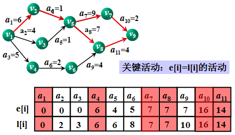

### 相关分析

- 关键路径上的所有活动都是关键活动，它是决定整个工程的关键因素，因此可以通过加快关键活动来缩短整个工程的工期。但也不能任意缩短关键活动，因为一旦缩短到一定的程度，该关键活动就可能不再关键（烧水与切菜）。
- 网中的关键路径并不唯一，且对于有几条关键路径的网，只提高一条关键路径上的关键活动速度并不能缩短整个工程的工期，只有加快包含在所有关键路径上的关键活动才能达到缩短工期的目的。
  具体做法是确定一个关键活动集合，要求该集合满足以下条件：

1. 所有关键路径都必须包含该集合中的至少一个活动
2. 通过缩短该集合中活动的持续时间，能够有效优化整体项目进度
   该集合应包含最少数量的关键活动，同时确保对项目总工期产生最大影响。

## 采用不同存储结构时各种图算法的时间复杂度

|          | Dijkstra | Floyd |  Prim  |  Kruskal  |  DFS  |  BFS  | 拓扑排序 | 关键路径 |
| :------: | :------: | :----: | :----: | :--------: | :----: | :----: | :------: | :------: |
| 邻接矩阵 |  O(n^2)  | O(n^3) | O(n^2) |     ~     | O(n^2) | O(n^2) |  O(n^2)  |  O(n^2)  |
|  邻接表  |    ~    |   ~   |   ~   | O(elog₂e) | O(n+e) | O(n+e) |  O(n+e)  |  O(n+e)  |

# 查找

## 概念与ASL公式

1. **查找**。在数据集合中寻找满足某种条件的数据元素的过程称为查找。查找的结果一般分为两种：一是查找成功，即在数据集合中找到了满足条件的数据元素；二是查找失败。
2. 查找表：用于查找的数据集合称为查找表，它由同一类型的数据元素组成。对查找表的常见操作有：①查询符合条件的数据元素；②插入、删除数据元素。
3. 静态查找表。若一个查找表的操作只涉及查找操作，则无须动态地修改查找表，此类查找表称为静态查找表。与此对应，需要动态地插入或删除的查找表称为动态查找表。适合静态查找表的查找方法有顺序查找、折半查找和散列查找等；适合动态查找表的查找方法有二叉排序树的查找、散列查找等。
4. **关键字**：数据元素中唯一标识该元素的某个数据项的值，使用基于关键字的查找，查找的结果是唯一的。
5. **平均查找长度**：在查找过程中，一次查找的长度是指**需要比较的关键字次数**，而平均查找长度则是所有查找过程中进行关键字的比较次数的平均值，其数学定义为：

$$
\mathrm{ASL} = \sum_{i=1}^{n} p_i \cdot C_i
$$

其中Pi是查找第i个数据元素的概率，Ci是找到第i个数据元素所需进行的比较次数。

## 顺序查找

顺序查找也称线性查找，它对顺序表和链表都是适用的。

### 一般线性表的顺序查找

作为一种最直观的查找方法，其基本思想：①从线性表的一端开始，逐个检查关键字是否满足给定的条件；②若查找到某个元素的关键字满足给定条件，则查找成功，返回该元素在线性表中的位置；③若已经查找到表的另一端，还没有找到符合给定条件的元素，则返回查找失败的信息。

```c
typedef struct{
    ElemType *data;
    int TableLen;
}SSTable;
// 使用哨兵
int Search_Seq(SSTable ST, ElemType key){
    ST.data[0] = key;                            // 牺牲一位作为哨兵
    int i;
    for(i = ST.TableLen;ST.data[i] != key;i--)
    return i;
}
// 常规
int Search_Seq(SSTable ST, ElemType key){
    for(int i = 0;i < ST.TableLen;i++){
        if (ST.data[i] == key) return i;
    }
    return -1;
}
```

在查找成功时：对处于第i个位置的元素，带哨兵需比较 `n−i+1`次，常规需比较i次。若各元素查找概率相等p_i=1/n，则成功的平均查找长度ASL=(n+1)/2。查找不成功时：带哨兵 ASL=n+1，常规ASL=n。

### 有序线性表的顺序查找

若顺序表按关键字非降序已排序，则顺序查找可在“失败”时**提前停止**：从左向右比较，一旦发现存在i使得key介于a[i]与a[i+1]之间（即 `a[i]<key<a[i+1]`），即可判定查找失败，无需扫描到表尾。该优化仅影响“失败”时的ASL：失败共有n+1种位置，其中比较次数依次为 1,2,…,n,n（最后两种均需比较 n 次），因此 `ASL(失败) = (1+2+…+n+n)/(n+1)  n/2 + n/(n+1)`。

### **折半查找 高频**

折半查找也称二分查找，它仅适用于有序的顺序表。折半查找的基本思想是：①首先给定值key与表中中间位置的元素比较，若相等，则查找成功，返回该元素的存储位置；②若不等，则所需查找的元素只用在中间元素以外的前半部分和后半部分进行查找；③在缩小的区域内查找，重复上述步骤，直至找到该元素或缩小的区域为空。

```c
int BinSearch(int A[], int low, int high, int key){
    int mid;
    while(low <= high){
        mid = (low + high) / 2;
        if(key == A[mid]) return mid + 1;
        else if(key < A[mid]) high = mid - 1;
        else low = mid + 1;
    }
    return 0;
}
```

#### 判定树

折半查找可用判定二叉树表示：内结点对应被比较的元素，叶结点对应查找失败的位置。若中点取下取整，则右子树的高度和结点个数≥左子树；若取上取整，则左子树的高度和节点个数≥右子树。查找成功的比较次数等于从根到目标结点的路径结点数。因此，平均查找长度（成功）约为 `log₂(n+1)−1`，时间复杂度为O(log₂n)。
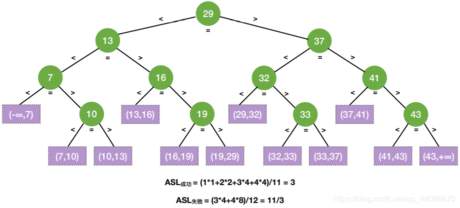
平均查找长度是指查找过程中元素的平均比较次数。每次比较包括对两个元素进行等于、大于或小于的判断，均计为一次比较。以判定树为例，虽然查询失败的节点位于查找成功的节点下方，但其比较次数与父节点相同。例如，查找元素10成功需要进行4次比较，而失败的区间（7,10）和（10,13）同样需要4次比较。在计算平均查找长度时，必须注意这一关键点。

## 分块查找

分块查找也称索引顺序查找，它吸取了顺序查找和折半查找各自的优点，既有动态结果，又适用于快速查找。
分块查找的基本思想是块内可无序、块间必须有序；将各块的块头组成有序索引表，先在索引表中查找(可用折半或顺序)，定位到目标块后在块内做顺序查找。平均查找长度由“索引查找+块内查找”共同决定，取决于分块策略。常取等长分块：长度为n的查找表均分为b块、每块s个(n=bs)。若索引表与块内均用顺序查找，则 `ASL = (b + 1) / 2 + (s + 1) / 2`，当 `b=s`时ASL最小为 `√n + 1`。注意：该最小值为理论值，需n可整分；失败ASL较复杂，此处不作计算。
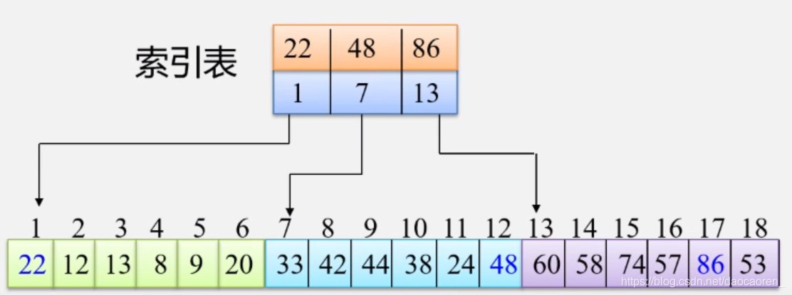

## 树形查找

### **二叉排序树BST 高频**

构造一棵二叉排序树的目的并不是排序，而是提高查找、插入和删除关键字的速度，二叉排序树这种非线性结构也有利于插入和删除的实现。

#### 查找

二叉排序树的查找过程：

1. 将给定值与根结点的关键字比较，若相等，则查找成功。
2. 当根结点的关键字小于给定关键字时，在根的左子树中寻找。
3. 否则在根的右子树中寻找。

```c
BSTNode *BST_Search(BiTree T, int key){
    while(T != NULL && key != T->key){
        if (key < T->key) T = T->lchild;
        else T = T->rchild;
    }
    return T;
}
```

**【查找效率分析】**
二叉排序树的查找效率，主要取决于树的高度和树的形状，若树是平衡的，是最好的情况，查找效率为O(log₂n)；若树中全部的结点要么没有孩子，要么只有左孩子或右孩子，这是最差的情况，查找效率为O(n)。

#### 插入

二叉树的插入实际是在查找失败的结点进行插入，过程如下：

1. 若原二叉树为空，则直接插入结点。
2. 若关键字小于根结点关键字，则插入到左子树中。
3. 若关键字大于根结点关键字，则插入到右子树中。

```c
int BST_Insert(BiTree &T, int key){
    if(T == NULL){
        T = (BSTNode *)malloc(sizeof(BSTNode));
        T->key = key;
        T->lchild = NULL;
        T->rchild = NULL;
        return 1;
    }
    if(T->key == key) return 0;
    if(key < T->key) return BST_Insert(T->lchild, key);
    else return BST_Insert(T->rchild, key);
}
```

#### 删除

在二叉排序树中删除结点必须保持中序有序性，通常分三类处理：

1) 叶结点：直接删除并更新父指针；
2) 仅有一棵子树：用其唯一子树(左或右)上移替换该结点；
3) 有两棵子树：用其**中序前驱或中序后继**的关键字替换该结点，再到相应子树中删除该前驱/后继结点，问题转化为1或2。

#### 特点

- 二叉排序树的构造是按关键字顺序依次插入结点；
- 其中序遍历序列为递增序列(无重复关键字时为严格递增)；
- 删除后再插入同一关键字，树形未必相同：①若删除的是叶结点，重新插入将沿原路径回到原位置，树形相同；②若删除结点有1或2棵子树时，结构已被重接，重新插入通常成为某子树的新叶，树形一般不同。但无论结构是否变化，其中序序列保持不变，且新插入的结点一定为叶结点。

### **平衡二叉树AVL 高频**

为了解决BST树因树形差导致树高增长过快、增删查性能下降的问题，AVL树约束任意结点的左子树与右子树高度差的绝对值≤1。对某个结点而言，其左右子树高度差的绝对值称为该结点的平衡因子，因此AVL树中任意结点的平衡因子≤1。
在AVL树中，当层数固定时：

1. 结点数量最多的情况对应满二叉树结构

2. 结点数量最少的情况遵循递推公式：
$$
a_n=
\begin{cases}
n, & n\le 2,\\
a_{n-1}+a_{n-2}, & n>2.
\end{cases}
$$

#### **插入**

AVL树的插入初始步骤与BST树一致；若插入后未失衡，无需处理。一旦失衡，自下而上在插入路径上找到第一个平衡因子绝对值>1的结点A(最小调整子树)，随后仅围绕这棵子树做调整。为便于手算，记B为A在插入路径上的子结点(插入结点落在B所代表的子树中)，C为B在插入路径上的子结点。根据B与C相对A的方向，仅有两类：

- 同向(LL或RR)：单旋(右旋或左旋)。做法可直观理解为“让B上位当根”：B成为最小调整子树的新根，A成为B除C所在侧之外的另一个孩子；同时把B原先指向A一侧的子树回挂给A。
  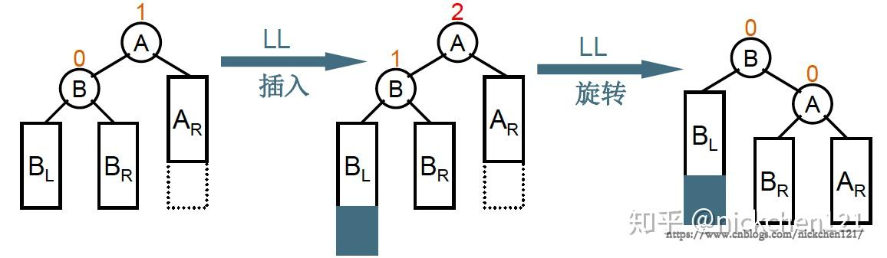
- 反向(LR或RL)：双旋(先右再左旋或先左再右旋)。做法可直观理解为“让C上位当根”：C成为最小调整子树的新根，A与B作为C的两个孩子；C的两侧子树分别回挂给B与A。
  以上按该思路手算即可，无需背公式化指针操作。
  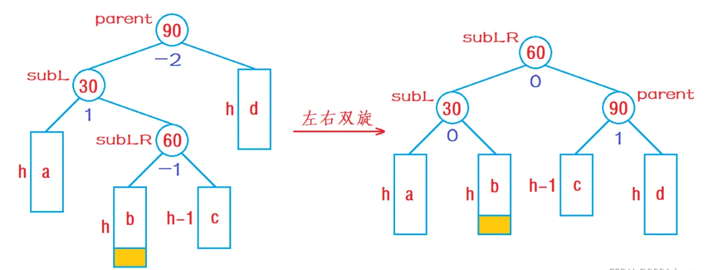

#### **删除**

删除也要维持AVL树的平衡。删除后同样自下而上定位到最小调整子树A；此时沿“更高的一侧”依次确定B与C(先在A中选更高子树B，再在B中顺着更高方向选C)，然后套用与插入对应的单旋/双旋进行调整。区别在于：**删除的失衡可能在一次调整后继续向上传播**，因此需持续向上检查并按上述规则在每个失衡处做相应旋转，直到整体恢复平衡或到达根结点为止。

此外，针对题目常见的“在AVL树中删除某结点后又插入该结点”的情形，有如下结论：
- 树的高度可能变化，也可能保持不变；
- 无论该结点为叶结点或非叶结点，树的结构可能改变，也可能保持不变。

#### 查找分析

在AVL树上进行的查找过程与BST树相同，因此在查找过程中，进行关键字的比较次数不超过树的深度，因此含有n个结点的AVL树的最大深度为O(log₂n)，因此平均查找效率为O(log₂n)。

### **B树 中频**

m阶B树是一类多路平衡查找树（所有叶结点位于同一层），每个结点内关键字按从小到大有序，并将子指针划分为有序区间。形式化地，一棵m阶B树或为空树，或满足下列特征：

1. 每个结点至多有m棵子树，因而至多含有m-1个关键字。
2. 若根结点不是叶结点，则至少有2棵子树；若整棵树只有根一个结点，其关键字个数可在[1, m-1]内（空树除外）。
3. 除根结点外的所有非叶结点至少有⌈m/2⌉棵子树，因而至少含有**⌈m/2⌉-1**个关键字。
4. 结点内关键字按从小到大有序排列。若某结点有k个关键字 `K1<K2<…<Kk`，则它有k+1个子树指针 `P0,P1,…,Pk`，且满足：P0中的所有关键字<K1；对1≤i≤k-1，Pi中的所有关键字∈(Ki,Ki+1)；Pk中的所有关键字>Kk。也就是：k个关键字把指针划分为k+1个“区间”。
5. 所有终端结点都在同一层。终端结点同样存放关键字（孩子指针为空）；查找失败发生在终端结点指针域对应的叶子结点位置。
   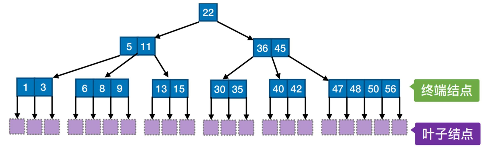

#### 查找关键字

可以把B树的查找理解为“多级分块+块内定位”的过程：

- 在当前结点内先定位关键字的相对位置（因为结点内有序，可顺序或二分查找）。
- 若命中则成功返回；若未命中，则根据关键字落在哪个区间，沿对应子指针下移到下一层结点。
- 重复上述过程，直到某一层命中，或在叶结点处确定失败（对应区间没有更深的孩子）。

#### 树的高度

为避免歧义，约定：根所在层记为第1层，高度h表示从根到叶的层数。

- 在“尽量满”的情况下（每个内部结点有m个孩子、每个结点含m-1个关键字），第i层结点数为m^(i-1)。此时关键字总数最大为(m^h-1)，于是n≤m^h-1，得到最小高度为h_min=⌈log_m(n+1)⌉。
- 在“尽量瘦”的情况下（根至少2个孩子，其余内部结点至少⌈m/2⌉个孩子），记t=⌈m/2⌉，可得关键字总数下界n≥2·t^(h-1)（h≥1）。因此高度上界约为h_max≈⌊log_t((n+1)/2)⌋。
  直观理解：m越大或结点越“满”，树越矮；反之，分支度越小，树越高。

#### **插入关键字**

插入分两步：

1) 查找：定位应插入到的终端结点的对应区间；
2) 插入与可能的分裂：将关键字按序插入该结点；若插入后关键字个数>m−1，则对该结点“按中位”分裂：取中间位置`i=⌈m/2⌉（**向上取整**）关键字上升到父结点，左右部分分别形成两个结点（相应子指针随之分配）；若父结点因此溢出，则向上级联分裂，必要时根也会分裂并生成新根，使树高+1。
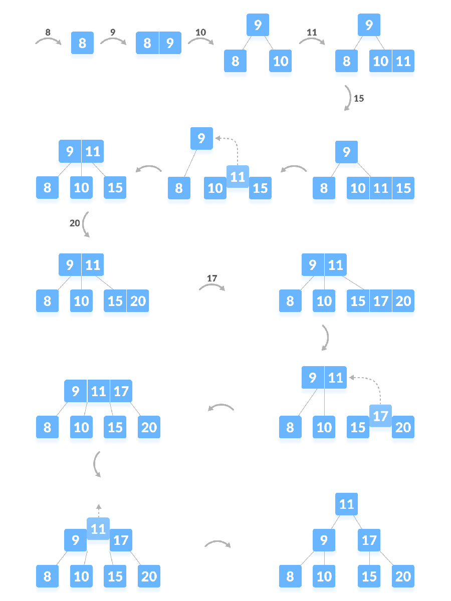

#### **删除关键字**

若删除位置在内部结点，先用其前驱或后继关键字替换之，再转化为在叶结点中删除。

- 若删除后该结点的关键字个数仍≥t-1（t=⌈m/2⌉），结构未被破坏，直接删除即可。
- 当删除关键字后，该结点的关键字个数小于[m/2]-1，破坏了B树的结构约束，此时根据相邻兄弟是否“够借”进行分类处理：
  1. 兄弟够借：存在相邻兄弟的关键字个数≥[m/2]，即可借出一个给当前结点。书面表述为：将兄弟结点中最接近当前结点一侧的关键字，上移替换父结点中夹在两者之间的分隔关键字；同时把该分隔关键字下降加入到当前结点，使其关键字数+1。
  2. 兄弟不够借：若所有相邻兄弟的关键字个数均<[m/2]，则需合并。将父结点中夹在两者之间的分隔关键字下降，与当前结点和该兄弟一起合并为一个结点。需要注意：本质上这是“父结点借出一个关键字”，父结点关键字数会减少，若因此违规，**则对父结点递归做同样处理（哪怕父结点为空），直至满足B树约束或回退到根（根若变空，则将其唯一孩子上移为新根，树高-1）**。
     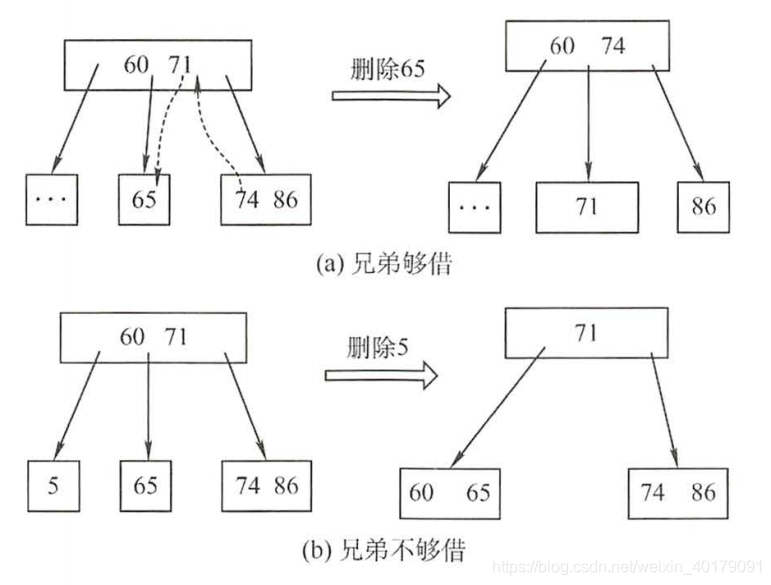
     图中示例仅展示了叶结点删除。与插入不同，删除也可能发生在非终端结点：按上述规则处理后，通常会引起父结点及其相邻子结点三处的关键字与分隔区间调整，相应子树的区间边界也随之重划。做题时抓住一点：元素集合未变，变化的是区间边界；只需依据更新后的区间，重新匹配各子树中的关键字范围即可。

#### B+树

B+树在结构上与B树相近，但更偏向“索引-数据分离”的组织：非叶结点只存索引信息（不直接存放记录），叶结点包含全部关键字及其记录指针，且所有叶结点通过链指针顺序相连，天然支持范围与顺序查找；结点内关键字个数与子树个数一致，便于块级顺序访问和磁盘I/O优化。
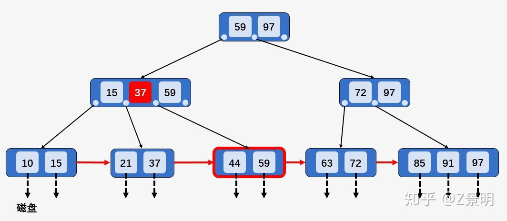

|            |                     m阶B树                     |                    m阶B+树                    |
| :---------: | :--------------------------------------------: | :--------------------------------------------: |
|    类比    |                   m阶查找树                   |                  多级分块查找                  |
| key与分孩子 |              n个key对应n+1个孩子              |               n个key对应n个孩子               |
|  结点信息  |           所有结点中都包含记录的信息           |  只有最下层的叶子结点才包含信息，其他只是索引  |
|    查找    | 不支持顺序查找，比较次数不固定，查询速度不稳定 | 支持顺序查找，比较次数固定为树高，查询速度稳定 |

## **散列查找 高频**

散列查找利用散列函数将关键字映射到表中地址，记为 `Hash(key)=Addr`。散列函数可能把两个或以上不同关键字映射到同一地址，称为**冲突**；这些发生冲突的不同关键字互为同义词。理想状态下，查找时间复杂度为O(1)，与表中记录个数无关。

### 构造方法

1. 直接定址法
   直接取关键字的某个线性函数值为散列地址，`H(key)=a*key+b`。当关键字集合较小且分布连续时可做到近似无冲突；若关键字分布稀疏或不连续，会出现大量空位，造成空间浪费。
2. ***除留余数法***
   假定散列表表长为m，取一个不大于m且接近m的质数p以减少冲突，令 `H(key)=key%p`。
3. 数字分析法
   对r进制关键字，各数码在各位上的出现频率可能不同，应选取分布较均匀的若干位作为散列地址。例如手机号，前几位在固定地区与运营商下基本固定，常选后四位。
4. 平方取中法
   取关键字平方值的中间若干位作为散列地址，具体取哪段及位数视数据分布而定。

### 处理冲突的方法

任何散列函数都无法绝对避免冲突，必须考虑冲突发生时如何处理，即为冲突关键字寻找下一个有效地址。记处理冲突时第i次探测得到的地址为Hi。

#### 开放定址法

表中可用空位对所有关键字开放，递推公式 `Hi=(H(key)+di)%m`，其中di为增量序列，常见取法：

- **线性探测法**：di为自然数序列0,1,2,3,...。冲突时依次检查下一个单元，直到找到空位；能遍历表中所有位置，但易产生主聚集，降低查找效率。
- **平方/二次探测法**：di=±1,±4,±9,...,±k^2(通常k≤m/2)。可缓解主聚集，但一般只能覆盖表中约一半单元；当m满足4k+3且为质数时，理论上可探测到所有单元。
- **双散列法**：采用第二个散列函数作增量，`Hi=(H(key)+i*Hash2(key))%m`，能有效降低聚集。
- 伪随机序列法：di取伪随机序列，进一步打散探测路径；为保证可复现性需固定随机种子。

**注意：开放定址法中元素不能随意物理删除，否则会截断同义词查找路径。一般采用逻辑删除标记，而在查找时，若查找位是删除标记时，应继续向前寻找。**因此多次删除会导致“墓碑”增多，不适合频繁删除的场景。

#### 拉链法

对于不同的关键字可能会通过散列函数映射到同一地址，为了避免非同义词发生冲突，可以把所有的同义词存储在一个线性链表中，这个线性链表由其散列地址唯一标识，该方法适合经常进行插入和删除的情况。

### 查找与性能分析

考试常给定元素序列与散列函数，要求计算平均ASL(各元素等概率)。散列表的查询与构造过程基本一致，可按如下查询逻辑理解：

1. 计算Addr=Hash(key)，检查该地址是否有记录；若无则失败返回；若有则比较关键字，若相同则成功，否则转步骤2。
2. 按指定的处理冲突规则计算下一个探测地址，回到步骤1。

**成功ASL**：构造完成后统计每个元素查找的比较次数，求平均即可。
**失败ASL**：假定**初始散列地址**等概率出现，若除留余数采用模m，则初始地址数为m。自每个初始地址出发，沿探测序列直到明确失败为止，包括遇空位（也算一次）或绕回初始地址仍未命中，将比较次数求和再除以m。
**【影响散列表查找的因素】**
直接影响查找效率的有三点：散列函数、处理冲突的方法以及装填因子α。其中装填因子定义为 `α=n/m(记录数/表长)`。不要将n或m单独视为影响因素，真正起作用的是它们共同决定的α(在给定散列函数与冲突处理方式下)。

# 排序

排序是将一组记录按关键字的非降（或非升）次序重新排列的过程，用于提高检索、统计与后续处理效率。
基本概念：

- 稳定性：相等关键字的相对次序保持则为稳定，否则为不稳定。
- 原地性：仅用O(1)额外空间为原地，否则为非原地。
- 内部/外部：能否全部驻留内存；外部排序常用多路平衡归并与置换-选择生成初始归并段。
- 评价指标：最好/平均/最坏时间、空间和稳定性。

做题时需区分“遍”和“趟（轮）”。一遍排序指算法从开始到结束的完整执行，由若干一趟（一轮）排序构成，最终得到有序结果；一趟（一轮）排序是一次外层循环或一次扫描的结果，只对序列做局部调整。文末附有各类排序的手算示例。

## 插入排序

基本思想：每轮从无序区取出一个记录，按关键字大小插入到左侧已排好序的子序列中，直至所有元素插入完成。

### 直接插入排序

思路最直观、实现最简单。将待排序表分为三部分：有序区 `L[1..i-1]`、当前元素Li和无序区 `L[i+1..n]`。每轮把 Li 插入到有序区的正确位置。实现如下：

```c
// 这里线性表将0位定为哨兵，因此实际长度为Length+1
void InsertSort(SqList &L){
    for(int i = 2;i <= L.length;i++){
        L.data[0] = L.data[i];          // 预留的哨兵位
        int j = i - 1;
        while(L.data[j] > L.data[0]){   // 在j=0时一定会跳出
            L.data[j + 1] = L.data[j];
            j--;
        }
        L.data[j + 1] = L.data[0];
    }
}
```

**算法性能分析**

- 空间复杂度：O(1)（仅用常数个辅助单元）。
- 时间复杂度：最好 O(n)（原序非降）；最坏 O(n^2)（原序逆序）。
- 稳定性：稳定。适用性：顺序存储与链式存储均适用。

### 折半插入排序

折半插入是在“左侧已有序”的前提下，用二分法定位插入位置，从而减少比较次数；注意它并不减少元素移动次数。

```c
void BinarySort(SqList &L){
    for(int i = 2;i <= L.length;i++){
        if (L.data[i] >= L.data[i - 1]) continue;
        L.data[0] = L.data[i];
        int low = 1, high = i - 1;
        while(low <= high){
            int mid = (low + high) / 2;
            if(L.data[0] < L.data[mid]) high = mid - 1;
            else low = mid + 1;
        }
        // 找到插入位置为mid
        for(int j = i;j > low;j--) L.data[j] = L.data[j - 1];
        L.data[low] = L.data[0];
    }
}
```

**算法性能分析**
该算法作为改良算法，其空间复杂度、时间复杂度和稳定性与直接插入排序算法一致，但其不适用与链式存储的结构。

### 希尔排序

希尔排序是一种特殊的插入排序算法，其思想是利用缩小的增量序列，将序列从无序逐步引向有序。该排序算法是多轮的，每轮都将间隔某个增量的元素视为一个序列进行插入排序，直到最后一轮增量为1。该算法考察较少，且不考察代码，只需要掌握手算即可。在题目中，观察序列中间隔为多少时，序列是有序的，就可以找到目前的增量。
**算法性能分析**

- 空间复杂度：O(1)（仅用常数个辅助单元）。
- 时间复杂度：最好情况约为O(n^1.3)；最坏为O(n^2)。
- 稳定性：不稳定。适用性：仅顺序存储适用。

## 交换排序

所谓交换，是指根据序列中两个元素关键字的比较结果来对换这两个记录在序列中的位置。

### **冒泡排序 中频**

顾名思义，每一轮都会“冒泡”出一个极值元素（最大或最小）到其正确位置。基本思想：自前向后（或自后向前）两两比较相邻元素，若为逆序则交换，直至本轮结束。若某一轮比较中无任何交换，则说明序列已整体有序，可提前终止；最多进行n−1轮。其代码如下：

```c
void BubbleSort(SqList &L){
    for(int i = 0;i < L.length - 1;i++){        // 最后一个元素不用遍历
        bool swapped = false;
        for(int j = 0;j < L.length - 1 - i;j++){
            if(L.data[j] > L.data[j + 1]){
                int tmp = L.data[j];
                L.data[j] = L.data[j + 1];
                L.data[j + 1] = tmp;
                swapped = true;
            }
        }
        if(!swapped) break;
    }
}
```

**算法性能分析**

- 空间复杂度：O(1)。
- 时间复杂度：最好 O(n)（一趟无交换即可提前结束）；最坏 O(n^2)。
- 稳定性：稳定；适用性：顺序存储与链式存储均可实现。

### **快速排序 高频**

快速排序采用分治思想：选取一个枢轴，将序列原地划分为“左侧≤枢轴、右侧≥枢轴”，并使枢轴归位；随后递归地对两侧子序列分别排序。一次划分完成后，枢轴已处于最终位置。一趟快速排序可视为“交替向内扫描并搬移元素”的过程。其代码如下：

```c
int Partition(SqList &L, int low, int high){
    L.data[0] = L.data[low];
    while(low < high){
        while(L.data[high] >= L.data[0] && low < high) high--;
        L.data[low] = L.data[high];
        while(L.data[low] <= L.data[0] && low < high) low++;
        L.data[high] = L.data[low];
    }
    L.data[low] = L.data[0];
    return low;
}
void QuickSort(SqList &L, int low, int high){
    if(low < high){
        int p = Partition(L, low, high);
        QuickSort(L, low, p - 1);
        QuickSort(L, p + 1, high);
    }
}
void Sort(SqList &L){
    QuickSort(L, 1, L.length);
}
```

**算法性能分析**

- 时间复杂度：最好 O(nlog₂n)；最坏 O(n²)；平均 O(nlog₂n)。
- 空间复杂度：与递归深度有关，平均 O(log₂n)，最坏 O(n)。
- 稳定性：不稳定。适用性：适合顺序存储。
  命题提示：枢轴选择影响极大。常见策略有首元素、随机化、三数取中等；当枢轴接近中位数时性能最佳，若总是取到极值则退化为 O(n²)。

## 选择排序

### 简单选择排序

简单选择排序的基本思想是：每一趟在后面 `n-1-i`个待排序元素中选择关键字最小的元素，作为有序子序列的第i个元素，直到第n-1趟完成排序。

```c
void SelectSort(SqList &L){
    for(int i = 1;i < L.length;i++){            // 最后一个元素无需遍历
        L.data[0] = i;
        for(int j = i + 1;j <= L.length;j++){   // 找最小时，最后一个元素依然需要遍历
            if(L.data[j] < L.data[L.data[0]]) L.data[0] = j;
        }
        if(L.data[0] != i){
            int tmp = L.data[i];
            L.data[i] = L.data[L.data[0]];
            L.data[L.data[0]] = tmp;
        }
    }
}
```

**算法性能分析**

- 时间复杂度：最好/最坏/平均均为 O(n^2)。
- 空间复杂度：O(1)。
- 稳定性：不稳定。适用性：顺序或链式存储均可。

### **堆排序 高频**

**【关于堆】**
n个关键字序列L[1...n]构成堆，当且仅当该序列满足以下性质之一：

1. **大根堆**：L(i)≥L(2i)且L(i)≥L(2i+1)，即每个双亲结点的关键字均大于等于其孩子结点的关键字；
2. **小根堆**：L(i)≤L(2i)且L(i)≤L(2i+1)，即每个双亲结点的关键字均小于等于其孩子结点的关键字。

堆可以视为一棵**完全二叉树**。在大根堆中，最大元素存放在根结点，且任意非根结点的值都小于或等于其双亲结点的值。堆排序的核心思想是：**首先将存放在L[1...n]中的n个元素构建成初始堆，然后重复执行"输出堆顶元素并重新调整堆"（输出与调整为一个原子，不可分割）的操作，直到所有元素都被输出**。

该算法需要解决两个关键问题：①如何建立初始堆？②输出堆顶元素后，如何重新调整堆结构？

#### 初始堆的建立

**存储结构**：堆使用数组存储，按完全二叉树的层次编号进行存储。为便于通过下标直接访问双亲和孩子结点，通常将数组的0号位置空置不用，从下标1开始存储数据。这样对于下标为i的结点：

- 双亲结点下标为⌊i/2⌋
- 左孩子结点下标为2i
- 右孩子结点下标为2i+1

**建堆思想**：采用自底向上的调整策略，从最后一个非叶子结点（下标为⌊n/2⌋）开始，逐个向前对每个非叶子结点进行堆调整，直到根结点为止。

**调整过程**（以小根堆为例）：对于每个需要调整的结点，执行以下步骤：

1. **比较子结点**：比较该结点的左右子结点，找出其中的最小值；
2. **比较父子关系**：将最小的子结点值与当前结点值进行比较；
3. **交换调整**：若最小子结点值小于当前结点值，则交换两者位置，并继续对被交换的子结点进行递归调整。
   通过对所有非叶子结点（从⌊n/2⌋到1）依次进行上述调整，最终可得到符合堆性质的初始堆。
   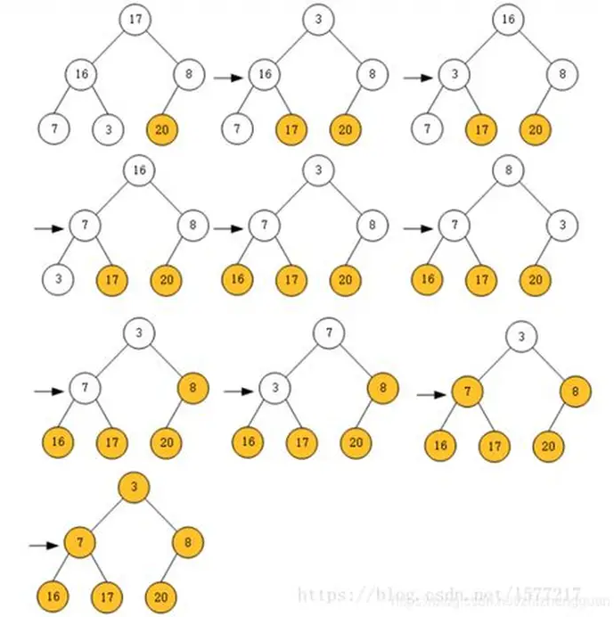

#### 删除及调整

**删除操作**：这里的删除特指输出堆顶元素，这是堆排序的核心步骤。删除过程包括：

1. **输出堆顶**：取出并输出当前堆顶元素（最大值或最小值）；
2. **元素替换**：将堆中最后一个元素移至堆顶位置；
3. **重新调整**：对剩余的n-1个元素进行自顶向下的堆调整。

**下坠调整过程**：将堆顶的新元素与其子结点进行比较，若不满足堆的性质，则与较大（大根堆）或较小（小根堆）的子结点交换位置，然后对交换后的子树继续进行调整，直至满足堆性质或到达叶子结点。这个自顶向下的调整过程称为"下坠"。在下坠过程中，若发现某个子树已经满足堆的性质，则可以提前终止调整，无需继续向下检查。
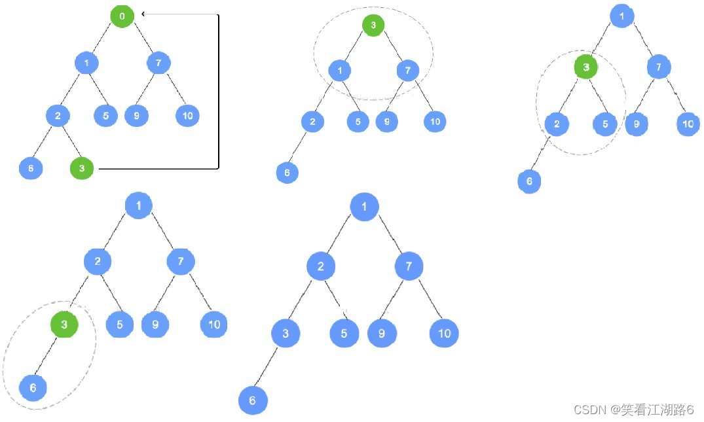

大根堆排序通过将最大元素置于堆顶并交换至序列末尾，从而实现升序排列。以下是基于大根堆的完整升序排序算法实现代码，包含建立初始堆和依次输出堆顶元素的全过程：

```c
#define MaxSize 1000
typedef struct{
    ElemType data[MaxSize];
    int size;
}Heap;
void HeapAdjust(int arr[], int k, int len){
    arr[0] = arr[k];
    for(int i = 2 * k;i <= len;i *= 2){
        if(i < len && arr[i + 1] > arr[i]) i++;
        if(arr[0] >= arr[i]) break;
        arr[k] = arr[i];
        k = i;
    }
    arr[k] = arr[0];
}
void HeapSort(int arr[], int len){
    if(arr == NULL || len <= 1) return;
    // 要满足2i为左孩子的特性，下标必须从1开始
    for(int i = len / 2;i > 0;i--) HeapAdjust(arr, i, len);
    while(len > 1){
        arr[0] = arr[len];
        arr[len] = arr[1];
        arr[1] = arr[0];
        HeapAdjust(arr, 1, --len);
    }
}
```

#### 插入及调整

堆还支持动态插入操作，其过程为：

1. **尾部插入**：将新元素添加到堆的末尾（数组最后位置）；
2. **上滤调整**：将新插入的元素与其双亲结点比较，若不满足堆性质则交换位置，然后继续向上调整直到满足堆性质或到达根结点。
   这种自底向上的调整过程称为"上滤"或"上浮"，与删除操作的"下坠"过程相对应。

#### 海量数据的最小/大k个数

在处理海量数据时，堆排序提供了高效求解Top-K问题的方法：

**求最大的k个数**：

1. **构建小根堆**：用前k个元素构建一个容量为k的小根堆；
2. **逐一比较**：依次读入后续元素，若元素值小于等于堆顶则舍弃；若大于堆顶，则用该元素替换堆顶并重新调整堆；
3. **完整扫描**：重复步骤2直到所有数据都被处理完毕，此时堆中保存的就是最大的k个数。

#### 算法性能分析

- 时间复杂度：建堆时间复杂度为O(n)，每次调整的时间复杂度为O(log₂n)，共需要进行n-1次调整，因此总的时间复杂度为O(nlog₂n)，且最好、最坏、平均情况均相同；
- 空间复杂度：O(1)，仅使用常数个额外变量，为原地排序算法；
- 稳定性：不稳定。适用性：仅适用于顺序存储结构，不适用于链式存储。

## 归并排序

归并排序采用"分治策略"，基本思想是将待排序序列不断二分，直到每个子序列只有一个元素（天然有序），然后将相邻的有序子序列合并成更大的有序序列，直至得到完全有序的序列。
**核心操作**

1. **分解**：将n个元素的序列分解为两个含n/2个元素的子序列
2. **解决**：递归地对两个子序列进行归并排序
3. **合并**：将两个已排序的子序列合并为一个有序序列

**算法实现**

```c
void Merge(SqList &L, SqList &T, int low, int mid, int high){
    int p = low, q = mid + 1, k = low;
    // 归并到辅助表 T
    while (p <= mid && q <= high) {
        if (L.data[p] <= L.data[q]) T.data[k++] = L.data[p++];      // 等于号保留保持先对稳定
        else T.data[k++] = L.data[q++];
    }
    while (p <= mid) T.data[k++] = L.data[p++];
    while (q <= high) T.data[k++] = L.data[q++];

    // 把归并结果拷贝回原表 L
    for (int i = low; i <= high;i++) L.data[i] = T.data[i];
}

void MergeSort(SqList &L, SqList &T, int low, int high){
    if(low < high){
        int mid = (low + high) / 2;                  // 对半
        MergeSort(L, T, low, mid);
        MergeSort(L, T, mid + 1, high);
        Merge(L, T, low, mid, high);                 // 归并
    }
}

void Sort(SqList &L) {
    if(L.length <= 1) return;
    SqList T;T.length = L.length;
    MergeSort(L, T, 1, L.length);
}
```

**算法性能分析**

- 时间复杂度：O(nlog₂n)。每层归并需要O(n)时间，共有log₂n层，最坏、最好、平均情况均为O(nlog₂n)。
- 空间复杂度：O(n)。需要与原数组等大的辅助数组temp。
- 稳定性：稳定排序算法；适用性：适用于顺序存储和链式存储结构。

## 基数排序

基数排序是一种基于多关键字（或单关键字的多位表示）逐位处理的“分配—收集”排序。设长度为 m 的线性表中，每个记录的关键字由 d 个“位”（关键字类的个数）构成，每一位的取值范围大小为 r（称为基数，通常各位可相同也可不同）。常见有两种策略：最高位优先（MSD）与最低位优先（LSD）。以 LSD 为例，共进行 d 轮，从最低有效位依次到最高有效位；每轮设置 r 个队列，按当前位的值将元素分配至对应队列，再按 0…r−1 的顺序依次收集回原序列。由于每轮必须保持稳定性，低位的相对次序在高位轮次中不会被破坏。以十进制整数为例，使用 10 个队列，依次按个位、十位、百位…进行分配并按 0–9 顺序收集，完成 d 轮后即可得到有序序列。

**算法性能分析**

- 时间复杂度：O(d(n+r))。
- 稳定性：稳定排序算法。
- 适用性：适用于顺序存储和链式存储结构。

## 外部排序

### 多路平衡归并

外部排序的速度主要受磁盘读写（I/O）效率制约，因此所有优化都围绕减少I/O次数展开。

**【k-路归并的作用】**
为了减少I/O，一次并非只合并2个，而是合并k个有序的“归并段”。k值越大，所需的归并总趟数就越少。若初始有m个归并段，经过k路归并，所需的归并趟数大约为`⌈log_k(m)⌉`。

**【磁盘I/O次数的估算】**
总I/O次数主要由读写数据的遍数决定。首先，生成初始归并段需要读写一遍数据。随后，每一趟归并都需要将当前所有数据完整地读入内存、合并后再写回磁盘。因此，总I/O次数大致是“文件总数据量”的2倍，乘以“归并趟数加1”。这里的“加1”就包含了初始生成归并段的那一趟读写。

### 败者树
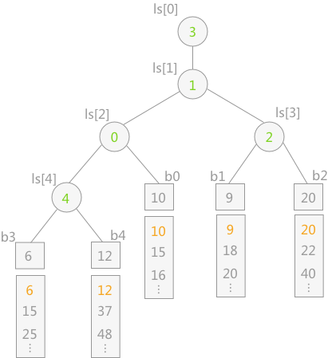

**【目的】**: 败者树用于在k-路归并中高效地选出关键字最小的记录，以替代耗时为O(k)的顺序比较。
**【原理】**：它是一棵完全二叉树，k个叶子节点对应k个归并段，非叶子节点存放比较中的“失败者”，而“胜利者”则继续向上比较，最终全局最小元出现在树顶。

### 置换-选择排序
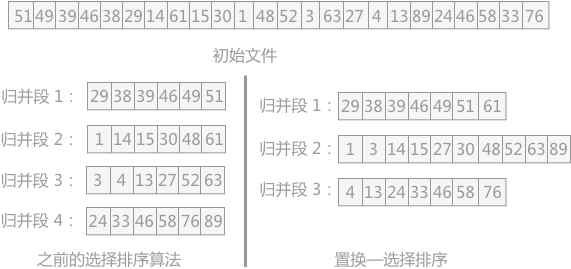

**【目的】**: 为了解决在外部排序的初始阶段，如何利用有限的内存，生成尽可能长的有序子文件的问题，从而最大限度地减少初始归并段的总数量。
**【操作过程】**：
1. 首先从初始文件中输入6个记录到内存工作区中；
2. 从内存工作区中选出关键字最小的记录，将其记为`MINIMAX`记录；
3. 然后将`MINIMAX`记录输出到归并段文件中；
4. 此时内存工作区中还剩余5个记录，若初始文件不为空，则从初始文件中输入下一个记录到内存工作区中；
5. 从内存工作区中的所有比`MINIMAX`值大的记录中选出值最小的关键字的记录，作为新的`MINIMAX`记录；
6. **重复过程3—5，直至在内存工作区中选不出新的MINIMAX记录为止**，由此就得到了一个初始归并段；
7. **重复2—6，直至内存工作为空**，由此就可以得到全部的初始归并段。

### 最佳归并树

该问题等价于构造一棵**k叉哈夫曼树**。若初始结点数n不满足`(n-1)%(k-1)==0`，则需补充若干权值为0的虚结点，以使条件成立。构建时，反复从集合中选取权值最小的k个结点，将它们合并为一个新结点（其权值为k个结点权值之和）并将新结点放回集合。此过程循环进行，直至最终只剩下一个结点，即完成最优归并树的构造。

## **排序算法性能评估与选择策略 高频**

### 算法比较

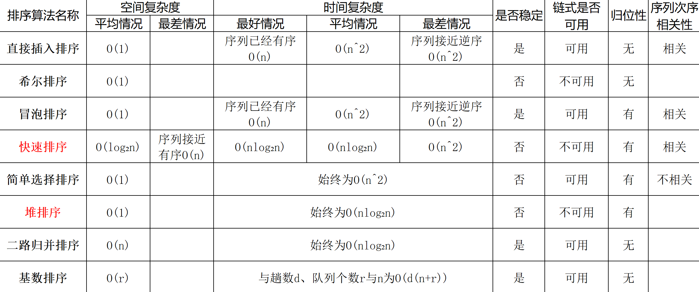

### 算法应用

- 选择排序算法需要考虑的因素
  1. 待排序的元素个数n；
  2. 待排序的元素的初始状态；
  3. 关键字的结构及其分布情况。
  4. 稳定性的要求。
  5. 存储结构及辅助空间的大小限制。
- 排序算法小结
  1. 若n较小，可采用直接插入排序或简单选择排序。由于简单选择排序对记录的移动次数较少，因此当记录本身信息量大的时候，用简单选择排序。
  2. 当n较大的时候，应采用复杂度为 `O(nlog₂n)`的排序算法：快速排序、堆排序或归并排序。当待排序的关键字随机分布时，快速排序被认为是目前内部排序中最好的算法。堆排序所需的辅助空间少于快排，且不会出现快排可能的最坏情况。但这两种排序都是不稳定的，若要求稳定则选择归并排序。
  3. 若待排序序列的初始状态已经基本有序，则选择直接插入排序或冒泡排序为宜。
  4. 当n很大，记录的关键字位数较少且可以分解时，采用基数排序较好。
  5. 当记录本身信息量较大时，为避免耗费大量时间移动记录，可用链表作为存储结构，相应算法有直接插入排序、冒泡排序、简单选择排序、归并排序和基数排序。

## 链表存储下各种排序算法的时间和空间复杂度

| 算法 | 时间复杂度（最好/平均/最坏） | 空间复杂度 | 链表适配性与要点 |
| :--: | :--------------------------: | :--------: | :---------------- |
| 直接插入排序 | `O(n)` / `O(n²)` | O(1) | 查找插入点需线性扫描，插入仅修改指针，移动开销小 |
| 折半插入排序 | ` O(n²)` | O(1) | 链表不支持随机访问，无法二分定位插入位置，性能退化为直接插入排序 |
| 冒泡排序 | `O(n)` / `O(n²)` | O(1) | 相邻交换用指针即可，但比较次数不变 |
| 简单选择排序 | `O(n²) ` | O(1) | 每趟线性找最小结点并摘取，比较次数多、移动少 |
| 堆排序 | - | - | 链式存储无法实现排序，必须转化为数组进行排序 |
| 归并排序 | `O(nlog₂n) ` | 就地合并指针O(1) | 链表场景首选：快慢指针拆分、指针就地合并，无需额外数组 |

## 手算排序题

**【InputList = [5, 1, 4, 6, 3, 8, 2, 7]，写出不同排序算法的一遍排序】**

- 直接插入排序

| 轮次 |         该轮结果         |
| :--: | :----------------------: |
|  1   | (1, 5), 4, 6, 3, 8, 2, 7 |
|  2   | (1, 4, 5), 6, 3, 8, 2, 7 |
|  3   | (1, 4, 5, 6), 3, 8, 2, 7 |
|  4   | (1, 3, 4, 5, 6), 8, 2, 7 |
|  5   | (1, 3, 4, 5, 6, 8), 2, 7 |
|  6   | (1, 2, 3, 4, 5, 6, 8), 7 |
|  7   |  1, 2, 3, 4, 5, 6, 7, 8  |

 - 冒泡排序

| 轮次 |             该轮结果              |
| :--: | :-------------------------------: |
|  1   | 1, 4, 5, 3, 6, 2, 7, (8)          |
|  2   | 1, 4, 3, 5, 2, 6, (7, 8)          |
|  3   | 1, 3, 4, 2, 5, (6, 7, 8)          |
|  4   | 1, 3, 2, 4, (5, 6, 7, 8)          |
|  5   | 1, 2, 3, 4, 5, 6, 7, 8            |

 - 快速排序

| 轮次 |                该轮结果                 |
| :--: | :------------------------------------: |
|  1   | 2, 1, 4, 3, **5**, 8, 6, 7 |
|  2   | 1, **2**, 4, 3, **5**, 7, 6, **8** |
|  3   | **1**, **2**, 3, **4**, **5**, 6, **7**, **8** |

 - 简单选择排序

| 轮次 |              该轮结果               |
| :--: | :--------------------------------: |
|  1   | (1), 5, 4, 6, 3, 8, 2, 7           |
|  2   | (1, 2), 4, 6, 3, 8, 5, 7           |
|  3   | (1, 2, 3), 6, 4, 8, 5, 7           |
|  4   | (1, 2, 3, 4), 6, 8, 5, 7           |
|  5   | (1, 2, 3, 4, 5), 8, 6, 7           |
|  6   | (1, 2, 3, 4, 5, 6), 8, 7           |
|  7   | 1, 2, 3, 4, 5, 6, 7, 8             |

- 堆排序

|  轮次  |         该轮结果         |
| :----: | :----------------------: |
| 初始堆 |  8, 7, 5, 6, 3, 4, 2, 1  |
|   1    | 7, 6, 5, 1, 3, 4, 2, (8) |
|   2    | 6, 3, 5, 1, 2, 4, (7, 8) |
|   3    | 5, 3, 4, 1, 2, (6, 7, 8) |
|   4    | 4, 3, 2, 1, (5, 6, 7, 8) |
|   5    | 3, 1, 2, (4, 5, 6, 7, 8) |
|   6    | 2, 1, (3, 4, 5, 6, 7, 8) |
|   7    |  1, 2, 3, 4, 5, 6, 7, 8  |

 - 二路归并排序

| 轮次 |                 该轮结果                  |
| :--: | :---------------------------------------: |
|  1   | (1, 5), (4, 6), (3, 8), (2, 7)            |
|  2   | (1, 4, 5, 6), (2, 3, 7, 8)                |
|  3   | 1, 2, 3, 4, 5, 6, 7, 8                    |

