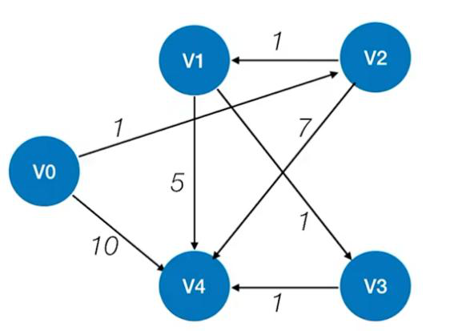

# 题库导出（23 题）


## 【串】

### 真题-2024-填空3
> 真题2024 | 填空

给定字符串 abcaabbabcab，求其对应的 next 数组。

| 下标 i | 1 | 2 | 3 | 4 | 5 | 6 | 7 | 8 | 9 | 10 | 11 | 12 |
|---|---|---|---|---|---|---|---|---|---|---|---|---|
| 字符 | a | b | c | a | a | b | b | a | b | c | a | b |
| next[i] | ? | ? | ? | ? | ? | ? | ? | ? | ? | ? | ? | ? |

**答案**：next[1..12] = 0, 1, 1, 1, 2, 2, 3, 1, 2, 3, 4, 5

**解析**：按严蔚敏 next 定义(next[1]=0，next[j]=最长相等前后缀长度+1)逐位递推。例如 j=7 时前 6 位 'abcaab' 的最长相等前后缀为 'ab'(长2)，故 next[7]=3。整表已逐位核对，与答案PDF一致。


## 【图】

### 真题-2024-算法2
> 真题2024 | 算法设计

编写代码及思想，判断在无向图中是否存在从顶点 i 到顶点 j 的长度为 k 的路径(使用邻接表表示图)。

**答案**：思想：从 i 出发做深度优先搜索并用 visited 标记，每深入一层路径长度 k 减 1；当到达 j 且剩余长度恰为 0 时说明存在长度 k 的路径，返回 1；一条分支失败则回溯(取消标记)继续尝试其它分支，全部失败返回 0。

```c
int visited[MAXSIZE];
int exist_path_len(ALGraph G, int i, int j, int k) {
    if (i == j && k == 0) return 1;
    else if (k > 0) {
        visited[i] = 1;
        for (ArcNode* p = G.vertices[i].firstarc; p; p = p->nextarc) {
            int temp = p->adjvex;
            if (!visited[temp] && exist_path_len(G, temp, j, k - 1)) {
                visited[i] = 0;      // 找到即回溯复位(可选)
                return 1;
            }
        }
        visited[i] = 0;              // 所有邻接分支失败后复位
        return 0;
    }
    return 0;                        // k<0 等情形
}
```

**解析**：DFS 回溯枚举从 i 出发长度恰为 k 的简单路径。visited 保证路径为简单路径(不重复顶点)；回溯时须在当前顶点所有邻接分支都尝试完毕后再复位 visited[i]。

### 真题-2024-阅读4
> 真题2024 | 程序阅读

请补全下面拓扑排序算法中的代码，假设顶点数为 |V|，边数为 |E|，分析这段代码的时间复杂度。

```c
bool Topologicalsort(Graph G) {
    InitStack(S);
    for (int i = 0; i < G.vexnum; i++) {
        if (indegree[i] == 0) {
            ____①____;
        }
    }
    int count = 0;
    while (____②____) {
        ____③____;
        print[count++] = i;
        for (p = G.vertices[i].firstarc; ____④____; p = p->nextarc) {
            v = p->adjvex;
            if (!(--indegree[v])) {
                Push(S, v);
            }
        }
    }
    if (count < G.vexnum) {
        return false;
    } else {
        return true;
    }
}
```

**答案**：① `Push(S, i)`
② `!IsEmpty(S)`
③ `Pop(S, i)`
④ `p != NULL`
时间复杂度 O(|V|+|E|)。

**解析**：先把所有入度为 0 的顶点压栈；栈非空则弹栈顶 i 输出，遍历 i 的邻接边把后继入度减 1，减为 0 者压栈；最终输出顶点数 < 顶点总数说明有回路，拓扑排序失败。每个顶点、每条边各处理一次，故 O(|V|+|E|)。

### 真题-2024-综合4
> 真题2024 | 综合应用

使用弗洛伊德(Floyd)算法，计算下面图的最短路径，给出每一步的最短路径矩阵 D(i) 以及保存中转点的矩阵 Path(i)。(图为 5 个顶点 V0..V4 的带权有向图，邻接矩阵见附图)



**答案**：按 Floyd 算法依次以 V0..V4 为中转点迭代，逐步更新距离矩阵 D(0)→D(4) 与路径矩阵 Path(0)→Path(4)；每步 D(k)[i][j]=min(D(k−1)[i][j], D(k−1)[i][k]+D(k−1)[k][j])，若更新则 Path[k][i][j]=k。

**解析**：Floyd 三重循环 O(V³)，逐个允许新中转顶点刷新所有点对最短距离，Path 记录中转点用于回溯具体路径。


## 【排序】

### 真题-2024-综合1
> 真题2024 | 综合应用

设数组 S[] = {93, 946, 372, 9, 146, 151, 301, 485, 236, 372, 43, 892}。
（1）采用最低位优先(LSD)基数排序将 S 排列成升序序列，写出每一趟排序的结果。
（2）增量等于 5 时进行希尔排序，写出第一趟排序结果。
（3）以第一个元素为轴进行快速排序，写出第一趟排序结果。
（4）构造小根堆，写出调整后的小根堆。

**答案**：（1）基数排序(补零成三位)：
第1趟(个位)：151, 301, 372, 372, 892, 093, 043, 485, 946, 146, 236, 009
第2趟(十位)：301, 009, 236, 043, 946, 146, 151, 372, 372, 485, 892, 093
第3趟(百位)：009, 043, 093, 146, 151, 236, 301, 372, 372, 485, 892, 946
（2）希尔(增量5)第一趟：43, 301, 372, 9, 146, 93, 892, 485, 236, 372, 151, 946
（3）快排(轴=93)第一趟：43, 9, 93, 372, 146, 151, 301, 485, 236, 372, 946, 892
（4）小根堆：9, 43, 151, 236, 93, 372, 301, 485, 946, 372, 146, 892

**解析**：（1）LSD 按个/十/百位做稳定收集排序；（2）增量5把下标 i,i+5,i+10 分组组内直接插入；（3）挖坑法以 93 为轴一趟划分；（4）自最后一个非叶结点(n/2−1=5)起向下筛选建小根堆。四问结果均已逐项复核。


## 【数组广义表】

### 真题-2024-填空6
> 真题2024 | 填空

给定一个二维数组 A[10][15]，A[0][0] 的地址为 644，行优先存储，每个元素占用一个地址空间，A[4][5] 的地址为 ________。

**答案**：709

**解析**：行优先：LOC(A[i][j]) = LOC(A[0][0]) + (i×列数 + j)×元素大小 = 644 + (4×15 + 5)×1 = 644 + 65 = 709。


## 【查找】

### 真题-2024-综合2
> 真题2024 | 综合应用

设散列函数 H(key) = key MOD 11，用线性探测再散列法解决冲突。对关键字序列 (13, 28, 72, 5, 16, 18, 7, 11, 24) 在地址空间 0-10 的散列区中建散列表，画出此表，并求等概率情况下查找成功和查找失败时的平均查找长度。

| 下标 | 0 | 1 | 2 | 3 | 4 | 5 | 6 | 7 | 8 | 9 | 10 |
|---|---|---|---|---|---|---|---|---|---|---|---|
| 关键字 | ? | ? | ? | ? | ? | ? | ? | ? | ? | ? | ? |

**答案**：散列表(下标→关键字)：0→11, 1→空, 2→13, 3→24, 4→空, 5→5, 6→28, 7→72, 8→16, 9→18, 10→7。
各关键字查找成功比较次数(按地址序 11,13,24,5,28,72,16,18,7)：1, 1, 2, 1, 1, 2, 4, 3, 4。
ASL成功 = (1+1+2+1+1+2+4+3+4)/9 = 19/9 ≈ 2.11。
各地址查找失败比较次数(地址0..10)：2, 1, 3, 2, 1, 8, 7, 6, 5, 4, 3。
ASL失败 = (2+1+3+2+1+8+7+6+5+4+3)/11 = 42/11 ≈ 3.82。

**解析**：线性探测：H(key)=key%11，冲突则向后逐个探测至空位。查找成功 ASL=各关键字比较次数之和/关键字数；查找失败 ASL=从每个地址探测到首个空位的比较次数之和/表长(11)。空位为地址 1 和 4。

### 真题-2024-填空5
> 真题2024 | 填空

对序列 {1, 2, 3, 4, 5, 6, 7} 进行顺序插入构建平衡二叉树(AVL)，平衡因子为 0 的结点个数为 ________。

**答案**：7

**解析**：依次插入并旋转平衡后得到满二叉树：根 4，左子树 2(1,3)，右子树 6(5,7)。7 个结点全部左右子树等高，平衡因子均为 0，故为 7。(已逐次插入+旋转核对，与答案PDF一致)

### 真题-2024-综合6
> 真题2024 | 综合应用

对 ["Jan","Feb","Mar","Apr","May","Jun","Jul","Aug","Sep","Oct","Nov","Dec"] 的月份集合，执行以下操作：
（1）构造二叉排序树，并计算查找成功的平均查找长度。
（2）对月份简写进行排序后，利用折半查找，计算查找成功的平均查找长度。
（3）构造二叉平衡树(AVL)，并计算查找成功的平均查找长度。

**答案**：（1）按给定顺序插入建 BST，各结点层数：Jan1；Feb,Mar2；Apr,May,Jun3；Jul,Aug,Sep4；Oct,Dec5；Nov6。
ASL成功 = (1×1+2×2+3×3+4×3+5×2+6×1)/12 = 42/12 = 7/2 = 3.5。
（2）排序后 ["Apr","Aug","Dec","Feb","Jan","Jul","Jun","Mar","May","Nov","Oct","Sep"]，折半判定树各层结点数 1,2,4,5。
ASL成功 = (1×1+2×2+3×4+4×5)/12 = 37/12 ≈ 3.08。
（3）构造 AVL，各层结点数 1,2,4,4,1。
ASL成功 = (1×1+2×2+3×4+4×4+5×1)/12 = 38/12 = 19/6 ≈ 3.17。

**解析**：BST 按插入顺序建、ASL=各结点层数加权平均；折半查找按 mid=(low+high)/2 建判定树；AVL 插入时旋转保持平衡。第(1)(2)问已逐结点/逐层核对无误；第(3)问公式自洽(层结点数 1+2+4+4+1=12)。


## 【栈队列】

### 真题-2024-填空1
> 真题2024 | 填空

设循环队列的表长为 n，f 指向元素的前一个位置，r 指向最后一个元素的位置。该循环队列的长度为 ________。

**答案**：(r − f + n) % n

**解析**：f 指向队头元素的前一个位置、r 指向队尾元素。队长 = (rear − front + maxsize) % maxsize，此处即 (r − f + n) % n。

### 真题-2024-填空2
> 真题2024 | 填空

将中缀表达式 a+b−a*((c+d)/e−f)+g 转换为后缀表达式 ________。

**答案**：ab+acd+e/f-*-g+

**解析**：用运算符栈逐个扫描：操作数直接输出；遇运算符弹出栈中优先级不低于它的运算符后再入栈；遇 '(' 入栈、遇 ')' 弹至 '('。逐字符转换后得后缀 ab+acd+e/f-*-g+，与答案PDF一致(已核对无误)。


## 【树】

### 真题-2024-算法1
> 真题2024 | 算法设计

编写代码及思想，判断一棵树是否为二叉排序树(BST)，结构体已给出。

```c
typedef struct BiTNode {
    int data;                 // 数据域，存储节点值
    struct BiTNode* lchild;   // 指向左子树的指针
    struct BiTNode* rchild;   // 指向右子树的指针
} BiTNode, *BiTree;
```

**答案**：思想：BST 中任一结点的值须落在其允许区间 (min, max) 内——根为 (−∞,+∞)，左子树上界收紧为父值、右子树下界收紧为父值，递归检查全树。

```c
bool isBSTUtil(BiTNode* t, int min, int max) {
    if (t == NULL) return true;                 // 空树是 BST
    if (t->data <= min || t->data >= max) return false;
    return isBSTUtil(t->lchild, min, t->data)
        && isBSTUtil(t->rchild, t->data, max);
}
bool isBST(BiTree T) {
    return isBSTUtil(T, INT_MIN, INT_MAX);
}
```
另一等价思路：中序遍历 BST 得严格递增序列，边遍历边比较前驱值即可判定。

**解析**：范围递归法时间 O(n)、空间 O(树高)。用 INT_MIN/INT_MAX 作初始边界时，若结点值恰等于该极值会有边界误判，工程上可改用 long 或中序遍历法规避。

### 真题-2024-综合3
> 真题2024 | 综合应用

一棵二叉树的先序、中序和后序序列如下，其中有部分未标出：
先序序列：_ _ C D E _ G H I _ K
中序序列：C B _ _ F A _ J K I G
后序序列：_ E F D B _ J I H _ A
（1）根据所给序列补全先序、中序、后序序列。
（2）构造二叉树。
（3）画出二叉树的中序线索链表。

**答案**：（1）补全：
先序序列：A B C D E F G H I J K
中序序列：C B E D F A H J K I G
后序序列：C E F D B K J I H G A
（2）二叉树结构：
```
            A
          /   \
         B     G
        / \   /
       C   D H
          / \  \
         E   F  I
              /
             J
              \
               K
```
（3）中序线索链表：按中序 C B E D F A H J K I G 建立线索(见答案PDF图)。

**解析**：先序定根、中序划分左右子树递归重建。由先序首 A 为根、中序中 A 分左右；逐层确定 B(左:C,右:D(E,F))、G(左:H(右:I(左:J(右:K))))。三序列补全后经交叉验证完全自洽，后序推导与答案一致。

### 真题-2024-算法3
> 真题2024 | 算法设计

编写代码及思想，计算二叉树的繁荣度(即每一层的结点数乘以该层的层数，再对各层求和)。

**答案**：思想：层次遍历，用 last 标记当前层最后一个结点在队列中的位置、levelSize 统计当前层结点数、level 记录层号；当队头到达 last 说明本层遍历完，累加 levelSize×level，然后层号加一、更新 last 为新队尾、levelSize 清零。

```c
int calculateProsperity(BiTree T) {
    if (!T) return 0;
    Queue Q; InitQueue(Q);
    int last = 1, level = 1, totalProsperity = 0, levelSize = 0;
    BiTNode* p = T;
    EnQueue(Q, p);
    while (!IsEmpty(Q)) {
        p = DeQueue(Q);
        levelSize++;
        if (p->lchild) EnQueue(Q, p->lchild);
        if (p->rchild) EnQueue(Q, p->rchild);
        if (Q.front == last) {            // 本层结束
            totalProsperity += levelSize * level;
            level++;
            last = Q.rear;
            levelSize = 0;
        }
    }
    FreeQueue(Q);
    return totalProsperity;
}
```

**解析**：层序+last 分层模板，时间 O(n)、空间 O(n)。繁荣度 = Σ(每层结点数 × 层号)。

### 真题-2024-填空4
> 真题2024 | 填空

在哈夫曼树中，已知有 1247 个结点，叶子结点的个数为 ________。

**答案**：624

**解析**：哈夫曼树只有度为 0 和度为 2 的结点，满足 N0 = N2 + 1，故总结点 N = N0 + N2 = 2·N0 − 1。由 2·N0 − 1 = 1247 得 N0 = 624。

### 真题-2024-阅读5
> 真题2024 | 程序阅读

描述以下递归代码的功能。

```c
int func(TreeNode* root) {
    if (root == NULL) {
        return 0;
    }
    if (root->left == NULL && root->right == NULL) {
        return 1;
    }
    return func(root->left) + func(root->right);
}
```

**答案**：该代码递归计算并返回二叉树中叶结点(度为 0 的结点)的数量。

**解析**：空树返回 0；当前结点左右孩子皆空即为叶结点返回 1；否则返回左右子树叶结点数之和。属典型二叉树递归三件套(终止条件+单层逻辑+返回值合并)。

### 真题-2024-综合5
> 真题2024 | 综合应用

设某通信信息由若干字母组成，字母以及其出现的次数如下表所示。采用赫夫曼(Huffman)编码算法对上述序列编码，给出相应的 Huffman 树，以及每个字符的 Huffman 码。

| 字符 | a | b | c | d | e | f | g |
|---|---|---|---|---|---|---|---|
| 出现频率 | 2 | 5 | 6 | 8 | 13 | 19 | 36 |

**答案**：正确的 Huffman 编码(一种合法最优方案，0/1 左右约定可整体互换)：
g=0, d=100, e=110, f=111, c=1010, a=10110, b=10111
对应带权路径长度 WPL = 36×1 + 8×3 + 13×3 + 19×3 + 6×4 + 2×5 + 5×5 = 215(最优)。
构造过程：反复合并最小两权 —— 2+5=7, 6+7=13, 8+13=21, 13+19=32, 21+32=53, 36+53=89。

**解析**：Huffman 每次取当前最小两权合并；频率最大的 g(36) 应最早停留在最后一步合并、码长最短(=1)。WPL 最小为 215。

### 真题-2024-填空7
> 真题2024 | 填空

已知一棵树有 2011 个结点，其中 116 个是叶结点，其对应二叉树中右子树为空的结点数量为 ________。

**答案**：1896

**解析**：树转二叉树(孩子兄弟法)中，结点的右孩子=其下一个兄弟，故'右子树为空'=该结点无右兄弟=是其父的最右孩子，或本身是树根。分支结点数=总结点−叶=2011−116=1895，每个分支结点恰有一个最右孩子(无右兄弟)，共 1895 个；再加树根(无兄弟)1 个，合计 1896。

### 真题-2024-填空8
> 真题2024 | 填空

设森林 F 中有三棵树，第一、第二、第三棵树的结点个数分别为 M1、M2 和 M3。与森林 F 对应的二叉树根结点的左子树上的结点个数是 ________。

**答案**：M1 − 1

**解析**：森林转二叉树：二叉树的根=第一棵树的根；根的左子树=第一棵树中根的子树森林所转的二叉树；根的右子树=其余各树(M2、M3)所转的二叉树。故根结点左子树上的结点数=第一棵树除根外的全部结点=M1−1。

### 真题-2024-填空9
> 真题2024 | 填空

已知一棵完全二叉树的第六层有 8 个叶结点，树根位于第一层，树的最多结点数为 ________。

**答案**：111

**解析**：要使结点最多，树高取 7 且第 6 层尽量满。第 6 层最多 2^5=32 个结点，其中 8 个为叶(必是最右侧 8 个)，则左侧 32−8=24 个结点在第 7 层各有 2 个孩子，第 7 层有 24×2=48 个。前六层满=2^6−1=63，共 63+48=111；亦即 (2^7−1)−8×2=127−16=111。


## 【线性表】

### 真题-2024-阅读2
> 真题2024 | 程序阅读

下面给出一段关于链表操作的代码片段，请将这些代码片段按正确的顺序填入空位，使其实现将结点 s 插入到结点 p 之前的功能(假设 p 既不是头结点也不是尾结点)，并分析时间复杂度。

待填代码片段：
- ① `prev->next != p && prev->next != NULL`
- ② `prev->next = s`
- ③ `head == NULL || p == NULL || s == NULL`
- ④ `prev->next == p`

```c
void insertBefore(Node* head, Node* p, Node* s) {
    if (________) return;          // 空1
    Node* prev = head;
    while (________) {             // 空2
        prev = prev->next;
    }
    if (________) {                // 空3
        s->next = p;
        ________;                  // 空4
    }
}
```

**选项**
① prev->next != p && prev->next != NULL
② prev->next = s
③ head == NULL || p == NULL || s == NULL
④ prev->next == p

**答案**：四个空自上而下依次填：③ ① ④ ②。
即：空1=③(边界检查)、空2=①(未找到 p 且未到表尾则继续)、空3=④(prev 的后继正是 p)、空4=②(prev->next=s)。
时间复杂度 O(n)(n 为链表长度，需从头遍历找到 p 的前驱)。

**解析**：插入到 p 之前须先定位 p 的前驱 prev。先做非法指针检查(③)；while 用 prev->next!=p && prev->next!=NULL 向后扫描(①)；找到后用 prev->next==p 确认命中(④)，再 s->next=p、prev->next=s 完成插入(②)。

### 真题-2024-阅读3
> 真题2024 | 程序阅读

合并两个非递减的链表为一个非递增链表，以下是部分代码，请补全代码使其正确实现功能。假设链表长度分别为 n 和 m，分析这段代码的时间复杂度。

```c
typedef struct Node {
    int data;
    struct Node* next;
} Node;

Node* mergeAndReverse(Node* La, Node* Lb) {
    Node* Lc = NULL;   // 非递增链表的头指针
    Node* hc = NULL;   // 临时指针，用于构建链表
    while (____①____) {
        Node* p = NULL;
        if (____②____) {
            p = La;
            La = La->next;
        } else {
            p = Lb;
            Lb = Lb->next;
        }
        ____③____;
        ____④____;
    }
    while (La != NULL) {
        Node* p = La;
        La = La->next;
        p->next = Lc;
        Lc = p;
    }
    while (Lb != NULL) {
        Node* p = Lb;
        Lb = Lb->next;
        p->next = Lc;
        Lc = p;
    }
    return Lc;
}
```

**答案**：① `La != NULL && Lb != NULL`
② `La->data <= Lb->data`
③ `p->next = Lc`
④ `Lc = p`
时间复杂度 O(n+m)。

**解析**：每次取两表当前较小结点，用头插法(p->next=Lc; Lc=p)插入 Lc 头部；由于两表非递减、每次取较小者且头插，最终 Lc 呈非递增。任一表遍历完后，把剩余结点同样头插到 Lc 头部。每个结点仅访问一次，故 O(n+m)。


## 【绪论】

### 真题-2024-阅读1
> 真题2024 | 程序阅读

有一个整数 n，其中 n 为 2 的幂。程序通过如下代码计算 count 的值并返回。请分析并给出该代码的时间复杂度。

```c
int main() {
    int count = 0;
    int x = 2;
    while (x < n / 2) {
        x *= x;
        count++;
    }
    return count;
}
```

**答案**：时间复杂度为 O(log₂(log₂ n))，即 O(log log n)。

**解析**：循环变量 x 从 2 开始每次平方：x 依次取 2, 2², 2⁴, 2⁸, …, 2^(2^k)。终止条件 x ≥ n/2，即 2^(2^k) ≥ n/2。两边取对数得 2^k ≥ log₂(n/2)=log₂n−1，再取对数得 k ≥ log₂(log₂n−1)≈log₂log₂n。故迭代次数(即 count)为 O(log log n)。
