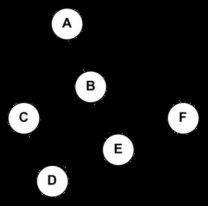
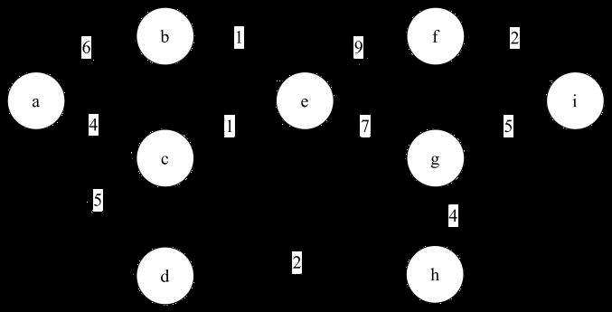
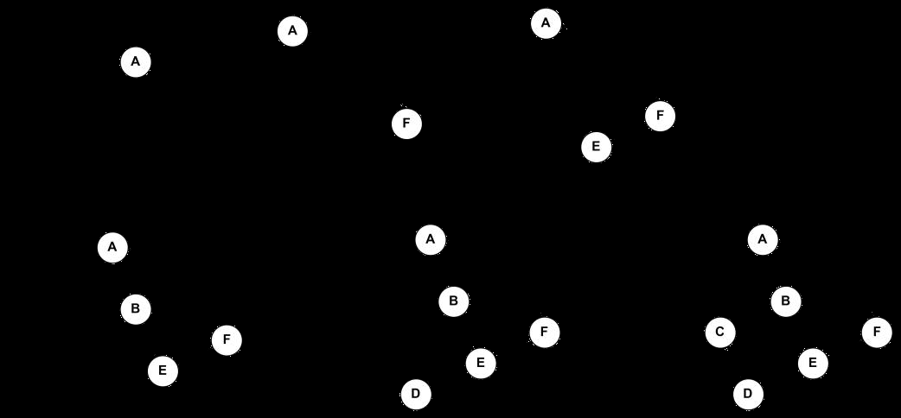
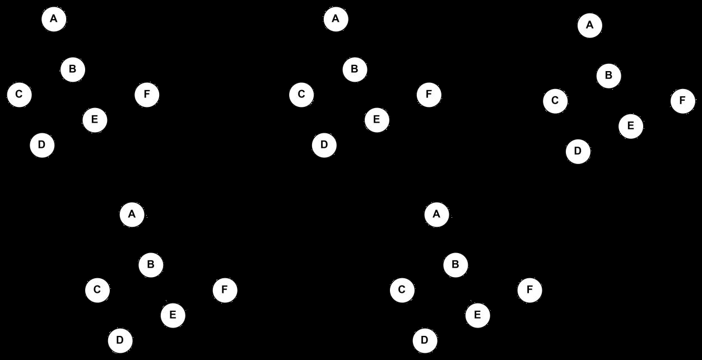
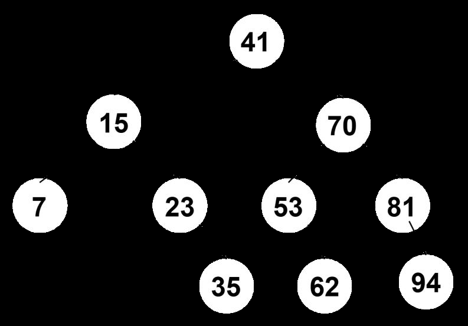
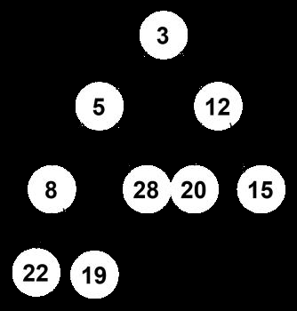
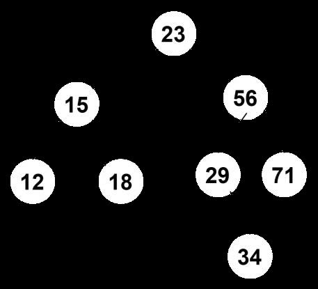
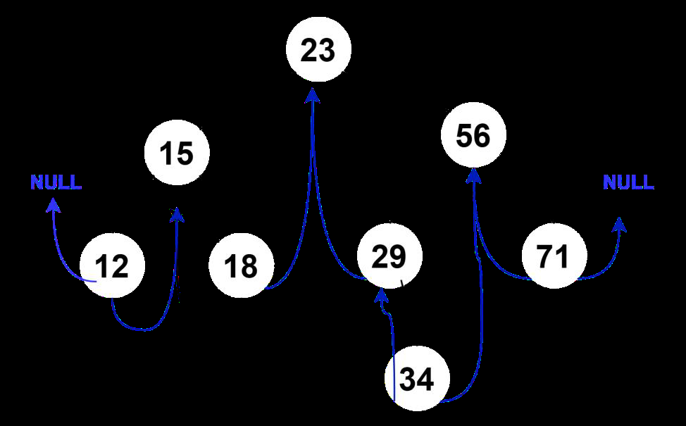
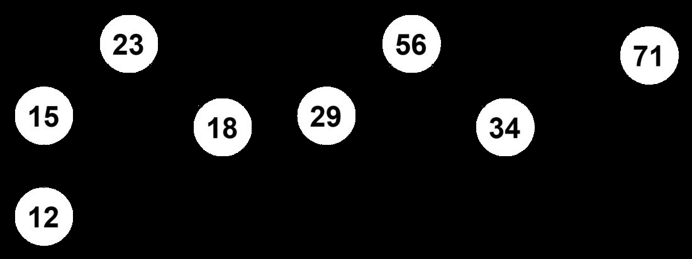
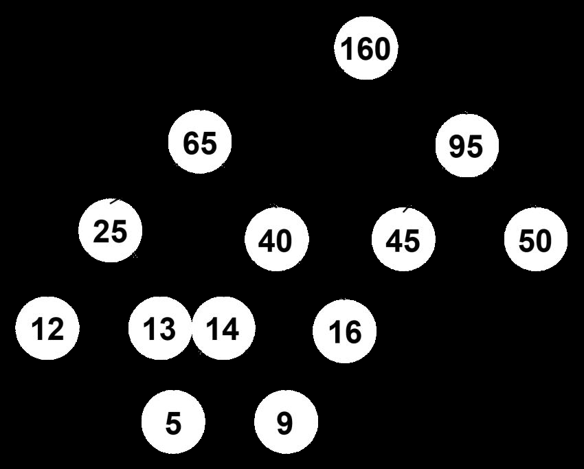

# 题库导出（23 题）


## 【串】

### 真题-2025-填空8
> 真题2025 | 填空

利用 KMP 算法，求 "abcaaba" 的 next 数组 _______。

**答案**：next=0111223（王道约定：next[1]=0，共 7 位对应 7 个字符）。
逐位：a→0, b→1, c→1, a→1, a→2, b→2, a→3。

**解析**：按王道约定 next[j] 基于前缀子串 p[1..j-1] 的最长相等前后缀长度 k，next[j]=k+1（next[1]=0,next[2]=1）：
next[1]=0；next[2]=1；
next[3]：'ab' 无相等前后缀→1；
next[4]：'abc'→1；
next[5]：'abca' 最长相等前后缀 'a'(长1)→2；
next[6]：'abcaa' 最长 'a'(长1)→2；
next[7]：'abcaab' 最长 'ab'(长2)→3。
故 next=0,1,1,1,2,2,3。


## 【图】

### 真题-2025-算法3
> 真题2025 | 算法设计

给定一个邻接表表示的连通图，输出从顶点 u 到顶点 v 并经过顶点 k 的一条路径。如果不存在这样的路径，输出 -1。
（1）描述算法的基本设计思想；
（2）根据设计思想，采用 C 语言描述算法。
```c
#define MaxVertexNum 100
typedef char InfoType;   // 附加信息类型
typedef int  VertexType; // 顶点数据类型
typedef struct ArcNode {
    int adjvex;              // 该弧所指向的顶点位置
    struct ArcNode *next;    // 下个结点
    // InfoType info;
} ArcNode;
typedef struct VNode {
    VertexType data;   // 顶点信息
    ArcNode *first;    // 指向第一个依附于该顶点弧的指针
} VNode, AdjList[MaxVertexNum];
typedef struct {
    AdjList vertices;
    int vexnum, arcnum;  // 图的当前顶点数和弧数
} ALGraph;
```

**答案**：（1）设计思想（分两阶段 DFS）：
阶段一：用 DFS 找从 u 到 k 的一条路径（visited 标记 + path 记录 + 失败回溯）；
阶段二：在阶段一成功的基础上，重置 visited，再用 DFS 找从 k 到 v 的一条路径；
两阶段任一失败则输出 -1；成功则把两段路径拼接输出。

（2）代码（答案PDF版）：
```c
bool visited[MaxVertexNum];

// 从 u 出发找到达 k 的路径，记录到 path
bool DFS(ALGraph *G, int u, int v, int k, int *path, int *pathLength) {
    visited[u] = true;
    path[*pathLength] = u;
    (*pathLength)++;
    if (u == k) return true;                 // 到达目标 k
    ArcNode *arc = G->vertices[u].first;
    while (arc != NULL) {
        int w = arc->adjvex;
        if (!visited[w]) {
            if (DFS(G, w, v, k, path, pathLength)) return true;
        }
        arc = arc->next;
    }
    (*pathLength)--;                          // 回溯
    visited[u] = false;
    return false;
}

bool findPath(ALGraph *G, int u, int v, int k) {
    int path[MaxVertexNum];
    int pathLength = 0;
    // 第一步：u -> k
    for (int i = 0; i < MaxVertexNum; i++) visited[i] = false;
    if (!DFS(G, u, v, k, path, &pathLength)) { printf("-1\n"); return false; }
    if (path[pathLength - 1] != k)            { printf("-1\n"); return false; }
    // 第二步：k -> v
    for (int i = 0; i < MaxVertexNum; i++) visited[i] = false;
    if (!DFS(G, k, v, v, path, &pathLength))  { printf("-1\n"); return false; }
    printf("Path: ");
    for (int i = 0; i < pathLength; i++) printf("%d ", path[i]);
    printf("\n");
    return true;
}
```

**解析**：把'u→v 且经过 k'拆成 u→k 与 k→v 两段简单路径问题，各用一次带回溯的 DFS。visited 防止重复访问成环，path 记录路径，失败时回溯撤销。时间 O(V+E) 每段。

### 真题-2025-综合5
> 真题2025 | 综合应用

已知带权的完全无向图 G（图见原题附图），回答以下问题：
（1）从 A 开始，分别写出图 G 的广度优先搜索(BFS)和深度优先搜索(DFS)序列。若遍历过程中有多个相同权值的路径，优先选择字母顺序较小的结点。
（2）使用 Prim 算法从结点 A 开始构建最小生成树，权值相同时优先选字母顺序较小的结点。
（3）使用 Kruskal 算法构建最小生成树，权值相同时优先选字母顺序较小的结点。









**答案**：（1）BFS 序列：A B F C D E；DFS 序列：A B C D E F。
（2）Prim(从 A 起)与（3）Kruskal 得到的最小生成树见答案PDF附图（z2425-p36-0.png、z2425-p36-1.png）。

**解析**：BFS 按层扩展、DFS 一路深入，均在权值/多分支相同时按字母序小者优先。Prim 从 A 逐步并入最近顶点；Kruskal 按边权从小到大选不成环的边。具体 MST 边集依赖图中权值。

### 真题-2025-综合6
> 真题2025 | 综合应用

给定一个 AOE 网（图见原题附图），请回答以下问题：
（1）计算每个事件的最早发生时间(ve)和最晚发生时间(vl)；
（2）计算每个活动的最早开始时间(e)和最迟完成时间(l)；
（3）确定关键路径。


**答案**：（1）事件 ve / vl（顶点 a,b,c,d,e,f,h,g,i）：
ve: a=0, b=6, c=4, d=5, e=7, f=16, h=7, g=14, i=19
vl: a=0, b=6, c=6, d=8, e=7, f=17, h=10, g=14, i=19
（2）活动 e(ai) / l(ai)（活动 ab,ac,ad,be,ce,ef,eg,dh,hg,fi,gi）：
e:  0,0,0,6,4,7,7,5,7,16,14
l:  0,2,4,6,6,8,7,8,10,17,14
关键活动(e==l)：ab, be, eg, gi。
（3）关键路径：a → b → e → g → i（长度 ve(i)=19）。

**解析**：ve 从源点向后取最大、vl 从汇点向前取最小；活动 e(ai)=ve(弧尾)，l(ai)=vl(弧头)-权值。e==l 的活动为关键活动，串成关键路径 a→b→e→g→i，权值和 6+1+7+5=19=ve(i)，自洽。


## 【排序】

### 真题-2025-填空1
> 真题2025 | 填空

分析这段代码在给定输入 a[]={5,4,3,2,1} 的时间复杂度 ________。
```c
void F(int a[], int i, int n) {
    if (i >= n - 1) {
        return;
    }
    for (int j = i; j < n - 1; j++) {
        if (a[j] > a[j + 1]) {
            int temp = a[j];
            a[j] = a[j + 1];
            a[j + 1] = temp;
        }
    }
    F(a, i + 1, n);
}
```

**答案**：O(n^2)。

**解析**：递归版冒泡排序：F(a,i,n) 做一趟从 j=i 到 n-2 的相邻比较交换（约 n-1-i 次），再递归 F(a,i+1,n)。总比较次数 Σ(i=0..n-2)(n-1-i)=n(n-1)/2，即 O(n^2)。输入 {5,4,3,2,1} 为逆序最坏情况，但代码无提前终止，任何输入均为 O(n^2)。

### 真题-2025-填空10
> 真题2025 | 填空

如图所示，有一个小根堆，当插入 3 后，小根堆经过调整后为 ____。

**解析**：小根堆插入：新元素放到堆末尾，再与其父结点比较，若小于父结点则交换（上浮），直到不小于父结点或到根。具体结果取决于原堆序列。


## 【数组广义表】

### 真题-2025-填空3
> 真题2025 | 填空

已知四维数组 A[9][3][5][8]（行优先存储），其中 A[0][0][0][0] 的地址为 100，每一个整数占 4B，则 A[2][1][4][7] 的地址为 ____。

**答案**：1376。

**解析**：行优先四维数组 A[n1][n2][n3][n4]，元素占 M 字节：LOC(A[i][j][k][l])=LOC(A[0][0][0][0])+(i·n2n3n4+j·n3n4+k·n4+l)·M。代入 n2=3,n3=5,n4=8,M=4：100+(2×3×5×8+1×5×8+4×8+7)×4=100+(240+40+32+7)×4=100+319×4=1376。

### 真题-2025-填空7
> 真题2025 | 填空

getHead[getTail[((a,b),(c,d))]] = ____。

**答案**：(c,d)。

**解析**：广义表 LS=((a,b),(c,d))。getTail(LS) 去掉表头 (a,b)，余下部分仍为表 ((c,d))；再 getHead(((c,d))) 取其表头 = (c,d)。故结果为 (c,d)（注意是一个含两个原子的子表，不带最外层括号）。


## 【查找】

### 真题-2025-综合2
> 真题2025 | 综合应用

设散列表为 HT[0..12]，即表的大小为 m=13。现采用双散列法解决冲突。散列函数和再散列函数分别为：
H0(key)=key%13
Hi=(Hi-1+(reverse(x)+1)%11+1)%13
其中 reverse(x) 是将 x 逆置，如 reverse(789)=987。
（1）若输入的关键码为 2, 8, 31, 20, 70, 59, 25, 28，请画出插入这 8 个关键码后得到的散列表。
（2）计算查找成功 ASL。

**答案**：（1）按答案PDF，各关键码插入地址与探测次数：
2→地址2(探测1)；8→地址8(探测1)；31→地址5(探测1)；20→地址7(探测1)；70→地址12(探测2)；59→地址1(探测2)；25→地址10(探测4)；28→地址4(探测4)。
散列表 HT[0..12]：
地址 0:空  1:59  2:2  3:空  4:28  5:31  6:空  7:20  8:8  9:空  10:25  11:空  12:70
（2）ASL成功=(1+1+1+1+2+2+4+4)/8=16/8=2。

**解析**：双散列：冲突时用第二个散列函数(基于 reverse(key) 的步长)计算增量继续探测。ASL成功=各元素探测次数之和/元素个数=16/8=2。

### 真题-2025-综合4
> 真题2025 | 综合应用

已知有序数组为 [7, 15, 23, 35, 41, 53, 62, 70, 81, 94]，对该数组进行二分查找，回答以下问题：
（1）画出二叉查找树（折半查找判定树）；
（2）查找 53 需要与哪些元素比较；
（3）查找 90 需要与哪些元素比较；
（4）计算查找成功和查找失败的平均查找长度。



**答案**：判定树(mid=⌊(low+high)/2⌋)：
        41
      /    \
    15      70
   /  \    /  \
  7   23  53   81
       \    \    \
       35   62   94
（2）查找 53：41 → 70 → 53（3 次比较，命中）。
（3）查找 90：41 → 70 → 81 → 94（90>81 右、90<94 左落到空，比较 4 次失败）。
（4）ASL成功=29/10=2.9；ASL失败=39/11≈3.55。

**解析**：各元素命中比较次数=所在层数：41(1)；15,70(2)；7,23,53,81(3)；35,62,94(4)。ASL成功=(1×1+2×2+4×3+3×4)/10=(1+4+12+12)/10=29/10=2.9。失败结点(外部结点)共 11 个，各失败比较次数之和=39，ASL失败=39/11≈3.55。


## 【栈队列】

### 真题-2025-填空2
> 真题2025 | 填空

元素 1,1,2,3,4 依次入栈，以 4 为开头的出栈序列有 ____ 个。

**答案**：答案PDF给出：9。

**解析**：按题面严格分析：要使 4 第一个出栈，必须先把 1,1,2,3,4 全部依次入栈（期间不能有任何出栈，否则首元素不是 4），随后弹出 4；此时栈内自底向上为 1,1,2,3，且已无入栈操作，只能按 LIFO 依次弹出 3,2,1,1。故以 4 开头的出栈序列只有唯一一种：4,3,2,1,1，正确答案应为 1。

### 真题-2025-阅读3
> 真题2025 | 程序阅读

下列代码实现循环单链表队列的出队入队，请填写完整代码。
队列的链式存储类型（仅设尾指针 rear，首尾相接成环）：
```c
typedef struct LinkNode {
    ElemType data;
    struct LinkNode *next;
} LinkNode;

typedef struct {
    LinkNode *rear;
} LinkQueue;

void EnQueue(LinkQueue *Q, LinkNode *p) {
    if (Q->rear == NULL) {
        Q->rear = p;
        p->next = p;
    } else {
        ①;
        Q->rear->next = p;
        Q->rear = p;
    }
}

LinkNode* DeQueue(LinkQueue *Q) {
    LinkNode *p;
    if (Q->rear == NULL) {
        return NULL;
    }
    p = Q->rear->next;
    if (Q->rear == p) {
        ②;
    } else {
        Q->rear->next = p->next;
    }
    return p;
}
```

**答案**：① p->next = Q->rear->next;  ② Q->rear = NULL;

**解析**：①入队：新结点 p 的 next 先指向队头(=Q->rear->next)，再让原尾结点指向 p，最后 rear 更新为 p，保持循环。②出队：当 Q->rear==p 说明队列只剩一个结点，出队后置 Q->rear=NULL 使队列为空。

### 真题-2025-填空5
> 真题2025 | 填空

对于后缀表达式 1 2 4 2 / + 5 * -，经过运算后的值为 ____。

**答案**：-19。

**解析**：用栈求值：1→栈[1]；2→[1,2]；4→[1,2,4]；2→[1,2,4,2]；/ 弹 2、4 算 4/2=2 入栈→[1,2,2]；+ 弹 2、2 算 2+2=4→[1,4]；5→[1,4,5]；* 弹 5、4 算 4×5=20→[1,20]；- 弹 20、1 算 1-20=-19。结果 -19。


## 【树】

### 真题-2025-综合1
> 真题2025 | 综合应用

已知一棵二叉查找树/二叉排序树(BST)的先序遍历序列为 23, 15, 12, 18, 56, 29, 34, 71。
（1）请画出此二叉树的形态。
（2）请给出这棵树的后序遍历序列。
（3）画出此二叉树的中序线索二叉树。
（4）画出与此二叉树对应的森林。









**答案**：（1）BST 形态（先序定根、按大小分左右）：
        23
      /    \
    15      56
   /  \    /  \
  12  18  29   71
            \
            34
（2）后序遍历序列：12, 18, 15, 34, 29, 71, 56, 23。
（3）中序序列为 12,15,18,23,29,34,56,71（升序）；据此把空左链改为指向前驱、空右链改为指向后继的线索，即得中序线索二叉树（图见答案PDF）。
（4）二叉树转森林：根 23 无右兄弟故对应一棵树；按'左孩子右兄弟'还原，得对应森林（图见答案PDF）。

**解析**：先序第一个 23 为根；BST 中小于 23 的 {15,12,18} 在左子树、大于 23 的 {56,29,34,71} 在右子树，递归重建。左子树先序 15,12,18→15 为根、12 左、18 右；右子树先序 56,29,34,71→56 为根，{29,34} 左、71 右，29 的右孩子为 34。中序即升序序列。后序=左后序+右后序+根=12,18,15 + 34,29,71,56 + 23。

### 真题-2025-算法2
> 真题2025 | 算法设计

给定一棵二叉树，输出从根结点到叶子结点的最长路径，打印路径的结点值，并输出该路径的长度。
（1）描述算法的基本设计思想；
（2）根据设计思想，采用 C 语言描述算法。
二叉树的链式存储结构描述如下：
```c
typedef struct BiTNode {
    ElemType data;
    struct BiTNode *lchild, *rchild;
} BiTNode, *BiTree;
```

**答案**：（1）设计思想（DFS + 路径记录 + 回溯）：
① 从根开始递归遍历，用数组 path 记录当前从根到该结点的路径，pathIndex 记录路径长度；
② 进入结点时把它压入 path；到达叶子结点时，若当前路径长度 currentLen 大于已记录的 maxLen，则更新 maxLen 并输出当前 path；
③ 递归处理左、右子树（currentLen+1）；
④ 回溯：返回前 pathIndex-- 撤销当前结点，保证不同分支路径互不干扰。

（2）代码（答案PDF版，用引用/cout，C++ 风格）：
```cpp
int maxDepth(BiTree root, int& maxLen, int currentLen, int path[], int& pathIndex) {
    if (root == NULL) return 0;
    path[pathIndex] = root->data;   // 当前结点入路径
    pathIndex++;
    if (root->lchild == NULL && root->rchild == NULL) {  // 叶子
        if (currentLen > maxLen) {
            maxLen = currentLen;
            cout << "Longest path: ";
            for (int i = 0; i < pathIndex; i++) cout << path[i] << " ";
            cout << endl;
        }
    }
    int leftLen  = maxDepth(root->lchild,  maxLen, currentLen + 1, path, pathIndex);
    int rightLen = maxDepth(root->rchild, maxLen, currentLen + 1, path, pathIndex);
    pathIndex--;                    // 回溯，撤销当前结点
    return (leftLen > rightLen) ? leftLen : rightLen;
}
// 初值调用示例：maxLen=0, pathIndex=0, maxDepth(root, maxLen, 1, path, pathIndex);
```

**解析**：先序遍历过程中用 path 保存根到当前结点的路径，遇叶比较并记录最长路径，返回时回溯弹出当前结点。时间 O(n)，空间 O(树高)。属'递归三件套/DFS 回溯'范式。

### 真题-2025-综合3
> 真题2025 | 综合应用

给定字符 a 到 g，它们的权值分别为：a:5  b:9  c:12  d:13  e:16  f:45  g:50。
（1）请根据给定的字符及其权值，使用哈夫曼编码算法构建一棵哈夫曼树。要求每次合并两个结点时，左结点的权值小于等于右结点的权值。
（2）根据哈夫曼树结构，写出每个字符的哈夫曼编码（左结点为 0，右结点为 1），填表。



**答案**：哈夫曼编码（左0右1）：
a(5)=0100
b(9)=0101
c(12)=000
d(13)=001
e(16)=011
f(45)=10
g(50)=11
构造过程(每次取最小两权合并，左≤右)：5+9=14；12+13=25；14+16=30；25+30=55；45+50=95；55+95=150(根)。

**解析**：合并序列得树：根150(左55,右95)；55(左25,右30)；25(左c12,右d13)；30(左14,右e16)；14(左a5,右b9)；95(左f45,右g50)。按左0右1从根到叶即得各字符编码，与答案完全一致。WPL=150（各叶权×码长之和，可选核对）。

### 真题-2025-填空4
> 真题2025 | 填空

哈夫曼树有 199 个结点，则叶子结点有 ____ 个。

**答案**：100。

**解析**：哈夫曼树（严格二叉树/正则二叉树）只有度为 0 和度为 2 的结点，满足 n0=n2+1，总结点数 n=n0+n2=2n0-1。由 2n0-1=199 得 n0=100。

### 真题-2025-填空6
> 真题2025 | 填空

森林 F 有 15 条边，25 个结点，则森林中一共有 ____ 棵树。

**答案**：10。

**解析**：一棵有 n 个结点的树恰有 n-1 条边。森林含 k 棵树、总结点 V、总边 E，则 E=V-k。代入 V=25,E=15 得 k=V-E=25-15=10。

### 真题-2025-填空9
> 真题2025 | 填空

在一棵度为 4 的树 T 中，若有 20 个度为 4 的结点，10 个度为 3 的结点，1 个度为 2 的结点，10 个度为 1 的结点，则树中叶结点的个数为 ____。

**答案**：82。

**解析**：设叶结点(度0) n0 个。总结点数 n=n0+n1+n2+n3+n4=n0+10+1+10+20=n0+41。总边数=各结点度数之和=1×10+2×1+3×10+4×20=10+2+30+80=122。树中边数=结点数-1，故 122=(n0+41)-1=n0+40，得 n0=82。（等价公式 n0=1+n2+2n3+3n4=1+1+20+60=82。）


## 【线性表】

### 真题-2025-算法1
> 真题2025 | 算法设计

给定一个单链表，找到倒数第 k 个元素。如果找到该元素，打印该元素的值并返回 1；否则返回 0。
（1）描述算法的基本设计思想；
（2）根据设计思想，采用 C 语言描述算法。
结点定义如下：
```c
typedef struct node {
    int data;
    struct node *next;
} LNode, *LinkList;
```

**答案**：（1）设计思想（快慢指针/双指针一趟扫描）：
① fast、slow 均指向链表首结点；
② 让 fast 先走 k 步，使 fast 与 slow 相隔 k 个结点；若走 k 步过程中 fast 变为 NULL，说明链表长度 < k，返回 0；
③ fast、slow 同步各走一步，直到 fast 到达表尾(NULL)，此时 slow 指向倒数第 k 个结点；
④ 打印 slow->data 并返回 1。

（2）代码：
```c
int findKthFromEnd(LinkList head, int k) {
    LinkList fast = head;
    LinkList slow = head;
    // fast 先走 k 步
    for (int i = 0; i < k; i++) {
        if (fast == NULL) {      // 链表长度小于 k
            return 0;
        }
        fast = fast->next;
    }
    // 同步移动直到 fast 到表尾
    while (fast != NULL) {
        fast = fast->next;
        slow = slow->next;
    }
    printf("The %d-th element from the end is: %d\n", k, slow->data);
    return 1;
}
```
（也可用栈或递归实现。）

**解析**：快慢指针保持固定间距 k，一趟 O(n) 时间、O(1) 空间即可定位倒数第 k 个结点，无需先求链表长度。

### 真题-2025-阅读2
> 真题2025 | 程序阅读

下列代码交换双向链表中 p 结点和 p 结点的前驱。请填写完整代码。
双向链表存储结构：
```c
struct DLinkNode {
    ElementType data;
    Position prior; // Front pointer
    Position next;  // Rear pointer
};

void SwapWithPrevious(DLinkNode* p) {
    DLinkNode* q = p->prior;
    ①;
    p->next = q;
    q->prior = p;
    ②;
    p->prior->next = p;
    q->next->prior = q;
}
```

**答案**：答案PDF给出：① p->prior = q->prior;  ② q->next = p->next;

【正确重组代码】（须在 p->next=q 之前保存 p 的原后继 y）：
```c
void SwapWithPrevious(DLinkNode* p) {
    DLinkNode* q = p->prior;
    DLinkNode* y = p->next;   // 先保存 p 的原后继
    p->prior = q->prior;      // ①
    p->next = q;
    q->prior = p;
    q->next = y;              // ② 用原后继 y，不能用已被覆盖的 p->next
    if (p->prior != NULL) p->prior->next = p;
    if (q->next != NULL) q->next->prior = q;
}
```

**解析**：交换 p 与其前驱 q：需重接 6 个指针——p、q 各自的 prior/next，以及 p 原前驱 X(q->prior) 与 p 原后继 Y(p->next) 的回指。关键：p->next=q 会覆盖 Y，故必须先把 Y=p->next 存入临时变量，才能让 q->next=Y。

### 真题-2025-阅读4
> 真题2025 | 程序阅读

下列代码实现带头结点的单链表的简单选择排序，请填写完整代码。
单链表存储结构：
```c
typedef struct LNode {
    ElemType data;
    struct LNode* next;
} LNode, *LinkList;

void SelectionSort(LinkList &L) {
    LNode *p, *q, *min;
    ①;
    while (p != NULL) {
        min = p;
        q = p->next;
        while (q != NULL) {
            if (q->data < min->data) {
                min = q;
            }
            q = q->next;
        }
        if (②) {
            ElemType temp = p->data;
            p->data = min->data;
            min->data = temp;
        }
        ③;
    }
}
```

**答案**：① p = L->next;  ② min != p;  ③ p = p->next;

**解析**：带头结点，故 p 从第一个有效结点 L->next 开始。每趟在 p 及其后用 min 记录最小值结点，若 min!=p 则交换两结点的 data（交换值而非结点），最后 p 后移进入下一趟。


## 【绪论】

### 真题-2025-阅读1
> 真题2025 | 程序阅读

求以下代码的时间复杂度，并分析原因。
```c
void move(char a, char b, int n) {
    printf("将第%d个盘子从%c移动到%c", n, a, b);
}

void F(int n, char a, char b, char c) {
    if (n == 1) {
        move(a, c, n);
    } else {
        F(n - 1, a, c, b);
        move(a, c, n);
        F(n - 1, b, a, c);
    }
}
```

**答案**：时间复杂度为 O(2^n)。

**解析**：这是汉诺塔递归。设 T(n) 为移动 n 个盘子的操作数，则 T(n)=2T(n-1)+1，T(1)=1，解得 T(n)=2^n-1，故为 O(2^n)。递归树高度为 n，第 i 层约有 2^(i-1) 个结点，总操作数指数级。
