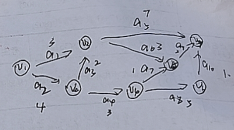

# 题库导出（26 题）


## 【图】

### 真题-2026-阅读1
> 真题2026 | 程序阅读

深度优先生成树（第一空1分，第二空2分，共3分）。下列代码用邻接表存储图，`DFS_Tree` 对每个连通分量调用 `DFSTree` 生成深度优先生成树，请补全 `DFSTree` 中的两个空。

```c
typedef struct ArcNode {
    int adjvex;
    struct ArcNode *nextarc;
} ArcNode;
typedef struct VNode {
    char data;
    ArcNode *firstarc;
} VNode;
typedef struct {
    VNode vertices[MaxVertexNum];
    int vexnum, arcnum;
} ALGraph;

void DFS_Tree(ALGraph G) {
    for (int i = 0; i < G.vexnum; i++) visited[i] = false;
    for (int i = 0; i < G.vexnum; i++)
        if (!visited[i]) DFSTree(G, i);
}
void DFSTree(ALGraph G, int v) {
    visited[v] = true;
    ArcNode *p = ________;              // 空1
    while (p != NULL) {
        if (!visited[p->adjvex]) {
            ________;                   // 空2
        }
        printf("Tree edge: %d -> %d\n", v, p->adjvex);
        p = p->nextarc;
    }
}
```

**答案**：空1：`p = G.vertices[v].firstarc`（取 v 的第一条依附边）
空2：`DFSTree(G, p->adjvex)`（递归进入未访问的邻接点）

**解析**：考察图的 DFS 遍历及生成树构建。访问顶点 v 后先取其第一条依附边，再对每个未访问的邻接点递归，递归边即生成树的树边。

### 真题-2026-填空10
> 真题2026 | 填空

设某个强连通图有 n 个顶点，则该强连通图至少有________条边。

**答案**：n

**解析**：强连通有向图至少需要一个包含全部 n 个顶点的有向环，恰好 n 条边。

### 真题-2026-综合19
> 真题2026 | 综合应用

找最短路径（回忆版题面仅'19.找最短路径'一句，配一张图）。



### 真题-2026-综合20
> 真题2026 | 综合应用

给定一个 AOE 网，完成表格(给出计算过程)，并给出关键路径。表头含 V1..V7、Ve、Vl、a1..a9、e、l。

### 真题-2026-综合21
> 真题2026 | 综合应用

给定一个有向图，利用 Dijkstra 算法寻找最短路径，完成表格(第一趟至第五趟，含 V1..V5、S)。

### 真题-2026-算法26
> 真题2026 | 算法设计

（12分）给一个由邻接表存储的图，以及一个序列 V1 V2 ... Vn，判断这个序列是不是该图的一个拓扑序列。

**答案**：算法思路一(前驱检查)：遍历序列中每个顶点 u，检查图中所有指向 u 的顶点 v(入边 v→u)；若存在某前驱 v 在给定序列中出现在 u 的后面，则该序列不是拓扑序列，否则是。
算法思路二(入度表法)：模拟拓扑排序过程，按序列顺序逐个检查当前顶点的入度是否为 0(只统计序列中尚未处理的顶点构成的入度)，若某顶点入度非 0 则不是拓扑序列。

**解析**：拓扑序列的充要条件：对每条边 (v→u)，v 在序列中都排在 u 前面。两种思路均 O(V+E)(邻接表)。


## 【排序】

### 真题-2026-填空15
> 真题2026 | 填空

大根堆后面加入一个元素，重新向上调整建堆需要比较的次数为________。

**答案**：⌊log₂n⌋（最坏情况，堆的深度）

**解析**：新元素插入堆底后向上调整，最坏情况从叶子比较到根，比较次数为树高 ⌊log₂n⌋。


## 【数组广义表】

### 真题-2026-填空14
> 真题2026 | 填空

（回忆版题面缺失）一个广义表的取表头、取表尾运算________。

### 真题-2026-填空8
> 真题2026 | 填空

已知二维数组 A 按行优先方式存储，每个元素占一个单元。若 A[0][0] 的存储地址为 100，A[3][3] 为 220，则 A[5][5] 的存储地址为________。

**答案**：300

**解析**：设每行 N 个元素：A[3][3]=100+(3N+3)=220 → N=39；A[5][5]=100+(5×39+5)=100+200=300。


## 【查找】

### 真题-2026-填空13
> 真题2026 | 填空

有 125 个元素的有序数组，使用折半查找，成功的比较次数最多为________。

**答案**：7

**解析**：最多比较次数 = ⌊log₂125⌋+1 = 6+1 = 7(判定树高度)。

### 真题-2026-综合17
> 真题2026 | 综合应用

散列表的散列函数为 H0=Key%13。将关键字序列 {19,14,23,1,68,20,84,27,55,11,10,79} 按顺序插入空哈希表。
（1）采用线性探测法处理冲突，画出插入完成的哈希表(HT[0..15]，表长16)，求等概率下查找成功与不成功的 ASL；
（2）采用链地址法处理冲突，画出哈希表，求查找成功与不成功的 ASL。

**答案**：（1）线性探测：19→6,14→1,23→10,1→2(冲突探测),68→3,20→7,84→8(6冲突→7→8),27→4(1→2→3→4),55→5(3→4→5),11→11,10→12(10→11→12),79→9(1→2…→8均冲突→9)。（具体 ASL 见答案 PDF 计算）

**解析**：线性探测逐个向后探测空位；链地址法同义词挂同一链表。ASL 成功=各元素比较次数之和/关键字数，失败=各地址失败比较次数之和/表长。

### 真题-2026-综合18
> 真题2026 | 综合应用

给一个整数序列 14,4,39,28,16,2,10,78。
（1）依次插入二叉排序树的最终结果；
（2）计算查找成功的平均查找长度；
（3）若一开始插入时进行平衡调整，给出最终结果(AVL)。

**答案**：（2）查找成功 ASL=(1×1+2×2+3×4+4×1)/8=21/8=2.625。（1)(3) 树形见答案 PDF 附图。

**解析**：按 BST 插入规则逐个插入；ASL 按各结点所在层数加权平均；AVL 插入时旋转平衡。

### 真题-2026-综合23
> 真题2026 | 综合应用

给定一个整数序列 (2,7,8,10,24,25,28,31,33,39,41) 进行折半查找。
（1）画出描述折半查找过程的判定树；
（2）若查找元素 28，需依次与哪些元素比较？
（3）求等概率情况下查找成功的平均查找长度。

**答案**：（2）查找 28 依次比较：25→33→28(mid=(1+11)/2=6→25；28>25向右，区间[7,11] mid=9→33；28<33向左，区间[7,8] mid=7→28，找到)。（1)(3) 判定树与 ASL 见答案。

**解析**：折半查找判定树按 mid=(low+high)/2 递归构造；比较序列即从根到目标结点的路径。


## 【栈队列】

### 真题-2026-阅读2
> 真题2026 | 程序阅读

共享栈（每空1分，共5分）。大小为 m 的数组实现两个栈，top[0] 为栈1指针初始指向 -1，top[1] 为栈2指针初始指向 m，两栈底在数组两端向中间生长。补全 Push、Pop 中的空。

```c
typedef struct {
    int data[MaxSize];
    int top[2];
    int bot[2];
} TwStack;
void InitStack(TwStack &S) {
    S.bot[0] = -1; S.bot[1] = m;
    S.top[0] = -1; S.top[1] = m;
}
bool Push(TwStack &S, int i, int x) {
    if (________) return false;         // 空1：判满
    if (i == 0) { S.data[________] = x; }      // 空2：栈0进栈
    else if (i == 1) { S.data[________] = x; } // 空3：栈1进栈
    return true;
}
bool Pop(TwStack &S, int i, int &x) {
    if (S.top[i] == S.bot[i]) return false;
    if (i == 0) { x = S.data[________]; }      // 空4：栈0出栈
    else if (i == 1) { x = S.data[________]; } // 空5：栈1出栈
    return true;
}
```

**答案**：空1：`S.top[0] + 1 == S.top[1]`（两栈顶相邻即满）
空2：`++S.top[0]`
空3：`--S.top[1]`
空4：`S.top[0]--`
空5：`S.top[1]++`

**解析**：一个数组实现两个栈，栈底分别在数组两端向中间生长。栈0 从左往右（先加指针再存值，出栈先取值再减指针），栈1 从右往左（先减指针再存值，出栈先取值再加指针）。

### 真题-2026-填空6
> 真题2026 | 填空

若 a=2, b=3, c=4, d=5，则后缀表达式 `abc+*d-` 的值为________。

**答案**：9

**解析**：还原为中缀 a*(b+c)-d = 2*(3+4)-5 = 9。

### 真题-2026-填空7
> 真题2026 | 填空

用一个大小为 6 的数组实现循环队列，当前 rear 和 front 的值分别为 0 和 3。从队列中删除一个元素、再加入两个元素后，rear 和 front 的值分别为________。

**答案**：front=4，rear=2

**解析**：删除一个元素 front=(3+1)%6=4；加入两个元素 rear=(0+2)%6=2。

### 真题-2026-填空9
> 真题2026 | 填空

已知一个栈的入栈序列是 1,2,3,…,n，输出序列为 T1,T2,…,Tn。若 T1=n，则第 i 个出栈的元素是________。

**答案**：n-i+1

**解析**：T1=n 说明所有元素先全部入栈再开始出栈，出栈即从 n 递减，第 i 个出栈为 n-i+1。


## 【树】

### 真题-2026-填空11
> 真题2026 | 填空

n 个节点的二叉树，采用二叉链表存储，空指针个数为________。

**答案**：n+1

**解析**：n 个结点共 2n 个指针域，其中 n-1 个用于连接(边数)，空指针 = 2n-(n-1) = n+1。

### 真题-2026-综合16
> 真题2026 | 综合应用

二叉树的中序序列为 BADCFEG，先序序列为ABCDEFG。
（1）画出该二叉树，并给出后序序列；
（2）画出该二叉树对应的三叉链表结构；
（3）画出该二叉树对应的树或森林。

**答案**：（1）后序序列：BDFGECA。树形：A 为根，左孩子 B，右子树 C(D, E(F,G))。
（2）三叉链表：在二叉链表基础上增加 parent 指针指向父结点。
（3）对应森林由 4 棵树组成：(A-B)、(C-D)、(E-F)、(G)。

**解析**：先序定根、中序划分左右子树，递归重建。

### 真题-2026-综合22
> 真题2026 | 综合应用

abcdefg 对应的出现次数(略)。
（1）建立哈夫曼树，要求同一节点的左根大于右根；
（2）对二叉树进行编码，左0右1，完成表格。

### 真题-2026-算法25
> 真题2026 | 算法设计

（10分）设一棵二叉树中各结点的值互不相同，其先序遍历序列和中序遍历序列分别存于两个一维数组 A[1..n] 和 B[1..n] 中，试编写算法建立该二叉树的二叉链表存储结构。

**答案**：算法思路：递归划分。先序 A 的第一个元素是根；在中序 B 中找到该根的位置 k，则 B 中 k 左边是左子树的中序、右边是右子树的中序，据左子树结点个数在先序 A 中划分出左右子树的先序；对左右子树递归建树。

**解析**：先序定根、中序划分左右，是二叉树重建的标准递归。结点值互不相同保证根在中序中位置唯一。

### 真题-2026-阅读5
> 真题2026 | 程序阅读

判断一个二叉树是否是平衡二叉树，若是返回深度，不是则不返回。结构为 (left, right, data)（每空2分，共4分）。补全 IsBalanced 中的空。

```c
bool IsBalanced(BiTree T, int &depth) {
    if (T == NULL) { depth = 0; return true; }
    int deepleft, deepright;
    if (________) {                       // 空1
        depth = (deepleft > deepright ? deepleft : deepright) + 1;
        int dif = deepleft - deepright;
        if (________) {                   // 空2
            return true;
        }
    }
    return false;
}
```

**答案**：空1：`IsBalanced(T->lchild, deepleft) && IsBalanced(T->rchild, deepright)`
空2：`abs(dif) <= 1`（或 `dif >= -1 && dif <= 1`）

**解析**：后序遍历判断平衡性：空树深度0返回true；递归检查左右子树是否都平衡并取得各自深度，再判左右深度差绝对值是否≤1，平衡则当前深度为较大者+1。


## 【线性表】

### 真题-2026-填空12
> 真题2026 | 填空

一个长度为 n 的链表，在第 i 个位置后插入一个元素的时间复杂度为________。

**答案**：O(n)

**解析**：需从头查找定位第 i 个结点，平均 O(n)。

### 真题-2026-算法24
> 真题2026 | 算法设计

（约瑟夫环，8分）有 n 个人围成一个圈，编号为 1~n。现要求从第 s 个人开始报数，数到 m 的人出列，出列后的下一个人继续从 1 开始报数，同样数到 m 的人出列，一直重复此过程，直到圈中只剩下最后一个人，返回其编号。

**答案**：算法思路：用循环链表模拟——建 n 个结点的循环链表，从第 s 个开始，每数 m-1 步删除当前结点，直到剩最后一个，返回其编号。也可用数组/递推公式(约瑟夫递推 f(n,m)=(f(n-1,m)+m)%n)求解。

**解析**：经典约瑟夫环。循环链表模拟直观；若只求最后幸存者编号，递推公式 O(n) 更优。

### 真题-2026-阅读3
> 真题2026 | 程序阅读

链表求交集（第一空1分，后面每空2分，共5分）。以两个元素依值递增有序排列的线性表 A 和 B 分别表示两个集合，另辟空间构成线性表 C 为 A、B 的交集（递增有序），**利用 A 表空间存放 C**。补全 mergelist 中的空。

```c
Status mergelist(LinkList &A, LinkList &B) {
    LNode *pa = A->next, *pb = B->next, *pc = A, *temp;
    while (________) {                    // 空1
        if (pa->data == pb->data) {
            ________                      // 空2
            pc = pa; pa = pa->next;
            temp = pb; pb = pb->next; free(temp);
        } else if (pa->data < pb->data) {
            temp = pa; pa = pa->next; free(temp);
        } else {
            temp = pb; pb = pb->next; free(temp);
        }
    }
    while (pb) { temp = pb; pb = pb->next; free(temp); }
    while (pa) { temp = pa; pa = pa->next; free(temp); }
    ________                              // 空3
    free(B);
    return OK;
}
```

**答案**：空1：`pa && pb`
空2：`pc->next = pa;`（相等时把 pa 尾插到结果链，随后 pc=pa）
空3：`pc->next = NULL;`（收尾）

**解析**：归并式求交集：双指针同步后移，相等则保留 pa 结点接到 pc 之后（复用 A 空间）、删除 pb 结点；不等则删除较小者。要求空间复杂度 O(1)（利用原结点）。


## 【绪论】

### 真题-2026-阅读4
> 真题2026 | 程序阅读

给出下列程序输出结果（1分）与算法时间复杂度（2分），其中 n 为 8（共3分）。

```c
int a[] = {23,33,16,79,34,79,29,86};
// 版本一
void riddle(int n) {
    if (n == 1) return;
    riddle(n - 1);
    if (a[n-1] < a[n-2]) printf("%d ", a[n-1]);
    else                 printf("%d ", a[n-2]);
}
// 版本二
int riddle(int n) {
    if (n == 1) return a[0];
    int p = riddle(n - 1);
    if (p < a[n]) return p;
    else          return a[n];
}
```

**答案**：版本一输出：`23 16 16 34 34 29 29`，时间复杂度 O(n)；
版本二无打印、返回值为 16，时间复杂度 O(n)。

**解析**：版本一递归到 n=1 返回后，自底向上打印每对相邻元素的较小者；版本二递归求前缀最小值。两者均线性递归，O(n)。
